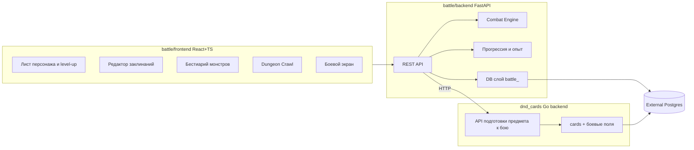

# Battle Service — Roadmap до версии 1

Цель: довести подпроект `battle` (сейчас MVP PvP-боя D&D 2024) до версии 1 с листами персонажей, прогрессией, заклинаниями и монстрами в БД, интеграцией предметов и режимом Dungeon Crawl.

## Принятые решения
- Фронтенд `battle/frontend` мигрирует на React + TypeScript (как основной `dnd_cards`).
- Интеграция предметов: дорабатываем Go-бэкенд (`backend/`) — добавляем боевые поля в карты и эндпоинт «подготовить предмет к бою»; battle дёргает этот API.
- БД: те же внешние Postgres, что у `dnd_cards`, но отдельные таблицы с префиксом `battle_`.
- Бэкенд battle остаётся Python/FastAPI.
- Каждый этап обязан полностью работать локально (локальный Postgres в docker-compose, с сохранением файлового fallback для dev).

## Текущее состояние (отправная точка)
- Бэкенд: FastAPI, движок боя `battle/backend/engine.py` (атаки, ~64 заклинания, conditions, grid 20x20), модели `battle/backend/models.py` (Pydantic), persistence только для шаблонов персонажей (`battle/backend/db.py` → таблица `battle_saved_characters`, либо файлы).
- Комнаты и бои — in-memory (`battle/backend/store.py`).
- Заклинания захардкожены в `battle/backend/spells.py`.
- Монстров, рас, dungeon crawl, интеграции предметов нет.
- Фронтенд: vanilla HTML/JS (`battle/frontend/static/index.html`, `characters.html`, `spellbook.html`).
- Классы Fighter/Wizard уровни 1–4, прогрессии (level up с выбором) нет.

## Архитектура целевой версии 1

---

## Этап 0 — Фундамент (инфраструктура)
Подготовка к росту, без новой игровой логики.
- Миграция фронтенда `battle/frontend` на React+TS+Vite: каркас, роутинг, перенос трёх существующих экранов (бой, персонажи, spellbook) 1:1, общий API-клиент (axios). Dockerfile/nginx обновить под `vite build`.
- DB-слой battle: ввести единый модуль миграций (нумерованные SQL/функции) поверх `battle/backend/db.py`; все новые таблицы — с префиксом `battle_`. Сохранить файловый fallback для локального dev без БД.
- `docker-compose.battle.yml` в `battle/`: backend + frontend + локальный Postgres, чтобы приёмка шла полностью локально.
- Скрипт приёмки `battle/scripts/test_battle_stack.py` (аналог корневого `scripts/test_full_stack.py`): health, поднятие комнаты, прогон базового боя.

Приёмка: локально поднимается весь стек (`docker-compose.battle.yml`), три экрана работают на React, старый функционал боя не сломан, тест-скрипт зелёный.

---

## Этап 1 — Лист персонажа и прогрессия (п.1)
- Таблица `battle_characters` (id, owner, имя, класс, уровень, опыт, характеристики, выборы прогрессии, экипировка, JSONB полного состояния). Раздельно от боевого `Character` в памяти; при входе в бой материализуется в движок.
- Классы: только Wizard и Воин (Fighter); раса — человек (фикс. бонусы); без черт происхождения.
- Подробное создание персонажа (point-buy, выбор стартовых опций) и пошаговый level-up с выбором опций способностей (например, боевой стиль/мастерства оружия для воина, заклинания/подготовка для волшебника). Прогрессия уровней 1→2→3.
- Система опыта: начисление XP после боя (по сложности противников), порог уровня, переход в режим level-up.
- Бэкенд: модуль `progression.py` (таблицы XP, фичи классов 1–3, опции выбора), API CRUD персонажей + `POST /battle/characters/{id}/level-up`, `POST .../award-xp`.
- Фронтенд: экран листа персонажа (редактируемый), мастер создания, мастер level-up.

Приёмка: локально можно создать воина и волшебника, провести бой, получить XP, повыситься до 2 и 3 уровня с выбором опций; персонаж сохраняется в БД и переживает рестарт.

---

## Этап 2 — Заклинания в БД (п.2)
- Таблица `battle_spells` (полная схема из `Spell` в `battle/backend/models.py`: effect, targeting, damage, saves, concentration, upcast, cantrip_scale + поддержка «выбора эффекта»).
- Миграция-сидер: перенести ~64 заклинания из `battle/backend/spells.py` в `battle_spells` (код-каталог становится сид-данными).
- «Заклинания с выбором эффекта»: модель варианта эффекта (например, выбор стихии/типа урона/состояния при касте), движок учитывает выбранный вариант в `cast_spell`.
- API: CRUD заклинаний (`/battle/spells`), пометка «готово к бою» (валидация механических полей).
- Фронтенд: редактор заклинаний (создание/редактирование/список), обновлённый spellbook читает из БД.

Приёмка: локально можно создать новое заклинание, отредактировать существующее, заклинание с выбором эффекта корректно применяется в бою; движок берёт заклинания из БД, а не из кода.

---

## Этап 3 — Монстры и бестиарий (п.3)
- Таблица `battle_monsters` (статблок: характеристики, AC/HP, скорость, атаки/мультиатака, спасброски, особенности, CR/уровень сложности для XP).
- Расширение боя: участник комнаты может быть монстром (NPC), не только игровым персонажем; материализация статблока в боевую сущность.
- (По возможности) простейший автоход монстра (выбор ближайшей цели, атака) для PvE — минимально, чтобы Dungeon Crawl работал.
- API: CRUD монстров (`/battle/monsters`), пометка «готов к бою».
- Фронтенд: бестиарий (создание/редактирование/список), добавление монстров в бой.

Приёмка: локально можно создать монстра, отредактировать, поставить в бой против персонажа и провести бой PvE; XP за победу начисляется по сложности монстров.

---

## Этап 4 — Интеграция предметов (п.4)
- Go-бэкенд `dnd_cards`: добавить в карты боевые поля для подготовки к бою (урон/кости/тип урона для оружия, AC/тип брони, боевые эффекты при экипировке/использовании) — расширение `CardEffects`/новых полей в `backend/models.go`, миграция, обновление API создания/обновления и формы конструктора карт (по правилу `new-field.mdc`).
- Новый эндпоинт «подготовить предмет к бою»: `POST /api/cards/{id}/battle-stats` (или batch) — отдаёт нормализованный боевой статблок предмета.
- Battle backend: клиент к Go-API, маппинг боевого статблока предмета в `Weapon`/`Armor`/`active_buffs` движка; экипировка предметов на листе персонажа.
- Фронтенд battle: выбор предметов из сервиса предметов и экипировка на листе персонажа.

Приёмка: локально (оба бэкенда подняты) предмет из `dnd_cards` помечается боевыми параметрами, импортируется в battle, экипируется на персонажа и влияет на бой (урон/AC/эффект).

---

## Этап 5 — Dungeon Crawl MVP (п.5)
- Таблицы `battle_runs` (прохождение: персонаж, прогресс, золото, состояние) и `battle_encounters` (комнаты возрастающей сложности).
- Луп: создать персонажа → войти в run → последовательность всё более сложных комнат с монстрами → XP и level-up между комнатами → магазин между уровнями (покупка предметов из сервиса предметов за золото).
- Персистентность run в БД (бой может оставаться in-memory в рамках комнаты, но прогресс run сохраняется).
- Фронтенд: экран Dungeon Crawl (карта прогресса, переход между комнатами, экран магазина, экран награды/level-up).

Приёмка: локально можно пройти полный цикл — создать персонажа, пройти несколько комнат с ростом сложности, получить XP/уровни, между уровнями купить предмет, дойти до проигрыша/победы; прогресс сохраняется в БД.

---

## Этап 6 — Планы после версии 1 (бэклог)
Не входит в v1, фиксируем направление: все классы; прогрессия до 20 уровня; визуальные улучшения боя и листа; перенос всех заклинаний и всех монстров; черты происхождения; универсальные черты (feats); расширение рас; мультиплеер/persistent rooms; единая авторизация с `dnd_cards`.

---

## Сквозные требования
- Локальная приёмка каждого этапа: всё поднимается через `docker-compose.battle.yml` с локальным Postgres; при отсутствии БД — файловый fallback для быстрого dev.
- Внешняя БД при деплое: те же `DATABASE_URL`/`DB_*`, что у `dnd_cards`; новые таблицы только с префиксом `battle_`, схему основного сервиса не ломаем.
- Без авто-коммитов в git (правило `commits.mdc`).
