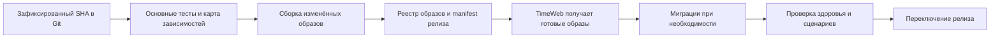

# Рекомендации по развитию Bag of Holding

**Дата:** 4 октября 2026 года. **Проект:** `C:\Projects\dnd_cards`. **Проверенный коммит:** `4549fb3c903659d3fe2beb272f7f903a731f7388`.

Этот отчёт фиксирует исходный аудит. После поручения на реализацию ход работ и фактические результаты ведутся отдельно: [выполнение плана](execution/README.md), [машинный реестр](execution/progress.json).

## Что я рекомендую сделать первым

Наибольший ожидаемый выигрыш дадут три направления: сократить повторную сборку каталога при игровых командах, собирать и доставлять только изменившиеся компоненты, заменить фиксированный узкий набор проверок на основной набор пользовательских сценариев. Полная перепись проекта для этого не нужна.

У проекта уже есть полезная основа: разделение frontend/backend/rules-worker, ленивая загрузка страниц, кеширование API, каноничные компоненты сущностей, авторитетные команды, сохранённые решения и закреплённые артефакты правил. Улучшения должны развивать эти решения. Упрощение ценой повторного броска после перезагрузки или расхождения листа и боя неприемлемо.

| Приоритет | Работа | Ожидаемый результат | Ориентировочная трудоёмкость |
|---|---|---|---|
| P0 | Измерение игровых команд и исправление выбора проверок по изменениям | Видно, где теряется время; изменения движка не проходят без нужных тестов | 2–4 рабочих дня |
| P0 | Изоляция тестовых БД и карантин опасных старых сценариев | Тесты не очищают рабочие данные | 1–2 дня |
| P1 | Пакетная загрузка зависимостей и кеш каталога по версии | Быстрее начало боя, действие и экипировка | 4–8 дней |
| P1 | Основной набор тестов с настоящим backend и worker | Проверяются реальные сценарии четырёх основных разделов | 4–7 дней |
| P1 | Сборка образов в CI, реестр и выкатка по компонентам | Сервер получает готовые образы; frontend не перезапускает весь сервис | 4–7 дней |
| P1 | Диагностика 403 и единый сервис изображений | Понятная причина отказа, корректные ошибки и хранение результата | 2–4 дня без переноса инфраструктуры |
| P2 | Сокращение боевого клиентского графа и пересчётов | Быстрее открытие и взаимодействие на слабых устройствах | 4–8 дней |
| P2 | Снимки, квитанции команд и архивирование БД | Управляемый рост хранения без потери истории | 5–10 дней после измерений |
| P2 | Поэтапное удаление старых функций и разбор крупных модулей | Меньше сопровождения и противоречащих реализаций | 1–3 недели по частям |

Это оценка объёма инженерной работы, а не измеренная продолжительность будущего выполнения агентами. Направления частично параллельны; сроки не следует просто складывать. Точность оценок повысится после первого этапа измерений.

## На чём основан отчёт

Изучены исходники, маршруты, сборка, инфраструктурные сценарии, модели хранения, CI и тестовые конфигурации. Выполнены локальная production-сборка frontend и адресный запуск пяти тестовых файлов. На сервер TimeWeb аудит не подключался, production не менял, платные запросы OpenAI не выполнял. Реальные p50/p95 сервиса, размер production БД и причина конкретного 403 пока **не измерены**.

| Наблюдение | Результат | Как его интерпретировать |
|---|---|---|
| Production-сборка frontend | Успешна, 112,16 с; этап Vite 30,07 с | Один локальный запуск на этом компьютере; это не время выкатки |
| Entry JavaScript | 795 117 байт исходного bundle, 231 511 байт gzip | Есть смысл уменьшать общие зависимости оболочки |
| JS библиотеки с entry и статическими зависимостями | 294 343 байта gzip | Расчёт по сборке, без API, изображений и динамических импортов |
| JS листа / боя с entry | 759 104 / 779 700 байт gzip | Сложный игровой граф существенно тяжелее библиотеки |
| Полный dist | 168 974 643 байта | Размер дистрибутива; браузер не скачивает всё сразу |
| Адресные тесты | 26 прошли, 1 упал, 13,97 с | Падает архитектурная граница rules-core → старый engine/mvp; это не полный регресс |
| Tracked-файлы | 4 259; около 462 тыс. строк исходников и тестов | Комментарии и пустые строки включены; это не размер исполняемого кода |
| Наборы проверок | 250 Go-файлов, 738 `*.test.ts(x)`, 9 browser spec-файлов | Число файлов не равно числу сценариев или качеству покрытия |

Материалы для проверки: [метрики сборки](runtime-build-metrics.json), [инвентаризация Git-файлов](inventory.json), [локальные размеры](local-disk-inventory.json), [производительность](runtime-findings.md), [выкатка и БД](deployment-database-findings.md), [тесты](tests-findings.md), [очистка и OpenAI](cleanup-openai-findings.md).

## 1. Загрузка страниц, начало боя и игровые действия

### Серверный путь — наиболее содержательный кандидат

`backend/roguelike_worker_catalog.go` собирает каталог итерациями: движок сообщает о недостающих сущностях, backend читает их и снова обращается к движку. Для начала боя предусмотрено до 16 проходов, для лагерных действий, отдыха и инвентаря — до 32. Это верхние границы, **не измеренное число запросов каждого боя**. Зависимости читаются отдельными запросами; растущий каталог сериализуется повторно.

При изменениях экипировки, затрагивающих максимумы ресурсов, пересчёт проходит из `character_runtime_command.go` через `roguelike_camp_inventory.go` внутри транзакции с блокировкой персонажа. Это условная ветка, не каждый equip/unequip. Чем дольше собирается каталог и отвечает worker, тем дольше другие команды ждут эту блокировку. Это подтверждённая конструкция кода; её вклад в задержки нужно измерить.

Рекомендуемая последовательность:

1. Замерять отдельно загрузку персонажа, SQL, сбор зависимостей, ожидание worker, вычисление правил, ожидание блокировки, запись и размер ответа.
2. Загружать найденные зависимости пакетами по типам сущностей; собирать их транзитивное замыкание и хранить по версии/хэшу. Для старого боя использовать его закреплённый каталог, для нового — актуальный разрешённый набор.
3. Переиспользовать в worker неизменяемые индексы и подготовленные данные по хэшам артефакта и каталога/контента, версии сборки; для личных данных учитывать область прав и сессию. Ограничить память и число версий; не кешировать мутируемый runtime персонажа между командами.
4. Только после этого сокращать критическую секцию: подготовить неизменяемые входы заранее, внутри короткой транзакции повторно проверить права, фазу, ревизии персонажа/забега и fingerprint входов. При доказанно тех же входах использовать авторитетно рассчитанную стоимость и результат, затем атомарно сохранить состояние и квитанцию. Под блокировкой не выполнять worker I/O и полную пересборку. Проигравшая гонку команда не должна повторно оплачивать действие или менять случайность.

Просто вынести проверку и списание из транзакции нельзя. Также нельзя ускорять сервер доверием к рассчитанному клиентом результату.

### Клиентский путь

Разделение страниц на чанки, кеш GET и ограниченный PWA precache уже есть. Советы «добавить lazy» и «включить gzip» без уточнений здесь мало полезны: App.tsx использует lazy, Caddy включает сжатие, nginx сохраняет immutable assets старых релизов.

Нужны:

- Профиль общих провайдеров App и их импортов: игровые диалоги и подготовка механики должны загружаться по необходимости. Библиотека и бумажный лист сохраняют каноничные превью.
- Один согласованный кеш сущностей и сборки персонажа по ревизиям. Не добавлять ещё один независимый источник правил. Существующие `apiCache`, `ownedItemCache`, `assemble` нужно расширять, сохраняя разграничение публичных и личных данных.
- Устранение лишней подготовки перед экипировкой: `SheetEquipmentPanel` каждый раз строит полного каноничного участника. Перед серверной инициализацией боя `SoloCombatPage` также собирает персонажа ради инициативных приёмов. Переиспользовать подготовленные данные и общие операции; после команды применять авторитетный ответ и адресно инвалидировать проекции. Безусловная полная пересборка после сохранения в аудите не установлена.
- Профиль React на листе и в бою: разделить подписки на состояние, мемоизировать дорогие производные по ревизии, не пересчитывать геометрию для каждой неизменившейся цели при обычном рендере. Виртуализация нужна только там, где профилирование показывает проблему длинного списка; превью, фокус и режим иконка/строка сохраняются.
- Оптимизация карт и иллюстраций: подготовленные WebP/AVIF-варианты, размеры под реальное отображение, URL с хэшем. В public карты занимают около 63 МБ, аудио 61 МБ. Перенос медиа в object storage/CDN прежде всего уменьшит доставляемые образы; первый экран улучшится только для реально загружаемых файлов.

**Как принять результат:** одинаковые персонажи и RNG, холодное и тёплое открытие, простой и насыщенный бой; измерять минимум 30 повторений серверных сценариев, браузер — отдельно с фиксированной сетью и CPU. Первичная цель — уменьшить p95 выбранных игровых команд не менее чем на 30% относительно воспроизводимого baseline без изменения результатов. Это цель эксперимента, не обещание уже найденного ускорения. Дополнительные ориентиры после согласования baseline: LCP до 2,5 с на целевом профиле, INP до 200 мс, тёплая обычная команда до 300–500 мс, открытие готового боя до 2 с.

## 2. Быстрая и раздельная выкатка на TimeWeb

Сейчас `infra/deploy-release` делает полный pg_dump, последовательно собирает три образа и запускает общий Compose-релиз. Сервисы физически разделены, но связаны одним SOURCE_COMMIT, а проверки ожидают одинаковый SHA. В CI нет задачи доставки на TimeWeb. В быстром выборе тестов есть отдельный дефект: изменения worker определяются только по `frontend/worker/*`, хотя он импортирует большую часть игрового кода из `frontend/src`; удаления не входят в diff-filter.

### Рекомендуемый вариант: сохранить VPS, перенести сборку в CI

Выбирать SHA при старте выпуска и не менять его в процессе. Для CI это должен быть коммит, доступный в удалённом репозитории; одного локального commit для GitHub Actions недостаточно. «Последняя версия» означает последний выбранный **прошедший проверки** SHA нужной ветки, а не подвижный `latest`.

Состав изменений считать от последнего **успешно развёрнутого manifest** до выбранного SHA. Сравнение только с предыдущим коммитом или уже обновлённым origin/main может пропустить накопленные изменения после неудачного выпуска. Допускать один активный deploy; не отменять начатую миграцию или переключение новым push. Очистка образов и артефактов учитывает ссылки всех сохраняемых manifest.

Собирать образы с кешами зависимостей и отдельными cache scope, хранить по digest. На VPS — pull и перезапуск только изменившихся сервисов. Релиз хранит общий release SHA, исходный SHA каждого образа, digest, версию API/worker-протокола и хэш правил. Переиспользованный backend должен честно показывать SHA своей сборки, а не новый SHA frontend. [Docker документирует раздельные scope для кешей образов](https://docs.docker.com/build/cache/backends/gha/).

| Изменение | Что собирать и проверять |
|---|---|
| Только CSS/страница без общих игровых импортов | Frontend и его сценарии |
| Только Go API | Backend; тесты API и контракт с текущим worker |
| Только оболочка worker | Worker, контракт и replay |
| Общий engine/rules-core/character/solo-combat/roguelike | Обычно frontend **и** worker; тесты механик и продолжения старого боя |
| Общие JSON-каталоги из backend | Все реальные потребители по графу импортов |
| Миграции | Backend/migration job и проверки старых/новых данных; иногда другие компоненты |
| Неизвестная общая зависимость | Консервативно все компоненты |

Полная независимость frontend и движка сейчас невозможна: они используют общие исходники правил. Для начала достаточно корректного определения затронутых компонентов. Позже общий пакет правил с явным протоколом упростит границы; перенос в другой репозиторий не обязателен.

Сохранить существующую защиту старых вкладок и rules-artifacts. При rolling-обновлении нужен период совместимости старого frontend с новым backend. Изменяющую данные миграцию нельзя откатить простым возвратом Docker image. Применять expand/contract и отдельный проверенный restore-план. Frontend-only выпуск не обязан ждать нового полного дампа БД; существующее резервное копирование должно при этом иметь проверенные RPO/RTO и свежесть. Для релиза с миграцией нужен отдельный pre-migration backup/restore gate.

Включение автодеплоя по push — отдельное решение владельца после локальной проверки нового конвейера. До этого можно подготовить всё и запускать выпуск вручную по SHA. Настоящий аудит не включает commit, push или активацию выкатки.

### Альтернативы

- **Малое изменение:** оставить сборку на VPS, добавить кеш, минимальные build contexts и выбор сервисов. Дешевле внедрение, но CPU и сеть сервера остаются в критическом пути.
- **Timeweb App Platform:** подключение репозитория и автоматическая сборка предусмотрены самим сервисом. Это ближе к Railway по интерфейсу. Для этого проекта отдельно проверить private networking, внешний PostgreSQL, SSE, длительную генерацию, постоянное хранение старых rules-artifacts и поддержку общего корня монорепозитория. Их совместимость с текущим тарифом не установлена. [Описание App Platform](https://timeweb.cloud/docs/apps/how-it-works).

Цель после baseline: frontend-only выпуск с тёплым кешем до 2–3 минут без перезапуска backend/worker; полный обычный выпуск до 5–8 минут, время миграций и восстановления считать отдельно. Это проектные ориентиры.

## 3. OpenAI, ошибка 403 и VPN

**Установка VPN-сервера на той же машине TimeWeb сама по себе не изменит исходящий адрес backend.** Для другой точки выхода требуется внешний egress. В проекте уже реализованы `HTTPS_PROXY`/`NO_PROXY` и `OPENAI_BASE_URL` в `backend/openai_service.go`; сначала нужно установить реальную причину отказа.

Проверять нужно API `api.openai.com`, а не открытие сайта ChatGPT. Есть три существенно разных случая:

| Причина | Что делать |
|---|---|
| 403 возвращает сам сервис: contentAdminAuth | Проверить права пользователя на генерацию; сеть не поможет |
| Ответ API о правах организации/модели | Проверить проект ключа и доступ к Images API; успешный GET моделей недостаточен |
| Региональный 403 либо сетевой/edge отказ | Зафиксировать безопасный error.code, request ID и точку выхода; выбирать поддерживаемое размещение/доступ или решать сетевой маршрут |

OpenAI документирует региональный 403 и список поддерживаемых территорий; Россия в нём не указана. Иностранный IP не делает любой сценарий использования допустимым. Региональное ограничение нельзя обещать устранить обычным VPN. Для устойчивого решения нужен поддерживаемый сценарий размещения и доступа либо провайдер, доступный в нужном регионе. [Коды ошибок](https://developers.openai.com/api/docs/guides/error-codes), [поддерживаемые территории](https://developers.openai.com/api/docs/supported-countries). Для GPT Image может понадобиться проверка организации; доступ конкретного аккаунта в аудите не проверялся. [Генерация изображений](https://developers.openai.com/api/docs/guides/image-generation).

Для обычной сетевой проблемы наиболее компактный вариант — контролируемый proxy только для клиента генерации. Следующий по сложности — отдельный сервис генерации с приватным соединением. Tunnel всего хоста затронет SSH, БД, Docker и Yandex Storage, поэтому усложнит эксплуатацию. Настройку нужно сначала проверять на тестовом окружении, включая DNS, TLS, proxy bypass внутренних адресов, поведение при потере egress и откат конфигурации. Не отключать проверку TLS.

Есть и ошибки самого контура генерации, которые стоит исправить независимо от VPN:

- Старый `/cards/generate-image` может ответить успехом и сохранить заглушку при отказе провайдера; успешный base64-ответ может попасть непосредственно в Card.ImageURL. Общий `/images/generate` уже использует object storage. Нужен единый путь.
- `image_controller.go` логирует полученный URL целиком, хотя это может быть весь PNG в base64. Логировать только метаданные и request ID.
- Вынести долгую работу в задания: запрос возвращает ID, интерфейс показывает состояние, результат хранится в object storage. Нужны лимиты и защита от повторного платного запуска.
- Timeout после отправки запроса — неизвестный результат, а не доказанный провал. Локальная идемпотентность задания не гарантирует exactly-once у внешнего API; автоматический повтор такого запроса может стоить денег.

## 4. Основной и расширенный наборы тестов

Не требуется писать все тесты заново. Нужны ясные группы и один манифест, который одинаково используют локальный запуск и CI.

**Основной набор** — на каждое изменение и перед выпуском. Целевой бюджет после настройки стенда: 5–8 минут. TypeScript/сборка затронутых пакетов, безопасность и auth, контракты worker/API, несколько общих примитивов, PostgreSQL integration и короткий browser smoke с настоящими backend/worker. Проверять:

1. Библиотеку: поиск, фильтр, пагинацию, каноничное превью, права редактора, режим иконка/строка.
2. Создание персонажа: выбор происхождения/класса/характеристик/навыков/экипировки, сохранение, перезагрузку и те же значения на листе.
3. Бумажный лист: создание, редактирование, сохранение, повторное открытие, подготовку печатного экспорта.
4. Экипировку: надевание/снятие, изменение КД/ресурсов, недопустимую операцию без частичного изменения, повтор команды.
5. Забег: старт, вход в бой, действие/заклинание, влияние на бросок, перезагрузку с незавершённым выбором, подтверждение без повторного списания и броска, завершение боя и возврат.
6. Торговца и отдых: покупку/продажу/ресурсы и подготовку заклинаний, поскольку они обслуживают забеги и лист.
7. Доступ: чужой персонаж/бой, истёкшая сессия, две одновременно отправленные команды.

Для расширения механики обязательны две сущности на одном примитиве с разными данными — как требует AGENTS.md. Проверки не должны строиться только на названии конкретной способности.

**Расширенный набор** — nightly и перед изменениями правил, миграций, хранения и протокола; ориентир 20–40 минут после шардирования. Разные классы/уровни/мультикласс, реакции/спасброски/урон/эффекты/смерть/движение, геометрия, party, восстановление после сбоев, replay старых артефактов, миграции старого снимка, мобильный интерфейс, клавиатура, экспорт и performance budgets. Ошибка блокирующего контракта не превращается в допустимую только потому, что тест выполняется ночью.

**Исторические certification suites** — отдельная ручная диагностика. Они не должны автоматически присваивать ручной статус «проверено» и не заменяют функциональные тесты. Действующий `importBoundary.test.ts` относится к архитектуре, а не к старой сертификации: сейчас он падает из-за 17 файлов с прямыми импортами engine/mvp за пределами адаптера. Нужно согласовать реальную границу и исправить зависимости; удаление теста ради зелёного CI проблему не решает.

Сейчас обычные browser-тесты преимущественно подменяют API, а real-backend canary запускается вручную. Оба слоя полезны, но подмена API не проверяет транзакции и серверную авторизацию. Новый основной full-stack smoke должен запускаться на отдельной локальной/CI БД, не на production. Старый `backend/tests/conftest.py` содержит автоматический DELETE FROM cards — его необходимо изолировать или отправить в карантин до любого массового запуска.

Пустой выбор тестов и пропуск обязательных PostgreSQL-проверок из-за отсутствующего DSN должны завершать основной runner ошибкой. Успешное выполнение с нулевым фактическим покрытием недопустимо.

## 5. Размер БД и рост хранения

Размер production БД пока неизвестен. Локальная `.local-postgres` занимает 22,15 GB, но содержит файлы кластера и может включать несколько БД, WAL и вспомогательные данные. Это не основание обещать сокращение production на определённый процент.

Начать с read-only отчёта: таблицы/индексы/TOAST, живые и мёртвые строки, средние и верхние размеры JSONB, размер WAL, число старых забегов, рост за сутки/неделю. Затем планы самых дорогих запросов на локальном восстановленном снимке.

Подтверждённый кандидат — повторное хранение крупных состояний: квитанции команд забега содержат полный ответ с забегом, персонажем и combat_state; рядом хранятся актуальное состояние, каталог и история. Есть и канонические хранилища с JSONB и canonical_bytes, но соответствующий транспорт отключён по умолчанию: нельзя объявлять его главным источником фактического роста.

Рекомендуемые изменения:

- Для новых данных — общий неизменяемый каталог по хэшу и ссылки на него, а не одинаковые копии. Разделить механику и оформление: изменение иконки не должно размножать боевое содержимое или изменять исторический артефакт.
- Квитанцию команды разделить на компактную запись идемпотентности и архивируемый результат. Сохранить command ID, fingerprint, outcome, revision, хэш/ссылку и возможность вернуть прежний результат. Нельзя удалить старую квитанцию по TTL и разрешить той же команде выполниться снова.
- Для истории — сохранить уже реализованную модель baseline + события `roguelike_combat_events`; при необходимости добавить checkpoints после проверки стоимости восстановления с закреплённым worker/RNG. Уже сохранённые артефакты не переписывать молча.
- Искать data URLs в полях карт/изображений и мигрировать в object storage только после проверки байтов и ссылок. Обычные изображения уже хранятся вне БД, тотальный перенос здесь не нужен.
- Политики для удалённых документов, завершённых забегов, логов и резервных копий задавать отдельно. Архив должен оставаться доступен для восстановления и replay; удаление личных данных — отдельная пользовательская операция.
- Индексы добавлять по фактическим запросам. Проверять дубли, редко используемые индексы и bloat; «добавить индекс на всё» увеличит БД и стоимость записи.

Обычный VACUUM делает место доступным для повторного использования внутри PostgreSQL; существенное возвращение места ОС обычно требует иных операций. VACUUM FULL переписывает таблицу, требует свободного диска и блокирует работу — это операция обслуживания, не регулярная кнопка очистки. [Документация PostgreSQL 15](https://www.postgresql.org/docs/15/routine-vacuuming.html).

## 6. Очистка репозитория и продукта

### Репозиторий и локальный диск

Нужно различать четыре объёма: текущие Git-файлы, история Git, Docker-контекст и локальные результаты работы. В local output — 13,46 GB, outputs — 19,35 GB, tmp — 1,07 GB. Большинство не входит в коммит, а production-архив собирается из tracked-файлов. Их очистка освободит локальный диск, но не обязательно уменьшит релиз.

Практические действия:

- Утвердить один каталог результатов и правила хранения: delivery/originals/evidence/cache. Оригиналы изображений и доказательства проверки сохранять; воспроизводимые кеши удалять по отдельному списку.
- Доработать `.gitignore` для output/tmp и `.dockerignore` для локальной БД, backup, node_modules и артефактов. Использовать минимальный контекст/allowlist; проверить реальные COPY и embed-зависимости.
- Вынести крупные production-медиа в версионированное object storage либо отделить слой assets от приложения. Хранить manifest хэшей и источники необходимых лицензий.
- Документацию разделить на действующие правила/архитектуру, архив завершённых задач и генерируемые отчёты. Ввести короткий индекс с датой проверки. Не определять актуальность только по возрасту: `docs/data-driven-rules.md` важнее исторических обзорных файлов.
- Не удалять целиком `src/mvp` и `src/canon` из-за исторических названий: production использует оттуда контракты и проекции.
- Git pack занимает 2,80 GiB, loose objects 515 MiB, временные объекты ещё 153 MiB. Перемещение файла в archive внутри Git не уменьшает историю. Переписывание истории — отдельная операция со всеми клонами/ветками; для ускорения обычной CI-сборки сначала достаточно ограничить checkout и исключить ненужные данные из context.

### Разделы сервиса

| Сохранить | Действие |
|---|---|
| Библиотека, Персонажи, Бумажный лист, Забеги | Основные продуктовые сценарии, отдельные smoke и performance budgets |
| Профиль, Настройки, Экспорт, Инициатива | Сохранить; второстепенная навигация и загрузка по запросу |
| Редакторы предметов/заклинаний/эффектов, изображения | Сохранить как обслуживающие библиотеку функции, можно объединить точку входа |
| Магазин и игровые операции инвентаря | Сохранить: ShopDetail используется забегами и листом |
| Отдельные группы/общий инвентарь/страница шаблонов | Кандидаты на скрытие и последующее удаление после проверки данных и пользователей |
| Старые персонажи v1/v2 | UI уже перенаправляет в Forge, но backend API зарегистрирован; нужна миграция/экспорт и прекращение поддержки по этапам |
| Лаборатория правил, руководства, отдельные онлайн-встречи | Возможный developer/admin profile; общий боевой код и тестовый стенд сохранять |
| Отдельный мобильный интерфейс | Решать после проверки PWA и пользователей; не удалять только потому, что вкладка не названа |

Скрыть навигацию, отключить создание новых старых объектов, предложить экспорт/перенос, затем убрать endpoints и недостижимый код. Удаление таблиц — последнее отдельное решение. Пример ловушки: удаление страницы «Шаблоны» допустимо, но данные шаблонов всё ещё нужны выбору искусности оружия.

## 7. Упрощение и рефакторинг

Крупнейшие модули: `rules-core/handler.ts` — 13 459 строк, `engine/execute.ts` — 6 619, `solo-combat/engine.ts` — 6 173, `SheetActionsPanel.tsx` — 3 565, `CardLibrary.tsx` — 2 959. Размер сам по себе не доказывает ошибку, но здесь сочетается с подтверждённым нарушением границы импортов и пересекающимися путями исполнения.

Предлагаю сначала зафиксировать слои, затем выделять небольшие вертикальные части:

1. **Данные:** определения сущностей, справочники, теги, декларации операций и цены.
2. **Правила:** чистые операции, предикаты, фазы и продолжения; без HTTP, React и БД.
3. **Приложение:** сборка входов, права, идемпотентность, транзакции и сохранение результата.
4. **Представление:** каноничные карточки, превью, диалоги, анимации и аудио.

Первый хороший срез — экипировка и пересчёт ресурсов; второй — действие и сохранённое влияние; третий — отдых. Каждый перенос сопровождается сравнением старого и нового результата на одинаковом вводе, проверкой второй сущности и replay. Сначала сохранить семантику, затем улучшать реализацию. Уменьшение числа строк не является самостоятельным критерием успеха.

Не создавать универсальный «метаконструктор всего» вместо повторяющихся компонентов. Общие CRUD-проекции и формы оправданы для одинаковых полей; различия прав, семантики и превью остаются явными. Аналогично постепенно унифицировать HTTP-клиенты и ошибки, сохранив уже существующую изоляцию личных данных в кеше.

Вынос общих правил в workspace package полезен для сборки и независимого тестирования; отдельный микросервис или новый язык движка сейчас не обоснован измерениями. Неиспользуемость зависимостей доказывать графом импортов, динамическими маршрутами и smoke; отсутствие строки поиска не является достаточным основанием удаления.

## 8. Дополнительные улучшения

**Наблюдаемость.** Связать request ID браузера, backend и worker; добавить длительность фаз, размер запроса/ответа, SQL count, cache hit/miss и lock wait. Не записывать prompt, base64, токены и полные личные листы в обычные логи. Раздельные health/readiness для процессов, БД, версии протокола и наличия закреплённых артефактов сделают релизные ошибки понятнее.

**Восстановление.** Проверять не только создание backup, но и восстановление БД вместе с rules-artifacts, media manifest и конфигурацией. Одного pg_dump недостаточно для полной воспроизводимости старого боя. Согласовать допустимую потерю данных и время восстановления.

В текущем release runner не найдена политика удаления старых дампов: сохранение пяти релизов и 90-дневная очистка frontend assets на них не распространяются. Политику backup следует задать отдельно и проверить восстановлением до включения очистки.

**Единая карта зависимостей.** Она должна определять и тесты, и сборку, и выкатку; три отдельных набора эвристик быстро расходятся. Неизвестные изменения безопасно расширяют набор проверок. Это особенно важно для общих JSON-каталогов из backend, которые импортирует frontend.

**Контроль расходов на изображения и хранение.** Лимит одновременных задач, явный статус платной операции, метрики стоимости/объёма, хранение медиа по хэшу. Это уменьшит случайные повторы и накопление одинаковых файлов.

## Порядок реализации

1. **Основание:** измерения, изолированный тестовый стенд, карта зависимостей и фактический контракт слоёв.
2. **Первые улучшения:** пакетный каталог, устранение лишних пересчётов, основной E2E, диагностика генерации, сборка по компонентам.
3. **Доставка:** проверенный manifest, реестр образов, локальная репетиция mixed-version выпуска и отката; затем отдельно разрешённое подключение TimeWeb.
4. **Хранение и код:** compact receipts, архивирование, media, выключение старых продуктовых веток и небольшие последовательные рефакторинги.

Подробные задания, зависимости, критерии приёмки и откат находятся во втором отчёте — [плане для агентов](agent-plan.json). Все приведённые изменения остаются рекомендациями: в рамках аудита изменены только файлы отчётов и локальные результаты сборки.
