# Legacy-движок листа и унифицированная система эффектов

> Этот документ описывает legacy executor существующих character sheets.
> Сертифицированный micro-MVP использует `frontend/src/rules-core` →
> `PersistentRulesSession` → domain events/replay → IndexedDB; его актуальная
> архитектура описана в `docs/rules-engine-migration-plan.md`. Серверный command
> worker пока не реализован, поэтому сетевой encounter всё ещё использует
> legacy relay и не является server-authoritative rules runtime.
>
> Обязательная effects-first граница авторинга зафиксирована в
> [`effects-first-authoring-invariants.md`](./effects-first-authoring-invariants.md),
> а актуальные отклонения и production-гейты — в
> [`effects-first-compliance-audit-2026-08-05.md`](./effects-first-compliance-audit-2026-08-05.md).

## Содержание

1. [Для кого и как читать](#1-для-кого-и-как-читать)
2. [Карта системы](#2-карта-системы)
3. [Словарь терминов](#3-словарь-терминов)
4. [Унифицированная механика](#4-унифицированная-механика)
5. [Сборка персонажа](#5-сборка-персонажа)
6. [Состояния персонажа](#6-состояния-персонажа)
7. [Формирование листа действий](#7-формирование-листа-действий)
8. [Выполнение действия](#8-выполнение-действия)
9. [Атаки, спасброски и проверки](#9-атаки-спасброски-и-проверки)
10. [Урон, лечение и концентрация](#10-урон-лечение-и-концентрация)
11. [Эффекты и состояния](#11-эффекты-и-состояния)
12. [События, триггеры и реакции](#12-события-триггеры-и-реакции)
13. [Ресурсы, ходы и отдыхи](#13-ресурсы-ходы-и-отдыхи)
14. [Предметы, экипировка и настройка](#14-предметы-экипировка-и-настройка)
15. [Выборы](#15-выборы)
16. [Формулы и переменные](#16-формулы-и-переменные)
17. [Сохранение результата](#17-сохранение-результата)
18. [Десктопный и мобильный листы](#18-десктопный-и-мобильный-листы)
19. [Полный справочник полей](#19-полный-справочник-полей)
20. [Матрица поддержки payload](#20-матрица-поддержки-payload)
21. [Как добавить механику](#21-как-добавить-механику)
22. [Сквозные примеры](#22-сквозные-примеры)

---

## 1. Для кого и как читать

Документ рассчитан на три роли:

- владелец продукта — чтобы видеть границы системы и путь изменения состояния;
- разработчик — чтобы понимать, в какой конвейер должна попасть новая механика;
- дизайнер контента — чтобы выразить правило данными через конструктор или JSON.

Если нужно быстро понять систему, прочитайте главы 2, 5, 8, 11, 12 и 13.
Если нужно добавить новую карточку, начните с глав 4, 19, 20 и 21.

Здесь используются английские имена фактических полей: `activation`, `effects`,
`resolution`, `payload`, `RuntimeState`. Русский текст объясняет их назначение.

---

## 2. Карта системы

Движок разделён на два связанных, но разных конвейера:

1. **Build pipeline** вычисляет постоянные правила персонажа.
2. **Runtime pipeline** выполняет действия и меняет текущее состояние.

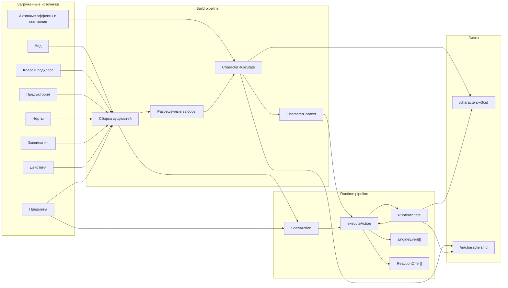

Главное разделение:

| Build | Runtime |
|---|---|
| Характеристики, владения, навыки, известные заклинания, чувства, скорости | HP, временные HP, заряды, ячейки, экипировка, инвентарь, активные эффекты |
| Результат — `CharacterRuleState` | Результат — новый `RuntimeState` |
| Пересчитывается из источников | Клонируется и изменяется действием |
| Обрабатывает `grant_*`, `value_method`, постоянные `modifier` | Обрабатывает урон, лечение, ресурсы, состояния, временные модификаторы |

Один `payload` может иметь только build-смысл, только runtime-смысл или участвовать
в обоих путях. Например, `grant_spell` нужен при сборке, а `damage` — при выполнении
действия. `modifier` используется обоими конвейерами.

---

## 3. Словарь терминов

| Термин | Значение |
|---|---|
| Сущность | Предмет, действие, заклинание, эффект, черта или другой объект библиотеки. |
| Носитель | Сущность, внутри которой сохранён объект `mechanics`. |
| Механика | Декларативное описание момента активации и результата. |
| Interaction | Один способ разрешения: автоматически, атакой, спасброском или проверкой. |
| Payload | Атомарный результат: урон, лечение, изменение ресурса, выдача владения и т.д. |
| Build-грант | Payload, меняющий итоговую сборку персонажа: `grant_spell`, `grant_feat` и другие. |
| Пассив | Механика, которая участвует в расчётах без нажатия игрока. |
| Активный эффект | Запись в `RuntimeState.activeEffects`, имеющая источник и срок жизни. |
| Состояние | Частный активный эффект с механикой `kind: "condition"`. |
| Ресурс | Именованный числовой пул в `resources` и `maxResources`. |
| Событие домена | Сигнал внутри движка, по которому ищутся триггеры и реакции. |
| Событие журнала | Человекочитаемый результат `EngineEvent`, сохраняемый в журнал персонажа. |
| Богатая цель | Цель, для которой переданы её `CharacterContext` и `RuntimeState`. |
| Dummy-цель | Только КЗ и модификаторы спасбросков без изменяемого состояния. |

Событие домена и событие журнала — не одно и то же. `hit` запускает слушателей,
но в журнал попадает объект типа `roll`. `damage_taken` запускает реакции, а в
журнале отображается `damage`.

---

## 4. Унифицированная механика

### 4.1. Мысленная модель

Любая механика отвечает на четыре вопроса:

1. **Когда?** — `activation`.
2. **По кому?** — `targeting` и `who`.
3. **Как определить исход?** — `resolution`.
4. **Что изменить?** — массив payload в `result`, `on_hit`, `on_fail` и т.д.

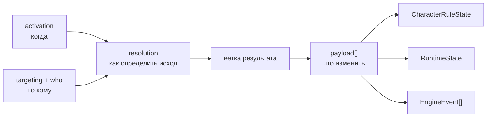

### 4.2. Верхний уровень

Минимальный объект:

```json
{
  "id": "second-wind",
  "name": "Second Wind",
  "kind": "action",
  "activation": {
    "mode": "active",
    "cost": [{ "resource": "bonus_action", "amount": 1 }]
  },
  "interactions": [
    {
      "resolution": "auto",
      "result": [{ "kind": "healing", "amount": "1d10 + self_level" }]
    }
  ]
}
```

В сохранённом контенте основной массив часто называется `effects`. Каноническая
схема использует имя `interactions`. Нормализация приводит оба варианта к формату,
который читает исполнитель.

### 4.3. Режимы активации

| `activation.mode` | Фактическое поведение |
|---|---|
| `passive` | Механика собирается как источник постоянных правил и модификаторов. |
| `active` | Отображается как применяемое действие и запускается игроком. |
| `triggered` | Слушает событие; без стоимости и без `optional` исполняется автоматически. |
| `reaction` | Слушает событие и формирует предложение игроку. |

У `triggered` со стоимостью и у `triggered` с `optional: true` также формируется
предложение, потому что движок не может применить их без решения игрока.

### 4.4. Способы разрешения

| `resolution` | Ветка результата |
|---|---|
| `auto` | `result` или `results` |
| `attack_roll` | `on_hit`, `on_crit`, `on_miss` |
| `save` | `on_fail`, `on_success` |
| `ability_check` | `result`, `on_success`, `on_fail` |

`choice` может находиться как payload внутри результата или как отдельный элемент
массива `effects`/`interactions`.

---

## 5. Сборка персонажа

### 5.1. Входные данные

Build pipeline получает:

- черновик персонажа: уровень, характеристики и `resolvedChoices`;
- собранные сущности вида, класса, подкласса, предыстории и черт;
- действия, эффекты и заклинания, выданные этими сущностями;
- runtime-источники, которые должны влиять на производные значения листа;
- механики доступных предметов с уже применённым гейтом экипировки и настройки.

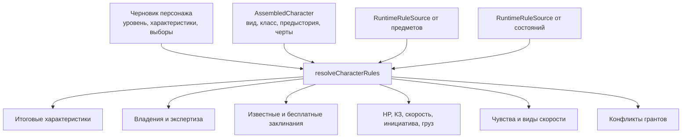

### 5.2. Порядок вычислений

Порядок важен:

1. Добавляются прямые выборы навыков класса.
2. Добавляются владения предыстории и класса.
3. Предварительно собираются `grant_ability_score` и `value_method` характеристик.
4. Вычисляются итоговые значения характеристик.
5. Вычисляются модификаторы характеристик и бонус мастерства.
6. Обходятся механики эффектов, действий и runtime-источников.
7. Разворачиваются сделанные `choice`.
8. Применяются гранты, чувства, скорости, искусности и числовые модификаторы.
9. Вычисляются навыки и спасброски.
10. Вычисляются производные значения листа.

### 5.3. Характеристики

`grant_ability_score` прибавляется к базовой характеристике. Положительное
увеличение не поднимает её выше 20, если сама база не была выше 20.

`value_method` не прибавляет значение, а предлагает альтернативный метод. Итог:

```text
max(база + допустимые прибавки, метод 1, метод 2, ...)
```

Поэтому предмет «Сила становится 19» моделируется так:

```json
{
  "kind": "value_method",
  "target": "str",
  "formula": "19"
}
```

Такой метод может дать значение выше 20.

### 5.4. Владения и конфликты

Гранты собираются по категориям:

- навыки;
- спасброски;
- инструменты;
- языки;
- оружие;
- доспехи;
- заклинания;
- черты.

Повторная выдача обычного владения не создаёт второй бонус. Экспертиза хранится
отдельно и добавляет ещё один бонус мастерства. Неповторяемая черта не должна
выдаваться повторно; повторяемость берётся из метаданных черты.

### 5.5. Производные значения

| Значение | Фактическая база |
|---|---|
| Бонус мастерства | Уровень персонажа |
| Максимум HP | Кость хитов класса, уровень, Телосложение, `modifier max_hp` |
| КЗ | Базовый метод, методы без доспеха, `set_value ac_base`, модификаторы; экипировка добавляется позднее в breakdown |
| Скорость | Скорость вида + `grant_speed walk` + модификаторы скорости |
| Инициатива | Модификатор Ловкости + модификаторы инициативы |
| Размер | Размер вида + постоянные модификаторы размера |
| Грузоподъёмность | Сила × 15 × множитель размера |
| СЛ заклинаний | 8 + бонус мастерства + модификатор заклинательной характеристики |
| Атака заклинанием | Бонус мастерства + модификатор заклинательной характеристики |

Нелинейные операции скорости `set`, `multiply`, `upgrade`, `downgrade` сворачиваются
после аддитивной базы. Состояние может таким способом установить скорость в 0.

---

## 6. Состояния персонажа

В приложении одновременно существуют три представления персонажа.

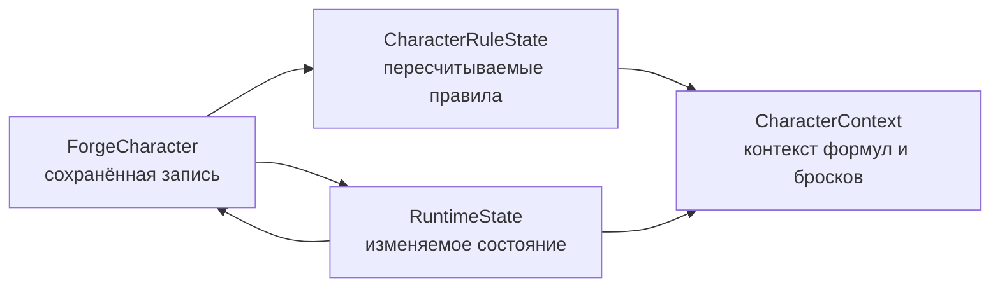

### 6.1. `CharacterRuleState`

Содержит вычисленные:

- характеристики и их модификаторы;
- бонус мастерства;
- владения и экспертизу;
- известные заговоры и заклинания;
- бесплатные использования заклинаний;
- бонусы навыков и спасбросков;
- максимум HP;
- КЗ без полного предметного breakdown;
- скорость, базовую скорость, размер и грузоподъёмность;
- чувства и дополнительные виды скорости;
- выбранные виды оружия для Weapon Mastery;
- конфликты грантов.

Это производное состояние. Его источник — сущности и выборы персонажа.

### 6.2. `RuntimeState`

```json
{
  "hp": { "current": 18, "max": 24, "temp": 5 },
  "resources": {
    "action": 1,
    "bonus_action": 1,
    "reaction": 1,
    "rage": 2,
    "spell_slot_1": 3
  },
  "maxResources": {
    "action": 1,
    "bonus_action": 1,
    "reaction": 1,
    "rage": 2,
    "spell_slot_1": 4
  },
  "equipment": {
    "main_hand": "weapon-card-id",
    "armor": "armor-card-id"
  },
  "inventory": [
    { "cardId": "potion-card-id", "qty": 2 }
  ],
  "activeEffects": [],
  "firedThisTurn": [],
  "firedThisRest": []
}
```

`executeAction` не изменяет переданный объект на месте. Он клонирует состояние и
возвращает новый объект.

### 6.3. `CharacterContext`

Контекст содержит значения, необходимые синхронному движку:

- модификаторы характеристик;
- бонус мастерства и уровень;
- уровни классов;
- модификатор заклинаний;
- базовую и итоговую скорость;
- размер;
- переменные;
- экипированные и известные карты;
- владения спасбросками и навыками;
- настройку на предметы;
- выбранные Weapon Mastery.

### 6.4. `ExecuteContext`

Дополняет контекст выполнения:

- цель;
- генератор случайных чисел;
- пассивные механики;
- триггерные механики;
- ответы на `choice`;
- уровень текущего каста;
- заранее загруженные `grant_effect`;
- механики Weapon Mastery;
- режим планирования кубов;
- принудительный исход спасброска для онлайн-боя.

Движок выполняется синхронно. Поэтому все внешние сущности, которые могут
понадобиться во время исполнения, UI загружает заранее.

---

## 7. Формирование листа действий

`SheetAction` — унифицированная строка действия на листе. В список попадают:

- базовые действия библиотеки;
- активные действия класса;
- активные эффекты вида;
- заклинания;
- активные механики предметов;
- действия, выданные через `grant_action`;
- действия контейнеров «Распаковать» и «Достать».

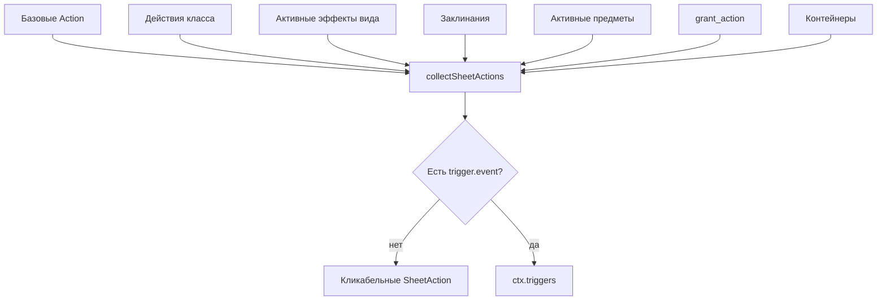

### 7.1. Нормализация активного действия

- Активная механика или реакция без явного массива `activation.cost` не
  становится действием листа и не проходит сертификацию. Движок не добавляет
  стандартную стоимость по умолчанию.
- `mechanics.uses` объявляет размер и восстановление виртуального пула
  `uses_<id>`, но не цену. Расход пула обязан быть явно записан как
  `activation.cost[{"resource":"self_uses"}]`; адаптер только связывает эту
  относительную ссылку со стабильным id сущности.
- Legacy-флаг `consumes_self` не имеет runtime-семантики. Саморасход объявляется
  ценой `activation.cost[{"resource":"self_item"}]`, которая связывается с
  конкретным экземпляром предмета.
- Боеприпас также должен быть явной контекстной записью `activation.cost`;
  оружие лишь поставляет выбранной записи id расходуемой карты.
- Заклинание получает оплату ячейкой или пулом бесплатного использования.

### 7.2. Доступность

До запуска UI проверяет:

- достаточно ли ресурсов;
- есть ли ячейка подходящего или более высокого круга;
- доступен ли бесплатный каст;
- есть ли требуемый предмет или боеприпас;
- находится ли нужное оружие в руке;
- не запрещены ли действие, бонусное действие, реакция или концентрация состоянием.

Окончательная атомарная проверка стоимости повторяется в `executeAction`.

---

## 8. Выполнение действия

### 8.1. Полный путь

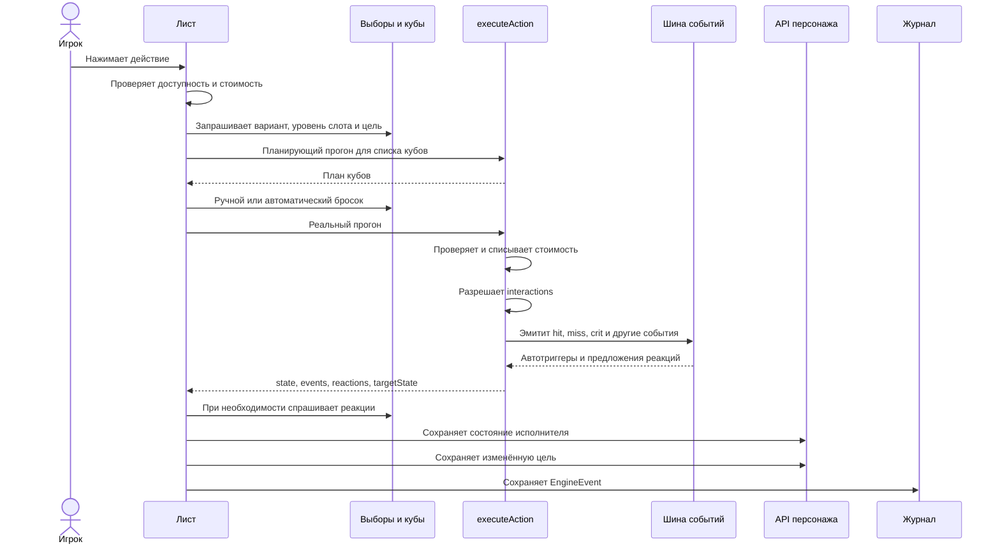

### 8.2. Атомарность стоимости

`activation.cost` проверяется целиком. Если хотя бы одного ресурса недостаточно,
стоимость не списывается и выбрасывается `InsufficientResourcesError`.

После успешной проверки все записи стоимости оплачиваются, и только затем
исполняются результаты.

### 8.3. Маршрутизация результата

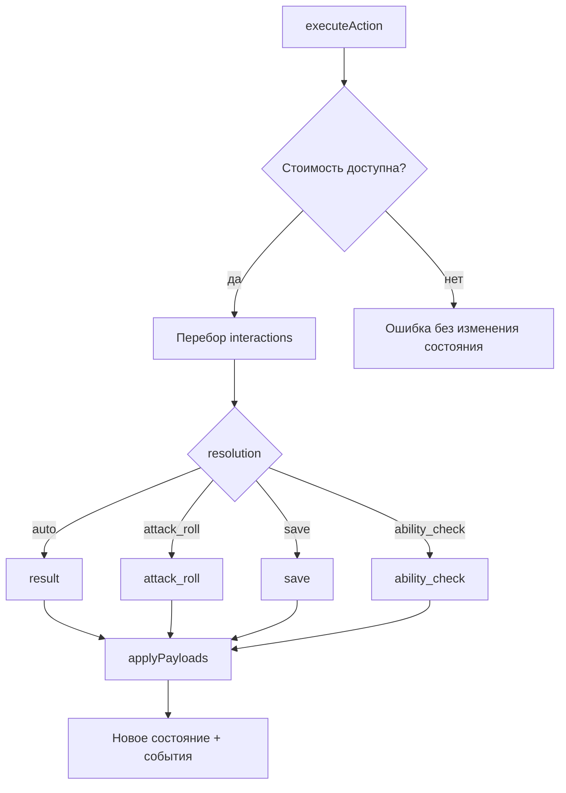

### 8.4. Исполнитель и цель

Payload направляется в цель, если interaction указывает `who: "target"` и
передан `target.runtimeState`. В остальных случаях изменяется исполнитель.

Исключение — payload, который только создаёт событие журнала, например движение
без модели координат. Для него нечего записывать в `RuntimeState`.

---

## 9. Атаки, спасброски и проверки

### 9.1. Атака

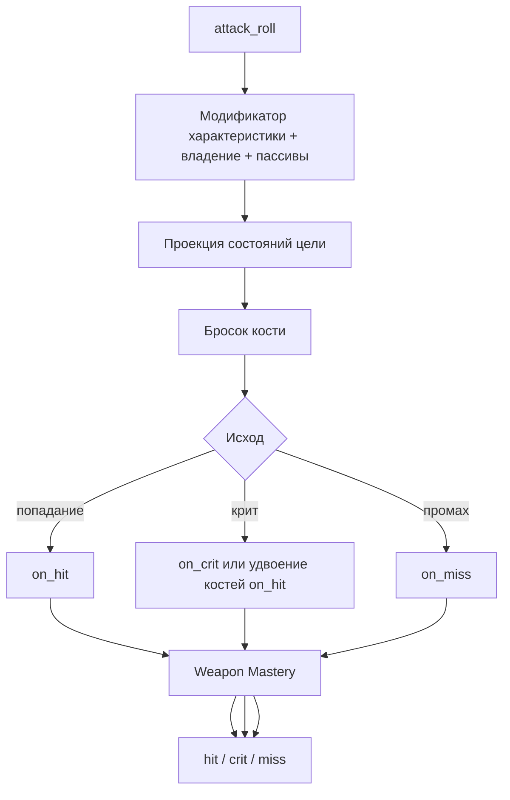

Для оружия `ability: "auto"` выбирает подходящую характеристику. Кость
`"weapon"` разворачивается по оружию в руке. Дополнительные строки урона оружия
исполняются отдельно, поэтому к каждой применяется свой тип сопротивления.

Если `on_crit` задан явно, он считается полной веткой крита. Если его нет,
движок берёт `on_hit` и удваивает только кости урона.

Состояния цели могут:

- дать преимущество или помеху;
- вызвать автопровал;
- превратить попадание в автокрит;
- запретить действие;
- изменить доступные цели.

### 9.2. Спасбросок

Спасбросок цели использует её модификатор, пассивы и активные состояния.

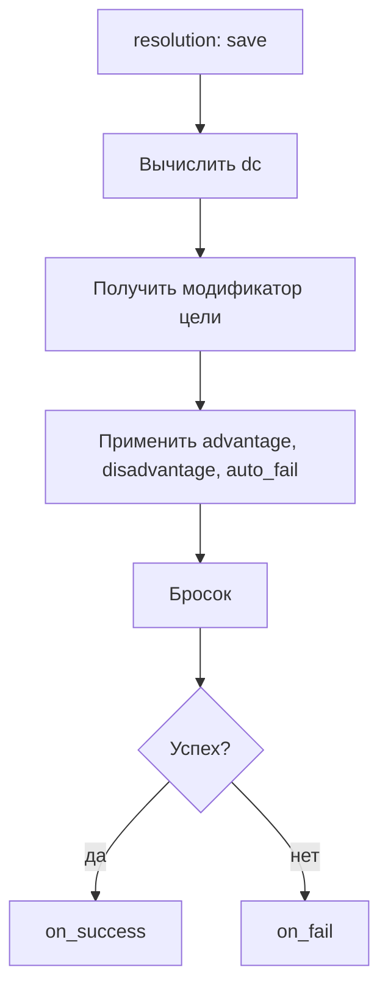

В обычном листе богатая цель может быть другим персонажем. В онлайн-бою:

- персонаж-цель получает pending-спасбросок и бросает его на своём листе;
- для монстра спасбросок выполняет сторона инициатора;
- инициатор заранее считает обе ветки на одинаковых костях урона;
- после выбора ветки к текущему состоянию цели применяется дельта.

`damage.on_success: "half"` использует половину уже брошенного значения с
округлением вниз.

### 9.3. Проверка характеристики

`ability_check` поддерживает проверку против СЛ и состязание. Источник
модификатора задаётся характеристикой и/или навыком. Результат попадает в журнал
тем же форматом `RollLog`.

---

## 10. Урон, лечение и концентрация

### 10.1. Входящий урон

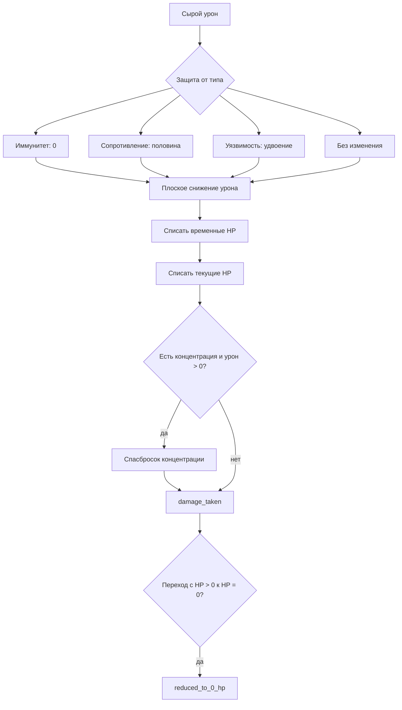

Порядок фактический:

1. Округление входа вниз и ограничение минимумом 0.
2. Иммунитет, сопротивление или уязвимость.
3. Плоское снижение урона.
4. Временные HP.
5. Текущие HP.
6. Проверка концентрации.
7. Событие `damage_taken`.
8. При первом падении до 0 — `reduced_to_0_hp`.

### 10.2. Лечение

Лечение повышает `hp.current`, но не выше `hp.max`. В журнал пишется фактически
восстановленное количество.

### 10.3. Временные HP

Новый источник временных HP не складывается с текущим. Сохраняется большее
значение. Долгий отдых сбрасывает временные HP в 0.

### 10.4. Концентрация

При применении заклинания с концентрацией UI добавляет специальный активный
эффект. Новая концентрация вытесняет предыдущую.

При получении положительного урона:

1. СЛ вычисляется из фактического урона.
2. Берётся полный бонус спасброска Телосложения, если лист его передал.
3. Добавляются пассивные модификаторы спасброска.
4. При критическом источнике применяется помеха, если она не компенсирована.
5. При провале эффект концентрации снимается.

---

## 11. Эффекты и состояния

### 11.1. Запись активного эффекта

```json
{
  "id": "effect-instance-id",
  "name": "Ярость",
  "mechanics": {
    "activation": { "mode": "passive" },
    "effects": []
  },
  "roundsLeft": 10,
  "expiry": "manual",
  "source": "Ярость",
  "sourceId": "character-id"
}
```

`sourceId` нужен для реляционных правил. Например, очарованный персонаж не может
выбрать очаровавшего целью.

### 11.2. Наложение

Эффект попадает в `activeEffects` тремя основными путями:

- payload `condition`;
- временный `modifier` или `resistance`;
- payload `grant_effect`, для которого UI заранее загрузил целевой эффект.

Неповторяемый `grant_effect` заменяет/не дублирует существующий экземпляр.
Повторяемый эффект может иметь несколько независимых экземпляров с собственными
источниками и длительностями.

### 11.3. Жизненный цикл

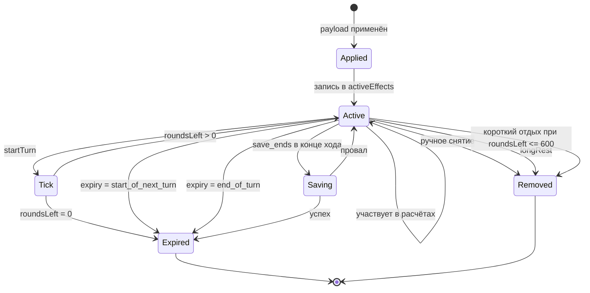

### 11.4. Длительности

| `duration.type` | Фактическое выполнение |
|---|---|
| `instantaneous` | Отдельный долгоживущий эффект не нужен. |
| `rounds` | `roundsLeft` уменьшается в начале хода. |
| `until_start_of_next_turn` | Снимается в начале следующего хода. |
| `until_end_of_turn` | Снимается в конце хода. |
| `minutes`, `hours` | Не имеют таймера реального времени; при создании могут быть представлены раундами. |
| `while_active`, `until_dispelled`, `permanent` | Живут до ручного снятия или очищающего пути. |
| `until_long_rest` | Долгий отдых очищает все активные эффекты. |

### 11.5. `save_ends`

В конце хода владелец эффекта выполняет спасбросок. При успехе эффект удаляется.
При провале остаётся. Характеристика и СЛ берутся из `save_ends`.

---

## 12. События, триггеры и реакции

### 12.1. Фактически эмитируемые события

| Событие | Момент |
|---|---|
| `hit` | Успешный бросок атаки после применения ветки попадания и Weapon Mastery |
| `crit` | Критическое попадание после `hit` |
| `miss` | Промах после `on_miss` и Weapon Mastery |
| `damage_taken` | После полного применения входящего урона |
| `reduced_to_0_hp` | При переходе с положительных HP к 0 |
| `spell_cast` | После выполнения механики, если передан контекст заклинания |
| `turn_start` | После восстановления экономики хода и истечения start-эффектов |
| `turn_end` | После end-истечений и `save_ends` |
| `short_rest` | После лечения, восстановления ресурсов и обработки таймеров |
| `long_rest` | До финального восстановления всех ресурсных пулов |

Схема допускает дополнительные имена событий, но они не запускаются текущим
движком: `attack_roll_made`, `damage_dealt`, `saving_throw_made`,
`forced_save`, `ability_check_made`, события перемещения, `condition_applied`,
`initiative_roll`, `on_acquire`, `level_gained`.

### 12.2. Поиск слушателей

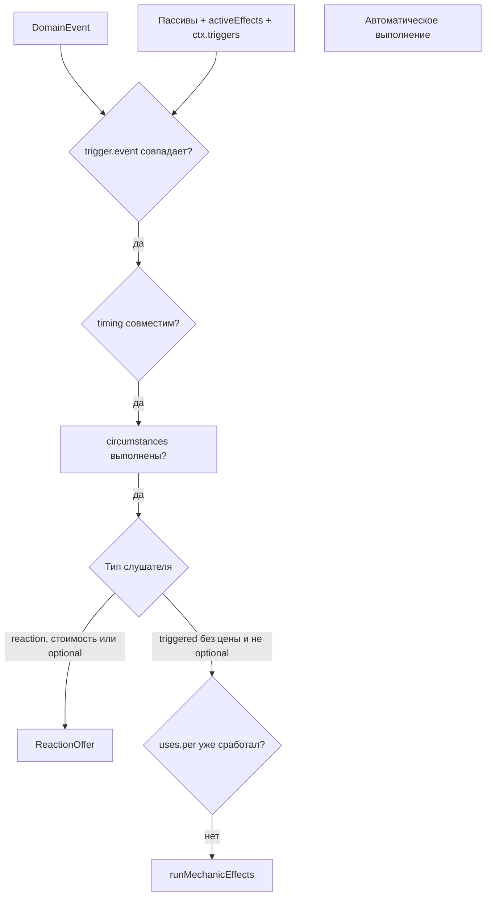

`subject` пока намеренно не фильтруется. Событийная модель в основном
одноакторная; реляционный контекст передаётся отдельными полями цели.

### 12.3. Периодические гейты

- `uses.per: "turn"` проверяет `firedThisTurn`.
- Любой другой период триггера проверяет `firedThisRest`.
- `startTurn` очищает `firedThisTurn`.
- `longRest` очищает `firedThisRest`.

Это предотвращает повторное автоматическое срабатывание одной способности.

### 12.4. Каскад

Триггер может выполнить payload, который создаёт следующее событие. Чтобы
зацикленные данные не повесили лист, один запуск имеет бюджет 16 эмиссий,
для которых реально найдены слушатели. После превышения дальнейшие триггеры
останавливаются, а в журнал добавляется предупреждение.

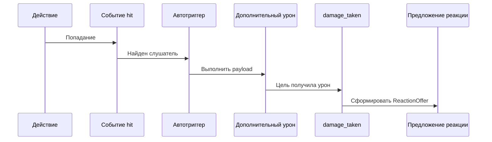

---

## 13. Ресурсы, ходы и отдыхи

### 13.1. Открытая модель ресурсов

Ресурс — любой строковый ключ:

```json
{
  "rage": 2,
  "focus": 3,
  "spell_slot_1": 4,
  "uses-second-wind": 1,
  "freeuse-misty-step": 1
}
```

Базовые ресурсы хода:

- `action`;
- `bonus_action`;
- `reaction`.

Ячейка заклинания хранится как `spell_slot_<уровень>`. `spell_slot` в стоимости
с полем `level` маршрутизируется к соответствующему ключу.

### 13.2. Инициализация

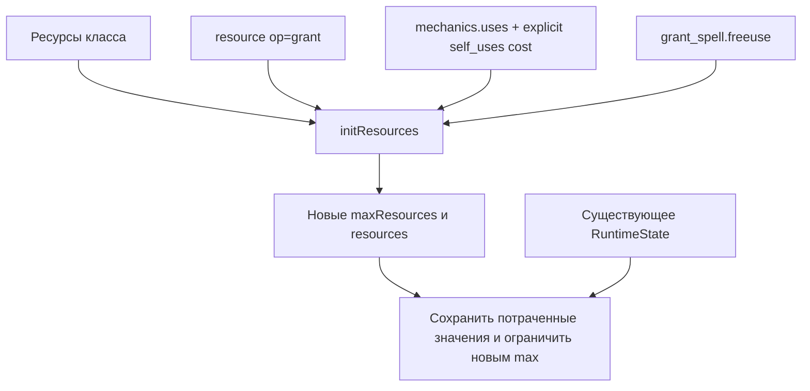

При повторной синхронизации уже потраченные заряды сохраняются. Если новый
максимум стал меньше, текущее значение ограничивается новым максимумом.

### 13.3. `uses`

```json
{
  "uses": {
    "count": "1 + prof_bonus",
    "per": "long_rest"
  }
}
```

Для действия создаётся виртуальный пул `uses_<card_number или id>`. Он
восстанавливается по карте recharge, но списывается только когда данные действия
явно содержат `activation.cost` с `resource: "self_uses"`. Несогласованная пара
(`uses` без `self_uses` или наоборот) закрывается ошибкой контента.

Действие, выданное через `grant_action`, сейчас не получает полноценный
инициализированный `uses`-пул: его экономика действия сохраняется, но собственный
лимит использований не гейтится.

### 13.4. Новый ход

`startTurn`:

1. Клонирует состояние.
2. Очищает `firedThisTurn`.
3. Восстанавливает `action`, `bonus_action`, `reaction` до максимумов.
4. Снимает `start_of_next_turn`.
5. Уменьшает `roundsLeft`.
6. Эмитит `turn_start`.

### 13.5. Конец хода

`endTurn`:

1. Снимает `end_of_turn`.
2. Выполняет `save_ends`.
3. Эмитит `turn_end`.

### 13.6. Короткий отдых

Фактическое поведение:

1. Восстанавливает `floor(max HP / 2)`, не превышая максимум.
2. Восстанавливает ресурсы, чья карта recharge указывает `short_rest`.
3. Считает отдых равным 600 раундам.
4. Снимает эффекты с `roundsLeft <= 600`.
5. Уменьшает большие раундовые длительности на 600.
6. Эмитит `short_rest`.

UI запрещает отдых при 0 HP. Успешный отдых разблокирует настройку предметов и
сбрасывает спасброски смерти.

### 13.7. Долгий отдых

Фактическое поведение:

1. Текущие HP становятся равны максимуму.
2. Временные HP становятся равны 0.
3. Очищаются все активные эффекты.
4. Очищается `firedThisRest`.
5. Эмитится `long_rest`.
6. Все ресурсы восстанавливаются до максимума.

Событие эмитится до финального восстановления, чтобы триггер отдыха, выдающий
ресурс, не создал значение выше максимума.

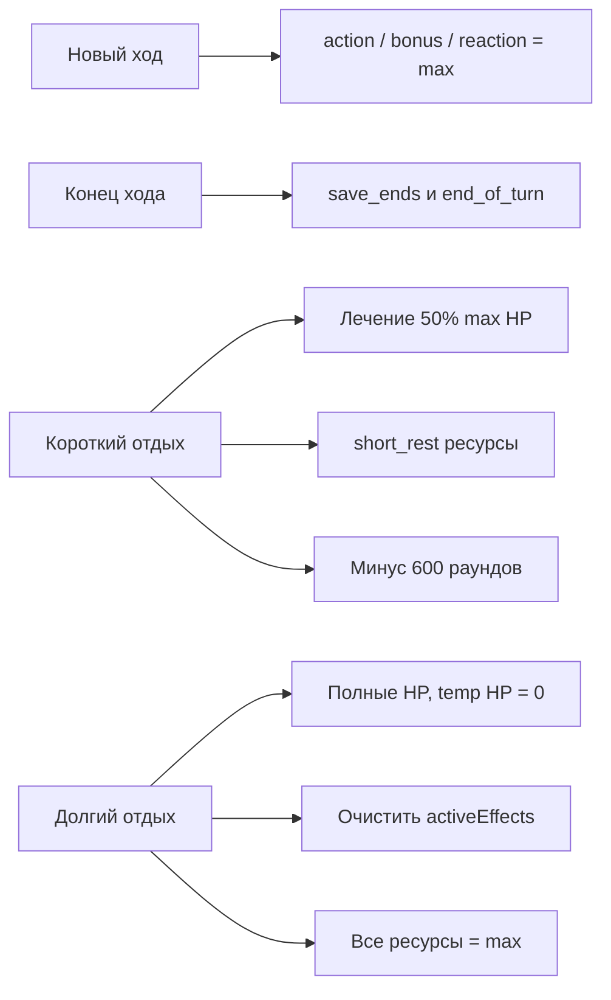

---

## 14. Предметы, экипировка и настройка

### 14.1. Слои предмета

Предмет может участвовать сразу в нескольких каналах:

- чистые поля карты: броня, урон, вес;
- пассивная `mechanics`;
- активная `mechanics`;
- `grant_effect`;
- `grant_action`;
- контейнер;
- стоимость самим предметом;
- боеприпас.

### 14.2. Гейт активности

`activation.while`:

| Значение | Условие |
|---|---|
| `equipped` | Предмет находится в подходящем слоте экипировки |
| `carried` | Предмет присутствует в инвентаре |
| `attuned` | Предмет находится среди настроенных |

Для предмета, требующего настройку, без настройки чистые физические свойства
карты могут оставаться, но магические механики не попадают в пассивный канал.

### 14.3. Расходники

Саморасход объявляется прямо в механике предмета:

```json
{
  "resource": "self_item",
  "amount": 1
}
```

Перед выполнением адаптер связывает `self_item` с id конкретного экземпляра, но
не изобретает цену. После выполнения в журнал попадает `item_consumed`, а UI
сохраняет изменённый инвентарь. `consumes_self` сохранён в схеме только как
deprecated-маркер для миграции и движком не читается.

### 14.4. Боеприпасы

Поле `ammo` оружия превращается в такую же стоимость предметом. До выполнения
проверяется фактическое количество в инвентаре.

### 14.5. Контейнеры

- `container_mode: "all"` создаёт действие распаковки всех вложений.
- `container_mode: "choice"` создаёт runtime-выбор одного вложения.
- Полученные карты добавляются payload `add_item`.
- Сам контейнер расходуется, только если созданное действие явно содержит цену
  `self_item` (после связывания — `item` с id контейнера).

---

## 15. Выборы

### 15.1. Контексты

| `context` | Когда разрешается |
|---|---|
| `build` | При создании персонажа |
| `level_up` | При повышении уровня |
| `in_play` | Непосредственно перед выполнением действия |

### 15.2. Build-выбор

Ключ хранится в `resolvedChoices`. Для одинаковых `choice.id` из разных
источников строится идентификатор экземпляра, чтобы выборы не конфликтовали.

Выбранное значение преобразуется:

- через общий шаблон `grant`;
- или через `grants` конкретного элемента `options.items`.

Вложенные выборы разворачиваются рекурсивно с ограничением глубины.

### 15.3. Runtime-выбор

Перед планом кубов UI собирает все `context: "in_play"` и запрашивает ответы.
Ответы передаются в `ExecuteContext.choices`. Исполнитель разворачивает выбранные
ветки через тот же роутер payload.

Build-гранты внутри runtime-выбора отфильтровываются: они не должны пытаться
перестроить персонажа в середине синхронного действия.

---

## 16. Формулы и переменные

### 16.1. Синтаксис

Поддерживаются:

- числа;
- кости `NdM`;
- `+`, `-`, `*`, `/`;
- скобки;
- `min(a, b)` и `max(a, b)`.

### 16.2. Токены

| Токен | Значение |
|---|---|
| `str`, `dex`, `con`, `int`, `wis`, `cha` | Модификатор характеристики |
| `prof_bonus`, `prof` | Бонус мастерства |
| `self_level` | Уровень персонажа |
| `class_level:<id>` | Уровень класса |
| `spellcasting` | Модификатор заклинательной характеристики |
| `spell_slot_above` | Разница между выбранным и базовым кругом |
| `rage_bonus` | Бонус урона ярости из контекста |
| `character_speed` | Итоговая скорость |
| `weapon_mod` | Модификатор характеристики текущей оружейной атаки |
| имя переменной | Число или кость из реестра переменных персонажа |

`weapon` и `auto` — маркеры, а не арифметические значения.

### 16.3. Переменные

Определение переменной хранит имя, тип и значение по умолчанию. Значение
персонажа формируется из эффектов сборки. Числовые и dice-переменные доступны
формулам.

Runtime payload `variable`, который должен менять переменную в ходе игры, сейчас
не изменяет состояние: в `RuntimeState` нет отдельного хранилища runtime-переменных.
Исполнитель добавляет диагностическое сообщение в журнал.

### 16.4. Мягкая деградация

Если interaction ссылается на недоступную переменную или формула не вычисляется,
этот interaction пропускается с сообщением в журнале; всё действие не падает.

---

## 17. Сохранение результата

### 17.1. Состояние исполнителя

После действия сохраняются:

- `current_hp`;
- `max_hp`;
- `resources`;
- `max_resources`;
- `active_effects`;
- `turn_state.temp_hp`.

Инвентарь передаётся только если события показывают его реальное изменение:
`item_consumed` или `item_added`. Это уменьшает риск перезаписать параллельное
изменение сумки старым снимком.

### 17.2. Состояние цели

Если `executeAction` вернул `targetState`, лист сохраняет HP, временные HP и
активные эффекты цели. В обычном режиме это запись другого персонажа.

В онлайн-бою изменяется комбатант через операцию боя. Сервер рассылает изменение
участникам и выполняет write-through в связанный лист персонажа.

### 17.3. Журнал

`EngineEvent[]` преобразуется в записи журнала. Поддерживаемые типы:

- бросок;
- урон;
- лечение;
- снижение урона;
- временные HP;
- расход и восстановление ресурса;
- расход и добавление предмета;
- применение и истечение эффекта;
- применение состояния;
- начало и конец хода;
- короткий и долгий отдых;
- нарратив.

Ошибка записи журнала не отменяет уже выполненное изменение состояния.

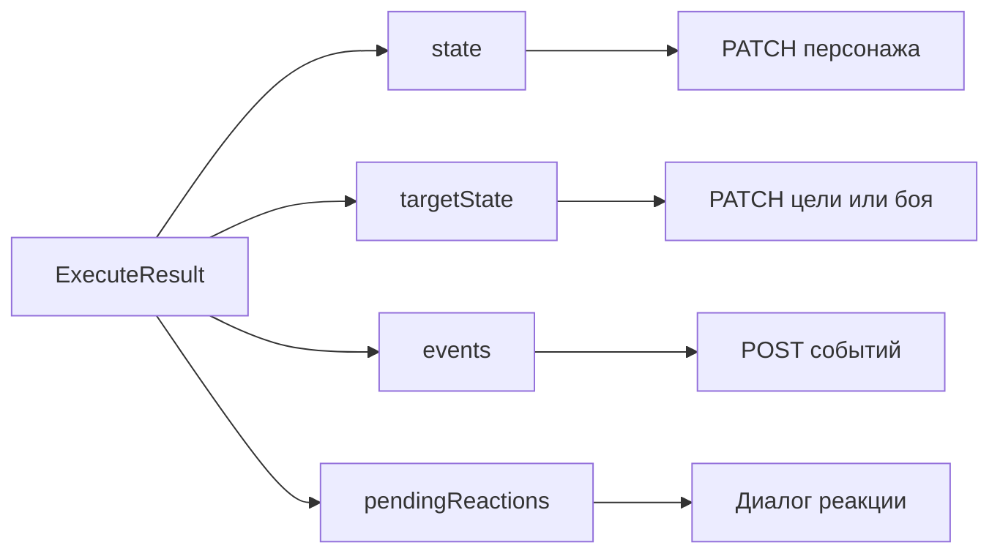

---

## 18. Десктопный и мобильный листы

Мобильная версия — отдельный UI, но не отдельный движок.

### 18.1. Общая часть

Оба листа используют:

- одну запись `ForgeCharacter`;
- одну сборку `AssembledCharacter`;
- `resolveCharacterRules`;
- `forgeToRuntimeState`;
- `buildCharacterContext`;
- `collectPassiveMechanics`;
- `breakdownValue`;
- общие панели действий, ресурсов, экипировки и отдыха;
- `executeAction`, шину событий и API сохранения.

### 18.2. Различия

| Область | Десктопный лист | Мобильный лист |
|---|---|---|
| Маршрут | `/characters-v3/:id` | `/m/characters/:id` |
| Компоновка | Секции большого листа | Пять нижних вкладок |
| Карточки | Общие превью и диалоги | Полноэкранные мобильные карточки |
| Активация | Нажатие сразу запускает общий диалог действия | Сначала карточка, затем «Применить» |
| Hover | Может использовать hover-превью | Hover отключён в переиспользуемых панелях |
| Назад | История браузера/листа | Собственная история вкладок; из «Общее» — список персонажей |
| Журнал | Расширенный журнал и интеграция боя | Компактный журнал на вкладке «Ещё» |
| Бой | Полная обработка pending save/attack и EncounterState | Общие панели доступны, но отдельный мобильный экран не реализует весь orchestration десктопной страницы |
| Rule runtime sources | Предметы и активные состояния передаются в resolver | В мобильном controller сейчас передаются предметы; активные состояния показываются, но отдельно не проецируются в `resolveCharacterRules` |
| Breakdown | Общие значения и всплывающие разбивки | Те же breakdown отображаются мобильными карточками |

Последние две строки — важные фактические различия. Общий исполнитель одинаков,
но десктопная страница содержит дополнительную оркестрацию онлайн-боя и добавляет
состояния как runtime-источники build-разрешения.

---

## 19. Полный справочник полей

### 19.1. Корень

| Поле | Тип | Назначение |
|---|---|---|
| `schema_version` | string | Версия схемы |
| `id` | string | Технический идентификатор |
| `name` | string | Имя |
| `russian_name` | string | Русское имя |
| `kind` | `passive_effect`, `action`, `spell`, `trait` | Категория |
| `source` | string | Происхождение |
| `description` | string | Описание |
| `tags` | string[] | Теги |
| `requirements` | requirement[] | Требования |
| `activation` | object | Активация |
| `targeting` | object | Описание цели |
| `interactions` | interaction[] | Массив способов разрешения |
| `duration` | object | Общая длительность |
| `uses` | object | Собственный лимит использований |
| `ammo` | string или object | Боеприпас |

### 19.2. `requirements`

`type` допускает: `class`, `subclass`, `species`, `feat`, `ability_score`,
`proficiency`, `equipment`, `resource`, `state`, `level`.

Дополнительные поля: `value`, `ability`, `min`, `min_level`, `kind`, `id`,
`present`. Требования описывают контент, но проверяются не всеми runtime-путями;
не используйте их вместо `activation.cost`.

### 19.3. `activation`

| Поле | Значения |
|---|---|
| `mode` | `active`, `passive`, `reaction`, `triggered` |
| `while` | `equipped`, `carried`, `attuned` |
| `consumes_self` | deprecated boolean без runtime-семантики; мигрировать в `cost: self_item` |
| `cost` | cost[] |
| `trigger` | trigger |
| `casting_time` | string |
| `range` | string |
| `components` | `{ verbal, somatic, material, material_text }` |

### 19.4. `cost`

| Поле | Смысл |
|---|---|
| `resource` | Ключ ресурса |
| `amount` | Число или формула |
| `level` | Круг для `spell_slot` |
| `card_id` | Карта для `item` |

Относительные примитивы `self_item` и `self_uses` допустимы только в сохранённых
механиках сущности. Адаптер связывает их с конкретным id карты или пула до
атомарной проверки и оплаты; отсутствие явного примитива не компенсируется
эвристикой UI.

### 19.5. `trigger`

| Поле | Значения |
|---|---|
| `timing` | `before`, `during`, `after`, `replaces` |
| `event` | Имя события |
| `subject` | `self`, `ally`, `enemy`, `attacker`, `target`, `any_creature` |
| `circumstances` | condition[] |

### 19.6. `targeting`

| Поле | Значения |
|---|---|
| `shape` | `self`, `single`, `multi`, `area`, `aura` |
| `range` | Строка дальности |
| `max_targets` | Число или формула |
| `area` | Форма и размер области |
| `filter` | Строковый фильтр |

`targeting` сейчас прежде всего управляет превью и решением UI о необходимости
цели. Площадь и координаты не применяются самим `executeAction`.

### 19.7. `interaction`

Общие поля:

- `resolution`;
- `who`;
- `result`;
- ветки исхода.

Для `attack_roll`: `attack_kind`, `ability`, `advantage`, `on_hit`, `on_crit`,
`on_miss`.

Для `save`: `ability`, `dc`, `on_fail`, `on_success`, `repeat`.

Для `ability_check`: `ability`, `skill`, `mode`, `dc`, `contest_vs`,
`on_success`, `on_fail`.

### 19.8. `modifier`

| Поле | Значения |
|---|---|
| `applies_to` | Объект с `roll` и фильтрами |
| `op` | `add`, `set`, `advantage`, `disadvantage`, `reroll`, `multiply`, `upgrade`, `downgrade`, `auto_fail`, `auto_crit`, `deny`, `set_die`, `crit_range`, `outcome`, `on_roll`, `die_bonus`, `explode` |
| `value` | Формула |
| `scope` | `self`, `target` |
| `range` | `melee`, `ranged` |
| `faces` | Число граней для roll-rule |
| `limit` | Формула лимита |
| `then` | Payload после roll-rule |
| `priority` | Порядок свёртки |
| `when` | Предикаты |
| `duration` | Длительность |

Roll-rule `op: "set_die"` внутри `modifier` применяется к d20. Отдельный
payload `kind: "set_die"` не маршрутизируется.

### 19.9. `duration`

Поля: `type`, `amount`, `concentration`, `ends_when`, `requires_each_turn`.
Фактическое выполнение основных типов описано в главе 11.

### 19.10. `uses`

| Поле | Значения |
|---|---|
| `count` | Формула максимума |
| `per` | `turn`, `round`, `short_rest`, `long_rest`, `day` |
| `recharge` | Строка дополнительного описания recharge |
| `recovery.short_rest` | Bounded-восстановление: `{ "mode": "fixed", "amount": <целое > 0> }` |
| `recovery.long_rest` | Полное восстановление: `{ "mode": "full" }` |

`recovery` является необязательным generic-примитивом. Если его нет,
`uses.per` сохраняет legacy-поведение полного восстановления пула. Если блок
присутствует, но не проходит schema/runtime validation, восстановление этого
пула запрещается fail-closed и не откатывается к legacy semantics.

### 19.11. `choice`

| Поле | Смысл |
|---|---|
| `id` | Стабильный ключ |
| `prompt` | Вопрос |
| `count` | Сколько выбрать |
| `options` | Источник и фильтры вариантов |
| `recommended` | Рекомендуемые значения |
| `grant` | Шаблон результата |
| `resolution` | `on_acquire` или `immediate` |
| `context` | `build`, `level_up`, `in_play` |

---

## 20. Матрица поддержки payload

### 20.1. Полностью исполняемые

| `kind` | Основные поля | Где исполняется |
|---|---|---|
| `damage` | `dice`, `type`, `scaling`, `on_success`, `per_dart`, `bonus`, `explode` | Runtime |
| `healing` | `amount`, `scaling` | Runtime |
| `reduce_damage` | `amount`/формула | Runtime |
| `temp_hp` | `amount` | Runtime |
| `condition` | `value`, `op`, `duration`, `save_ends` | Runtime |
| `resource` | `op`, `id`, `amount`, `level` | Build-инициализация и runtime |
| `modifier` | `applies_to`, `op`, `value`, `when`, `priority` | Build и runtime |
| `resistance` | `damage_type`, `value` | Runtime и пассивный расчёт |
| `set_value` | `target`, `formula` | Runtime; `ac_base` как метод |
| `value_method` | `target`, `formula`/`value` | Build |
| `narrative` | `description`/`text` | Runtime-журнал |
| `add_item` | `card_id`, `qty`, `name` | Runtime |
| `grant_effect` | `value`/`values` | Сборка ссылок и runtime при предзагрузке |
| `grant_language` | `value` | Build |
| `grant_expertise` | `value` | Build |
| `grant_proficiency` | `prof`, `value` | Build |
| `grant_feat` | `value` | Build |
| `grant_spell` | `value`, `level_gate`, `ability`, `freeuse` | Build |
| `grant_ability_score` | `ability`, `amount` | Build |
| `grant_sense` | `sense`, `range` | Build |
| `grant_speed` | `mode`, `value` | Build |
| `weapon_mastery` | `value` | Build и оружейный runtime |
| `choice` | поля выбора | Build и runtime |

### 20.2. Частично исполняемые

| `kind` | Что работает | Чего нет |
|---|---|---|
| `movement` | Создаётся запись журнала | Нет координат и фактического перемещения |
| `boon` | Создаётся активный чип и нарратив | Кость талона применяется вручную |
| `reroll` | Создаётся инструкция в журнале | Сам payload не заменяет уже совершённый бросок |
| `transform` | Создаётся эффект и нарратив | Не подменяется стат-блок |
| `grant_action` | На листе загружается действие по slug | Runtime-роутер не выдаёт действие; собственный uses-пул гранта не инициализируется |

### 20.3. Не исполняемые как отдельный payload

| `kind` | Фактическое поведение |
|---|---|
| `variable` | Сообщение в журнале; runtime-переменная не меняется |
| `set_die` | Отдельный payload не маршрутизируется; используйте `modifier.op: "set_die"` |

---

## 21. Как добавить механику

### 21.1. Через конструктор

1. Выберите правильный тип сущности: действие, эффект, заклинание, черта или предмет.
2. В разделе активации задайте режим и стоимость.
3. Добавьте interaction.
4. Выберите самый узкий `resolution`.
5. Заполните ветки результата payload-блоками.
6. Для временного результата задайте длительность.
7. Для ограниченного использования задайте `uses`.
8. Для выбора создайте `choice` и явно укажите `context`.
9. Просмотрите машинное описание механики.
10. Сохраните и проверьте сущность на тестовом персонаже.

Правило выбора `resolution`:

- нет броска — `auto`;
- атака против КЗ — `attack_roll`;
- цель сопротивляется — `save`;
- активная проверка навыка/характеристики — `ability_check`.

### 21.2. Через JSON

1. Начните с минимального валидного корня.
2. Используйте `interactions` в канонической форме.
3. Проверьте `activation.cost`.
4. Разделяйте независимые результаты на несколько payload.
5. У каждого урона указывайте тип.
6. Не складывайте маркер `weapon` с числом — создайте второй payload.
7. Не используйте зарезервированное событие как рабочий триггер.
8. Не используйте отдельный `kind: "set_die"`; создайте `modifier`.
9. Для неподдерживаемой части добавьте честный `narrative`.

Минимальный шаблон:

```json
{
  "id": "my-mechanic",
  "name": "My Mechanic",
  "kind": "action",
  "activation": {
    "mode": "active",
    "cost": [{ "resource": "action", "amount": 1 }]
  },
  "interactions": [
    {
      "resolution": "auto",
      "result": [
        { "kind": "narrative", "description": "Результат механики" }
      ]
    }
  ]
}
```

### 21.3. Выбор нужного слоя

| Задача | Используйте |
|---|---|
| Постоянно дать навык | `grant_proficiency` в пассивной механике |
| Увеличить максимум HP | `modifier` к `max_hp` |
| Установить альтернативную КЗ | `set_value` с `target: "ac_base"` |
| Дать новое действие | `grant_action` со slug существующего Action |
| Дать заклинание | `grant_spell` |
| Наложить временный бафф | Runtime `modifier` с длительностью или `grant_effect` |
| Потратить заряд | `activation.cost` |
| Создать заряд | Ресурс класса, `resource grant` или `uses` |
| Среагировать на попадание | `reaction`/`triggered` с `trigger.event: "hit"` |
| Повторный спас в конце хода | `condition.save_ends` |

---

## 22. Сквозные примеры

Примеры учебные: у них стабильные понятные идентификаторы, но они используют
фактический формат и существующие пути выполнения.

### 22.1. Броня: постоянная КЗ

```json
{
  "id": "defense-style",
  "name": "Defense",
  "kind": "passive_effect",
  "activation": { "mode": "passive" },
  "interactions": [
    {
      "resolution": "auto",
      "result": [
        {
          "kind": "modifier",
          "applies_to": { "roll": "ac" },
          "op": "add",
          "value": 1
        }
      ]
    }
  ]
}
```

Путь: предмет/эффект → пассивы → breakdown КЗ → отображение на обоих листах.

### 22.2. Оружейная атака с боеприпасом

```json
{
  "id": "longbow-shot",
  "name": "Longbow Shot",
  "kind": "action",
  "activation": {
    "mode": "active",
    "cost": [{ "resource": "action", "amount": 1 }]
  },
  "ammo": { "card_id": "arrow", "name": "Стрела" },
  "targeting": { "shape": "single", "range": "150/600 ft" },
  "interactions": [
    {
      "resolution": "attack_roll",
      "attack_kind": "weapon_ranged",
      "ability": "auto",
      "who": "target",
      "on_hit": [
        { "kind": "damage", "dice": "weapon", "type": "piercing" }
      ]
    }
  ]
}
```

Путь: UI добавляет стоимость стрелой → движок атомарно списывает действие и
стрелу → бросок против КЗ → урон богатой цели → журнал и сохранение.

### 22.3. Зелье лечения

```json
{
  "id": "healing-potion",
  "name": "Potion of Healing",
  "kind": "action",
  "activation": {
    "mode": "active",
    "cost": [
      { "resource": "bonus_action", "amount": 1 },
      { "resource": "self_item", "amount": 1 }
    ]
  },
  "interactions": [
    {
      "resolution": "auto",
      "who": "self",
      "result": [{ "kind": "healing", "amount": "2d4 + 2" }]
    }
  ]
}
```

После применения сохраняются HP и инвентарь, потому что возникает
`item_consumed`.

### 22.4. Ярость

```json
{
  "id": "rage",
  "name": "Rage",
  "kind": "action",
  "activation": {
    "mode": "active",
    "cost": [
      { "resource": "bonus_action", "amount": 1 },
      { "resource": "rage", "amount": 1 }
    ]
  },
  "duration": { "type": "rounds", "amount": 10 },
  "interactions": [
    {
      "resolution": "auto",
      "result": [
        {
          "kind": "modifier",
          "applies_to": { "roll": "damage" },
          "op": "add",
          "value": "rage_damage_modifier",
          "duration": { "type": "rounds", "amount": 10 }
        },
        {
          "kind": "resistance",
          "damage_type": "bludgeoning",
          "value": "resistance"
        },
        {
          "kind": "resistance",
          "damage_type": "piercing",
          "value": "resistance"
        },
        {
          "kind": "resistance",
          "damage_type": "slashing",
          "value": "resistance"
        }
      ]
    }
  ]
}
```

Независимые payload позволяют отдельно применять типы сопротивления и показывать
источники. Ограничения «только атака Силой» должны быть выражены поддерживаемым
фильтром или оставлены нарративом; неподдерживаемый `when` будет закрыт.

### 22.5. Второе дыхание

```json
{
  "id": "second-wind",
  "name": "Second Wind",
  "kind": "action",
  "activation": {
    "mode": "active",
    "cost": [{ "resource": "bonus_action", "amount": 1 }]
  },
  "uses": {
    "count": 2,
    "per": "short_rest",
    "recovery": {
      "short_rest": { "mode": "fixed", "amount": 1 },
      "long_rest": { "mode": "full" }
    }
  },
  "interactions": [
    {
      "resolution": "auto",
      "who": "self",
      "result": [
        { "kind": "healing", "amount": "1d10 + self_level" }
      ]
    }
  ]
}
```

`uses` создаёт отдельный виртуальный ресурс. Короткий отдых читает bounded
recovery из mechanics и возвращает ровно одно потраченное использование;
долгий отдых восстанавливает пул полностью. Runtime не знает UUID,
`card_number` или название Второго дыхания.

### 22.6. Огненный снаряд

```json
{
  "id": "fire-bolt",
  "name": "Fire Bolt",
  "kind": "spell",
  "activation": {
    "mode": "active",
    "cost": [{ "resource": "action", "amount": 1 }]
  },
  "targeting": { "shape": "single", "range": "120 ft" },
  "interactions": [
    {
      "resolution": "attack_roll",
      "attack_kind": "spell_ranged",
      "ability": "spellcasting",
      "who": "target",
      "on_hit": [
        {
          "kind": "damage",
          "dice": "1d10",
          "type": "fire",
          "scaling": { "per": "character_level", "dice": "1d10" }
        }
      ]
    }
  ]
}
```

Каст создаёт `spell_cast`; попадание создаёт `hit`, крит — дополнительно `crit`.

### 22.7. Огненный шар

```json
{
  "id": "fireball",
  "name": "Fireball",
  "kind": "spell",
  "activation": {
    "mode": "active",
    "cost": [
      { "resource": "action", "amount": 1 },
      { "resource": "spell_slot", "level": 3, "amount": 1 }
    ]
  },
  "targeting": {
    "shape": "area",
    "range": "150 ft",
    "area": { "kind": "sphere", "size": 20 }
  },
  "interactions": [
    {
      "resolution": "save",
      "ability": "dex",
      "dc": "8 + prof_bonus + spellcasting",
      "who": "target",
      "on_fail": [
        {
          "kind": "damage",
          "dice": "8d6",
          "type": "fire",
          "on_success": "half",
          "scaling": { "per": "spell_slot_above", "dice": "1d6" }
        }
      ]
    }
  ]
}
```

Апкаст выбирается UI. Сам исполнитель обрабатывает одну переданную цель; область
пока не размножает действие по координатам.

### 22.8. Щит как реакция

```json
{
  "id": "shield",
  "name": "Shield",
  "kind": "spell",
  "activation": {
    "mode": "reaction",
    "cost": [
      { "resource": "reaction", "amount": 1 },
      { "resource": "spell_slot", "level": 1, "amount": 1 }
    ],
    "trigger": {
      "event": "hit",
      "timing": "after",
      "subject": "self"
    }
  },
  "duration": { "type": "until_start_of_next_turn" },
  "interactions": [
    {
      "resolution": "auto",
      "result": [
        {
          "kind": "modifier",
          "applies_to": { "roll": "ac" },
          "op": "add",
          "value": 5,
          "duration": { "type": "until_start_of_next_turn" }
        }
      ]
    }
  ]
}
```

В локальном одноакторном запуске реакция формируется из события. В онлайн-бою
десктопная оркестрация дополнительно доставляет цели pending-атаку.

### 22.9. Концентрация

```json
{
  "id": "hold-person",
  "name": "Hold Person",
  "kind": "spell",
  "activation": {
    "mode": "active",
    "cost": [
      { "resource": "action", "amount": 1 },
      { "resource": "spell_slot", "level": 2, "amount": 1 }
    ]
  },
  "duration": {
    "type": "rounds",
    "amount": 10,
    "concentration": true
  },
  "interactions": [
    {
      "resolution": "save",
      "ability": "wis",
      "dc": "8 + prof_bonus + spellcasting",
      "who": "target",
      "on_fail": [
        {
          "kind": "condition",
          "value": "paralyzed",
          "op": "apply",
          "duration": { "type": "rounds", "amount": 10 },
          "save_ends": {
            "ability": "wis",
            "dc": "8 + prof_bonus + spellcasting",
            "timing": "end_of_turn"
          }
        }
      ]
    }
  ]
}
```

UI устанавливает концентрацию исполнителю, а состояние — цели. Получение урона
проверяет концентрацию исполнителя; `save_ends` проверяется на ходе цели.

### 22.10. Бесплатное заклинание

```json
{
  "id": "ancestral-magic",
  "name": "Ancestral Magic",
  "kind": "passive_effect",
  "activation": { "mode": "passive" },
  "interactions": [
    {
      "resolution": "auto",
      "result": [
        {
          "kind": "grant_spell",
          "value": "misty-step",
          "level_gate": 5,
          "ability": "cha",
          "freeuse": {
            "count": 1,
            "recharge": "long_rest",
            "level": 2
          }
        }
      ]
    }
  ]
}
```

Build pipeline добавляет заклинание и описание freeuse. Инициализация создаёт
пул `freeuse-misty-step`. При касте UI предлагает оплату ячейкой или пулом.

### 22.11. Короткий и долгий отдых

Отдых — не карточка действия, а отдельная команда листа. Она использует тот же
`RuntimeState`, `CharacterContext`, пассивы и шину событий.

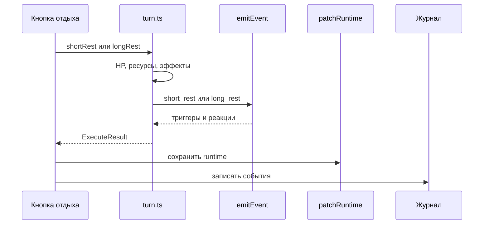

---

## Итоговая модель

Новая механика должна войти в один или несколько стандартных каналов:

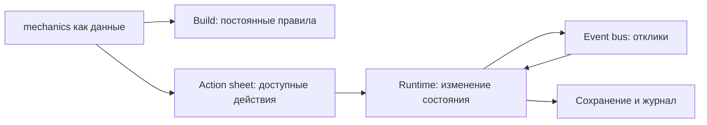

Если правило не помещается в существующий payload, resolution, событие или
предикат, текущий движок его не исполняет. В таком случае фактическое состояние
нужно показать через `narrative`, пока соответствующий универсальный примитив не
появится в движке.
