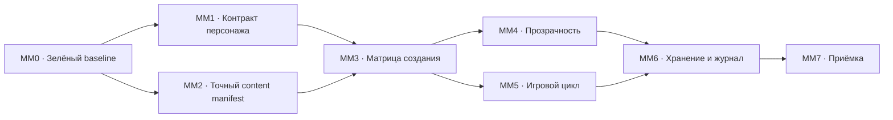

# Micro-MVP Implementation Roadmap

**Статус:** рабочий технический план
**Дата аудита:** 2026-07-28
**Связанный документ:** [Product Requirements Document](./product-prd.md)

## 1. Цель ближайшей поставки

Ближайшая цель — не весь Micro-MVP, а эталонный micro-micro-MVP, который
доказывает один сквозной путь:

1. пользователь создаёт любого допустимого персонажа из ограниченного каталога;
2. все выбранные сущности механически попадают в лист;
3. производные значения рассчитываются и объясняются по источникам;
4. действие или заклинание исполняется;
5. системный или ручной бросок приводит к воспроизводимому результату;
6. ресурсы, HP и эффекты изменяются;
7. изменения записываются в журнал;
8. персонаж сохраняется и корректно восстанавливается после перезагрузки.

Регистрация, кампании, сетевой encounter и карта не входят в эту поставку.

Текущий полный каталог не удаляется. По умолчанию интерфейс показывает
`verified_mechanical`, `verified_partial` и `verified_narrative`. Пользователь
может включить показ остальных сущностей и выбрать их после предупреждения.

## 2. Эталонный каталог

### Классы

- Воин;
- Волшебник;
- Плут;
- Жрец.

### Виды

- Человек;
- Эльф;
- Дварф;
- Драконорождённый.

### Предыстории

- Солдат;
- Мудрец;
- Преступник;
- Прислужник (`Acolyte`; в интервью также использовалось название
  «Послушник»).

### Черты происхождения

- Бдительный;
- Посвящённый в магию;
- Одарённый;
- Крепкий.

### Заговоры

Обязательные эталонные примеры:

- Огненный снаряд;
- Священное пламя;
- Наставление (`Guidance`; в интервью также использовалось название
  «Указание»);
- Малая иллюзия.

Дополнительный пул для завершения классовых выборов:

- Луч холода;
- Леденящее прикосновение;
- Свет.

### Заклинания первого уровня

Обязательные эталонные примеры:

- Волшебная стрела;
- Огненные ладони;
- Лечение ран;
- Щит.

Дополнительный пул для завершения классовых выборов:

- Доспехи мага;
- Волна грома;
- Псевдожизнь;
- Обнаружение магии;
- Благословение;
- Направляющий снаряд.

### Боевые стили

- Стрельба;
- Оборона;
- Сражение двумя оружиями;
- Защита.

Русские названия должны быть связаны со стабильными slug/id. Приёмка опирается
на идентификаторы, а не на приблизительный поиск по отображаемому имени.

## 3. Фактический baseline

На момент первоначального аудита:

- `npm test`: 92 файла, 803 теста — проходили;
- `npm run test:mvp`: 6 файлов проходят, 11 пропускаются;
- offline MVP: 86 тестов проходят, 31 пропускается, 4 помечены `todo`;
- `go test ./...`: проходит;
- `npm run build`: не проходил.

После пакета MM0 от 2026-07-28:

- исправлены обе первоначальные TypeScript-ошибки и найденный вслед за ними
  неиспользуемый параметр;
- `npm run build` проходит;
- `npm test`: 94 файла, 812 тестов — проходят;
- `npm run test:mvp`: 86 проходят, 31 пропускается, 4 `todo`;
- `go test ./...` проходит;
- `npm run test:content-manifest`: 9 тестов — проходят;
- production live-content gate выполняется без случайных skip и намеренно
  остаётся красным: все 37 обязательных записей найдены, но ещё не
  сертифицированы.

После начала MM3 от 2026-07-28:

- добавлена обязательная отдельная команда
  `npm run test:micro-micro:matrix`, которая без `skip` собирает все 256
  базовых сочетаний через живой production-контент;
- общий автоматический строитель теперь разрешает spell-choice тем же
  фильтром, который используют desktop и mobile;
- матрица проходит для Воина и Плута и выявляет 128/256 блокирующих сочетаний:
  все варианты Волшебника и Жреца;
- первый прогон выявил, что исходного набора `4 заговора + 4 заклинания`
  недостаточно для классовых выборов Волшебника и Жреца;
- после продуктового решения пул расширен до 7 заговоров и 10 заклинаний
  первого уровня: четыре исходных примера каждого круга сохранены, новые
  записи служат для легального заполнения spell-choice;
- автосборщик не повторяет UUID заклинания из двух источников, поскольку такой
  выбор даёт blocking conflict (например, класс + «Посвящённый в магию»).

Зелёный offline-набор не является release gate: контентные проверки включаются
только через `MVP_CONTENT=1` и без этого молча пропускаются.

## 4. Что уже можно использовать

| Область | Текущее основание |
|---|---|
| Создание персонажа | `CharacterForge`, мобильный wizard, `assembleCharacter`, `resolveCharacterRules` |
| Механический контент | `mechanics.schema.json`, карточки действий/эффектов, ссылки между сущностями |
| Rules engine | `executeAction`, броски, стоимость ресурсов, урон, лечение, состояния, реакции и триггеры |
| Прозрачность | `breakdownValue`, источники модификаторов, `RuleSource`, журнальные `EngineEvent` |
| Хранение | `characters_v3`, runtime patch, `character_events` |
| Проверка механик | обычные unit-тесты и отдельный MVP-набор |
| Будущий сетевой бой | durable `encounter_events`, последовательность `seq`, SSE и восстановление потока |

Ближайший micro-micro-MVP следует достраивать поверх этих компонентов, а не
создавать второй лист или второй исполнитель правил.

## 5. Критические разрывы

### P0 — мешают честной приёмке micro-micro-MVP

1. Живой контент не входит в обязательный стандартный MVP-прогон.
2. Точный эталонный manifest добавлен; все 28 записей уже привязаны к стабильным
   `card_number`, но ещё не прошли механическую проверку и не имеют сохранённой
   сертификации.
3. `MVP_LEVELS = [1, 2]` расходится с утверждённой целью первого уровня.
4. Известные неподдержанные механики допускают `NOT_IMPLEMENTED` или `todo`.
5. Нет E2E-теста реального `CharacterForge`.
6. Нет автоматической сертификации любой допустимой комбинации эталонного
   каталога.
7. Текущий короткий отдых автоматически лечит половину максимальных HP вместо
   выбора и расходования костей хитов.

### P1 — нужны до полного Micro-MVP

1. Не все ручные значения представлены как отдельные методы расчёта.
2. Не для каждого ключевого числа гарантирован полный breakdown и причина выбора
   метода.
3. Контентный readiness-гейт допускает процентное покрытие заклинаний, хотя
   продукт требует механической работоспособности каждого заявленного
   заклинания.
4. D&D-предположения находятся непосредственно в общих TypeScript-модулях:
   шесть характеристик, D20, КЗ, spell slots и классовые правила.

### P2 — не блокируют автономный Micro-MVP, но блокируют полноценный MVP

1. Авторизация отключена; используется общий пользователь `public`.
2. `Group` ещё не является полной моделью Campaign и authority.
3. Encounter принимает готовые клиентские patches и прямо описан как
   `client-authoritative-relay`.
4. Сервер не исполняет игровые намерения через rules engine.
5. Журнал encounter хранит операции, но состояние пока не строится полноценным
   replay с отменой произвольного события и разрешением конфликтов.

## 6. Архитектурная граница ближайшего этапа

Для автономного листа допустимо оставить исполнение механики на клиенте:
пользователь сам является источником истины. Перенос `executeAction` на сервер не
должен задерживать micro-micro-MVP.

Минимальные метаданные уже добавлены:

- `system_id = dnd5e-2024`;
- закреплённую `ruleset_version`;
- `character_type = free`;
- `character_schema_version`.

Полный System Pack DSL сейчас не строится. D&D-константы постепенно собираются за
стабильной границей `Dnd5e2024SystemDefinition`, чтобы не распространять новые
hardcode-зависимости.

## 7. Рабочие пакеты

### MM0. Восстановить зелёный baseline

Работы:

- исправить две TypeScript-ошибки сборки;
- сделать `npm run build` обязательным gate;
- разделить обычные unit-тесты, offline contract tests и live-content tests;
- запретить release-команде считать пропущенные live-тесты успешной приёмкой;
- синхронизировать manifest с первым уровнем.

Готово, когда:

- `npm run build` проходит;
- `npm test` проходит;
- `npm run test:mvp` проходит;
- отдельная обязательная команда live-content gate не содержит случайных skip.

### MM1. Зафиксировать контракт персонажа

Работы:

- добавить системную принадлежность, версию ruleset, тип персонажа и версию
  схемы;
- мигрировать существующие записи как свободных D&D 2024 персонажей;
- добавить эти поля в create/get/update API;
- показывать тип и систему в интерфейсе;
- запретить изменение `system_id` существующего персонажа.

Готово, когда сохранение и повторная загрузка не теряют метаданные, а попытка
сменить систему отклоняется.

Статус на 2026-07-28: технический контракт реализован.

- миграция `082_character_system_metadata` переводит все существующие
  `characters_v3` в `dnd5e-2024 / 2024 / free / schema 1`;
- поля входят в модель, create/get/update API и frontend-типы;
- старые localStorage-черновики и ответы API до миграции получают те же
  безопасные значения по умолчанию;
- desktop/mobile создание, редактирование и дублирование сохраняют метаданные;
- список персонажей и лист показывают систему, ruleset и тип;
- обычный update возвращает конфликт при попытке поменять систему, ruleset, тип
  или версию схемы; PostgreSQL-trigger дополнительно запрещает смену
  `system_id` в обход API;
- создание другой системы, другого ruleset и ещё не реализованных типов
  `campaign`/`dungeon_crawl` честно отклоняется вместо сохранения
  неработоспособной комбинации.

### MM2. Создать точный manifest эталонного контента

Работы:

- перечислить стабильные id всех утверждённых сущностей;
- внедрить статусы `verified_mechanical`, `verified_partial`,
  `verified_narrative`, `partial`, `untested` и `known_mismatch`;
- показывать по умолчанию три проверенных статуса;
- разрешить показ и выбор остальных после предупреждения;
- привязать certification к версии/хэшу сущности и зависимостей;
- сбрасывать certification после содержательного изменения;
- проверить существование, тип, версию и ссылки каждой сущности;
- проверить `mechanics` общей JSON Schema;
- запретить дубликаты slug;
- выдавать отчёт `ready`, `broken_ref`, `invalid_mechanics`,
  `not_executable` или `needs_engine`;
- убрать readiness по одному только количеству записей.

Первый versioned manifest находится в
`scripts/content/micro-micro-manifest.mjs`. Команда
`npm run test:content-manifest` проверяет его структуру, а
`npm run test:micro-micro:live` запускает строгую проверку живого каталога.
Сущность, найденная только по `name_en`, намеренно получила бы
`unstable_identity`, даже если её механика сертифицирована. В текущем
эталонном срезе таких селекторов уже не осталось.

Первый прогон по production-каталогу нашёл исходные 28 обязательных записей по
стабильным `card_number`. После расширения spell-пула manifest содержит 37
записей. До механической сертификации они получают честный результат
`not_certified (untested)`: существование контента подтверждено, его
механическая корректность ещё не сертифицирована.

Техническая инфраструктура MM2 уже реализована:

- миграция `081_content_support_certification` добавляет certification ко всем
  восьми типам контента и сбрасывает её при содержательном изменении записи;
- API отдаёт `support` для классов, видов, предысторий, черт, заклинаний,
  предметов, действий и эффектов;
- кузница по умолчанию скрывает непроверенное, показывает статус на сущности и
  требует подтверждение при выборе через режим «Показать все сущности»;
- `certification-hash.mjs` вычисляет канонический хэш записи и хэш транзитивного
  замыкания зависимостей по `id`/`card_number`;
- live-gate возвращает `stale_certification`, если изменилась сама запись или
  любая найденная зависимость;
- `npm run content:certify -- ...` готовит certification в режиме dry-run,
  перечисляет зависимости и записывает результат только с явным `--apply`;
- серверная запись защищена отдельным `CONTENT_CERTIFICATION_KEY` и при
  отсутствующей настройке закрыта, поскольку обычная авторизация прототипа
  сейчас намеренно работает в optional-режиме.

Пример безопасной подготовки без записи:

```bash
npm run content:certify -- --type class --card-number CLASS-warrior \
  --status verified_partial --limitation "Проверен только первый уровень"
```

После ручной механической проверки та же команда запускается с `--apply`, а
одинаковый `CONTENT_CERTIFICATION_KEY` должен быть задан у backend и в окружении
команды.

Готово, когда каждая сущность эталонного каталога имеет `ready`, а лишняя запись
в БД не может замаскировать отсутствие обязательной.

### MM3. Сертифицировать создание персонажа

Работы:

- генерировать все допустимые сочетания класса, вида, предыстории и черты;
- генерировать допустимые наборы стилей, заговоров и заклинаний;
- автоматически разрешать и отдельно проверять каждый обязательный choice;
- собирать персонажа через тот же `assembleCharacter` и
  `resolveCharacterRules`, которые использует UI;
- проверять отсутствие неразрешённых конфликтов и потерянных grants;
- добавить E2E-сценарий создания на desktop;
- реализовать стандартный массив и point buy;
- поддержать все внутренние варианты четырёх эталонных видов.

Минимальная матрица включает 256 базовых сочетаний
`4 класса × 4 вида × 4 предыстории × 4 черты`, после чего расширяется
класс-зависимыми вариантами заклинаний и боевых стилей.

Статус на 2026-07-28: технический matrix-gate реализован и после расширения
spell-пула проходит все 256/256 базовых сочетаний.

- `microMicroMatrix.ts` строит ровно 256 уникальных случаев и запрещает тихо
  уменьшать любую из четырёх осей;
- каждый случай использует общий `autoBuildAt`, настоящий `loadBundle`,
  `assemble`, `resolveCharacterRules` и `completionIssues`;
- проверяются системные метаданные, фактически загруженные класс/вид/
  предыстория/черта, все обязательные choices, конфликты и принадлежность
  выбранных заклинаний manifest;
- `spellMatchesChoice` вынесен в общий модуль, поэтому desktop, mobile и gate
  больше не могут независимо разойтись в правилах фильтрации;
- справочник переменных кэшируется вместе с остальными справочными сущностями:
  повторный полный прогон 256 случаев занимает около 9 секунд вместо тысяч
  одинаковых запросов.
- Волшебник, Жрец и комбинации с «Посвящённым в магию» закрывают все
  обязательные spell-choice без повторных UUID и blocking conflicts.

Принято решение расширить эталонный spell-пул, не ослабляя требование
завершённого персонажа. Исходные 4+4 остаются обязательными демонстрационными
примерами, а дополнительные заклинания также входят в manifest и подлежат
сертификации.

Готово, когда любой допустимый вариант из manifest создаётся, сохраняется,
открывается и даёт одинаковое рассчитанное состояние после повторной сборки.

Micro-micro-MVP сначала принимается на desktop. После его принятия тот же основной
функционал переносится на mobile. Полный Micro-MVP требует функционального
паритета обеих поверхностей.

### MM4. Закрыть прозрачность листа

Обязательные значения:

- характеристики и модификаторы;
- КЗ;
- максимум HP;
- скорость;
- инициатива;
- спасброски;
- навыки;
- пассивное восприятие;
- атака заклинанием и СЛ;
- максимумы ресурсов.

Для каждого значения нужны:

- все применимые методы;
- части формулы;
- источник каждой части;
- выбранный метод;
- причина выбора;
- ручной метод, если пользователь ввёл значение;
- изменение результата после добавления или удаления источника.

Статус на 2026-07-28: начат первый сквозной срез MM4.

- общий `ValueBreakdown` теперь сообщает не только части формулы и отвергнутые
  варианты, но и выбранный способ расчёта с причиной выбора;
- лист показывает выбранный метод КЗ (например, обычный КЗ, броня или Защита
  без доспехов), причины отдельных частей формулы и альтернативные методы;
- добавлены breakdown для значения и модификатора характеристики, пассивного
  Восприятия, атаки заклинанием и СЛ заклинаний;
- оба desktop-представления листа используют эти breakdown вместо
  необъяснённых итоговых чисел;
- контрактные тесты проверяют нечётную характеристику, владение Восприятием и
  обе формулы заклинателя, а также наличие выбранного метода КЗ.

До закрытия MM4 остаются: раскладывать само значение характеристики по
конкретным постоянным источникам (распределение, предыстория, предмет,
пользовательский метод), показывать источники максимумов ресурсов и провести
desktop UI/E2E-приёмку popover.

Готово, когда автоматический тест проверяет равенство итогового числа сумме или
результату показанных операций и UI раскрывает ту же структуру.

### MM5. Закрыть сквозной игровой цикл

Работы:

- исполнить каждое эталонное действие, стиль, заговор и заклинание;
- поддержать системный бросок и ручной ввод результата;
- для нескольких костей позволить переключаться между вводом каждой выпавшей
  грани и вводом общего результата;
- записывать происхождение броска;
- применять стоимость, HP, временные HP, состояния и ресурсы атомарно;
- исправить короткий отдых на выбор и расход костей хитов;
- сохранять каждое изменение текущего состояния как событие;
- отличать ручную установку HP от расчётного метода максимума HP;
- не считать `NOT_IMPLEMENTED` успешным исполнением обязательной механики.

Свободный лист поддерживает локальную временную тестовую цель с настраиваемыми
КЗ, HP и спасбросками, а также симуляцию входящей атаки. Тестовая цель не
сохраняется с персонажем. Инициатива и полноценный encounter в этот режим не
входят.

Готово, когда для каждой активной эталонной сущности есть положительный,
отрицательный и граничный тест, а результат после перезагрузки совпадает с
результатом до неё.

### MM6. Хранение, журнал и восстановление

Работы:

- сохранять snapshot персонажа и упорядоченный журнал событий;
- гарантировать идемпотентность повторной отправки batch событий;
- показывать время, инициатора, источник и последствия;
- проверить create → play → save → reload;
- проверить восстановление после прерванного runtime update;
- определить политику удаления персонажа и его журнала в анонимном прототипе.

Готово, когда ни одно подтверждённое действие не исчезает и повторная доставка не
дублирует его.

### MM7. Приёмочный gate

Обязательные команды и проверки:

- TypeScript production build;
- frontend unit tests;
- backend tests;
- offline engine contract tests;
- live-content contract tests;
- exhaustive generated character matrix;
- desktop E2E;
- mobile E2E;
- ручной smoke-test на поддерживаемых браузерах.

Внутри эталонного среза не допускаются:

- `skip`;
- `todo`;
- `NOT_IMPLEMENTED`;
- невалидные ссылки;
- механика только в описании;
- неизвестный источник производного значения;
- известный блокирующий дефект.

## 8. Порядок зависимостей



MM4 и MM5 можно выполнять параллельно после сертификации сборки персонажа.

Снаряжение в micro-micro-MVP должно сохранять текущее рабочее поведение и не
регрессировать, но полная сертификация всего снаряжения блокирует только полный
Micro-MVP.

## 9. Расширение до полного Micro-MVP

После принятия эталонного среза тот же pipeline расширяется на:

- все 12 официальных классов первого уровня;
- все официальные виды и варианты;
- все официальные предыстории;
- все черты происхождения;
- все доступные на первом уровне боевые стили;
- все заговоры;
- все заклинания первого уровня.

Для новой сущности не создаётся отдельный путь приёмки. Она добавляется в
versioned manifest и обязана пройти те же schema, reference, assembly,
execution, transparency, persistence и UI gates.

Полный Micro-MVP нельзя принять по условию «90% контента имеет механику».
Каждая заявленная сущность должна быть либо полностью работоспособной, либо
исключена из заявленного релизного каталога.

## 10. Следующий технический рубеж после Micro-MVP

После автономного листа основной архитектурный переход полноценного MVP:

1. включить аккаунты и Campaign authority;
2. заменить клиентские patches командами-намерениями;
3. исполнять encounter-команды серверным rules engine;
4. сделать encounter state производным от событий и snapshot;
5. реализовать реакции, отмену, replay и разрешение конфликтов;
6. только после этого связывать полноценную 2D-карту с боевыми событиями.

Разработка карты поверх текущего `client-authoritative-relay` закрепит неверную
модель истины и создаст дорогую последующую переделку.
