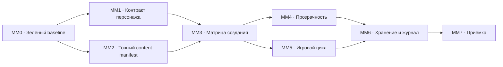

# micro-MVP Implementation Roadmap

**Статус:** рабочий технический план
**Дата актуализации:** 2026-08-06
**Связанные документы:** [Product Requirements Document](./product-prd.md),
[план миграции rules engine](./rules-engine-migration-plan.md)

## Шкала продуктовых вех

| Веха | Граница содержания |
|---|---|
| micro-MVP | Ограниченный заявленный каталог первого уровня; база приёмки |
| mini-MVP | Все заявленные расы, классы и эффекты первого уровня |
| part-MVP | Базовый набор правил D&D 2024 до пятого уровня включительно |
| MVP | Базовый набор правил D&D 2024 до двадцатого уровня включительно |

Конечный source corpus — полный PHB, DMG и MM линейки правил 2024 с
закреплёнными ревизиями/errata. SRD не ограничивает каталог; вехи определяют
порядок механической сертификации полного корпуса.

Рабочие пакеты MM0–MM7 ниже относятся к micro-MVP. Они не являются отдельными
продуктовыми вехами.

Шкала описывает полноту правил. Локальный сценарий, сетевой групповой encounter
и 2D-карта остаются отдельной осью режимов продукта.

## 1. Цель ближайшей поставки

Ближайшая цель — micro-MVP: ограниченный срез первого уровня и базовая веха
приёмки, которая доказывает один сквозной путь:

1. пользователь создаёт двух допустимых персонажей из ограниченного каталога;
2. все выбранные сущности механически попадают в их листы;
3. производные значения рассчитываются и объясняются по источникам;
4. персонажи действуют в строгой последовательности ходов;
5. сценарий включает как минимум одно действие, одно заклинание и одно
   состояние, применяемые между персонажами;
6. системный или ручной бросок, спасбросок и проверка дают воспроизводимый
   результат;
7. ресурсы, HP и эффекты обоих участников изменяются и проверяются;
8. изменения записываются в журнал, сохраняются и корректно восстанавливаются.

Регистрация, кампании, сетевой encounter и карта не входят в эту поставку.
Двух участников обслуживает локальный сценарный runtime. Дистанция,
досягаемость, линия видимости, укрытие, отношение к цели и её готовность
передаются движку как явные факты; вычислять их по полной геометрии не требуется.

Текущий полный каталог не удаляется. По умолчанию интерфейс показывает
`verified_mechanical`, `verified_partial` и `verified_narrative`. Пользователь
может включить показ остальных сущностей и выбрать их после предупреждения.

## 2. Каталог micro-MVP

### Классы

- Воин;
- Волшебник;
- Плут;
- Жрец;
- Чародей;
- Колдун;
- Друид.

В micro-MVP входят реальные особенности этих классов первого уровня и их
обязательные выборы. Особенности более высоких уровней не переносятся на первый
уровень; они входят в part-MVP или MVP согласно уровню получения.

### Виды

- Человек;
- Эльф;
- Дварф;
- Драконорождённый.

### Предыстории

- Солдат;
- Мудрец;
- Преступник;
- Прислужник (`Acolyte`; в интервью также использовалось название
  «Послушник»).

### Черты происхождения

- Бдительный;
- Посвящённый в магию;
- Одарённый;
- Крепкий.

Подтверждённое продуктовое правило `free_origin_feat_choice_v1`: персонаж
выбирает ровно одну черту из ограниченного пула независимо от предыстории. Этот
выбор заменяет фиксированный feat-grant официальной предыстории, а не добавляет
вторую черту. В mechanics/provenance он маркируется как `product_rule`, чтобы
не выдаваться за RAW.

### Заговоры

Versioned manifest `2.1.0` фиксирует 12 заговоров:

- Огненный снаряд;
- Священное пламя;
- Наставление (`Guidance`; в интервью также использовалось название
  «Указание»);
- Малая иллюзия;
- Луч холода;
- Леденящее прикосновение;
- Свет;
- Пляшущие огоньки;
- Искусство друидов;
- Починка;
- Ядовитые брызги;
- Фокусы.

### Заклинания первого уровня

Versioned manifest `2.1.0` фиксирует 14 заклинаний первого уровня:

- Волшебная стрела;
- Огненные ладони;
- Лечение ран;
- Щит;
- Доспехи мага;
- Волна грома;
- Псевдожизнь;
- Обнаружение магии;
- Благословение;
- Направляющий снаряд;
- Доспех Агатиса;
- Обнаружение болезней и яда;
- Обретение фамильяра;
- Очищение пищи и питья.

### Боевые стили

- Стрельба;
- Оборона;
- Сражение двумя оружиями;
- Защита.

### Действия и эффекты

В каталог входят все действия, состояния, эффекты, ресурсы и обязательные
выборы, образующие транзитивное механическое замыкание перечисленных сущностей
первого уровня. Их точные стабильные id фиксируются в versioned manifest;
зависимость нельзя считать покрытой только потому, что она описана текстом.

Русские названия должны быть связаны со стабильными slug/id. Приёмка опирается
на идентификаторы, а не на приблизительный поиск по отображаемому имени.

## 3. Фактический baseline

Команды, переменные окружения и имена модулей с `mvp` или `micro-micro` ниже —
существующие технические идентификаторы. В рамках переименования документации
они сохраняются для совместимости и не определяют границы продуктовых вех.

На момент первоначального аудита:

- `npm test`: 92 файла, 803 теста — проходили;
- `npm run test:mvp`: 6 файлов проходят, 11 пропускаются;
- legacy offline-набор `test:mvp`: 86 тестов проходят, 31 пропускается,
  4 помечены `todo`;
- `go test ./...`: проходит;
- `npm run build`: не проходил.

После пакета MM0 от 2026-07-28:

- исправлены обе первоначальные TypeScript-ошибки и найденный вслед за ними
  неиспользуемый параметр;
- `npm run build` проходит;
- `npm test`: 94 файла, 812 тестов — проходят;
- `npm run test:mvp`: 86 проходят, 31 пропускается, 4 `todo`;
- `go test ./...` проходит;
- `npm run test:content-manifest`: 9 тестов — проходят;
- production live-content gate выполняется без случайных skip и намеренно
  остаётся красным: все 37 обязательных записей найдены, но ещё не
  сертифицированы.

После начала MM3 от 2026-07-28:

- добавлена обязательная отдельная команда
  `npm run test:micro-micro:matrix`, которая без `skip` собирает все 256
  базовых сочетаний прежнего четырёхклассового среза через живой
  production-контент;
- общий автоматический строитель теперь разрешает spell-choice тем же
  фильтром, который используют desktop и mobile;
- матрица проходит для Воина и Плута и выявляет 128/256 блокирующих сочетаний:
  все варианты Волшебника и Жреца;
- первый прогон выявил, что исходного набора `4 заговора + 4 заклинания`
  недостаточно для классовых выборов Волшебника и Жреца;
- промежуточное продуктовое решение расширило пул до 7 заговоров и 10
  заклинаний; текущий manifest `2.1.0` завершил границу до 12 и 14 записей;
- автосборщик не повторяет UUID заклинания из двух источников, поскольку такой
  выбор даёт blocking conflict (например, класс + «Посвящённый в магию»).

Зелёный legacy offline-набор `test:mvp` не является release gate: контентные
проверки включаются только через `MVP_CONTENT=1` и без этого молча пропускаются.

Состояние технического baseline на 2026-08-03:

- CI на каждый push/PR обязательно выполняет production build, lint, 841+
  frontend unit-тест, legacy offline-набор `test:mvp` и backend-тесты; живой
  production-контент проверяется отдельным ночным/ручным gate;
- manifest, exhaustive-матрица и сертификация контента реализованы для прежнего
  четырёхклассового среза;
- короткий отдых использует добровольную последовательную трату костей хитов,
  а длинный отдых восстанавливает их;
- максимумы ресурсов показывают формулу и источник в hover-карточке;
- batch журнала имеет клиентский UUID и уникальный индекс, поэтому повторная
  доставка идемпотентна;
- публичный API остаётся без авторизации по продуктовому решению, но ограничен
  по размеру запросов и частоте, снабжён request ID, security headers и аудитом
  мутаций.

Текущий реализованный baseline на 2026-08-06 (он заменяет перечисленные выше
исторические ограничения для приёмки micro-MVP):

- canonical manifest содержит 49 сущностей: 7 классов, 4 вида, 4
  предыстории, 4 черты, 12 заговоров, 14 заклинаний и 4 боевых стиля;
- offline compiler строит ровно 448 root-сочетаний и отдельно материализует
  все внутренние choices первого уровня;
- `rules-core` и `PersistentRulesSession` дают единый двух-PC мир,
  детерминированные команды/events, immutable genesis, replay и fail-closed
  проверку snapshot;
- semantic gate требует unit + исполненный `mandatory-two-pc-v1` для каждой
  obligation/cell; простая регистрация имени теста больше не считается
  evidence;
- Playwright создаёт двух персонажей через настоящий UI Character Forge, но
  перехватывает весь `/api/**` изолированной in-memory fixture без backend/БД;
  затем связывает payload с exact compiled roots, исполняет сценарии Rules Lab
  и проверяет offline/reload и corruption failure на desktop и Pixel 7;
- отдельный явно разрешаемый `test:browser:live` использует два настроенных
  аккаунта и настоящий backend: создаёт два временных CharacterV3, проводит их
  через encounter с CAS-ходом, спасброском, HP и condition, проверяет reload
  листа и удаляет все canary-записи. Pending save в этом transport-smoke
  синтетический (`DC 99`, `hpDelta 3`), поэтому canary не сертифицирует
  production action/spell semantics;
- shared encounter transport требует `expected_seq`, проверяет его под row lock,
  возвращает `409` stale writer, проверяет ownership/GM authority и доставляет
  события через SSE. Backend всё ещё принимает рассчитанные клиентом patches,
  поэтому это transport consistency, а не server rules authority;
- PostgreSQL 17 integration проверяет schema-v5 snapshots/events и отклоняет
  некорректные INSERT/UPDATE. Production DB этими тестами не изменяется;
- финальная проверка patch `1.5.0` использует два независимых PostgreSQL 17
  клона: materialized clone K даёт read-only plan `0`, а baseline clone L —
  plan `105` (`100 update + 5 create`). Локальный drill подтвердил apply
  `105/105`, последующий no-op plan `0` и exact rollback `105/105`;
  production-контент на эту дату ещё не изменён.

## 4. Реализованные архитектурные пути

| Область | Текущее основание |
|---|---|
| Создание персонажа | `CharacterForge`, мобильный wizard, `assembleCharacter`, `resolveCharacterRules` |
| Механический контент | `mechanics.schema.json`, карточки действий/эффектов, ссылки между сущностями |
| Legacy-листы | `src/engine/executeAction`; поддерживается как compatibility path, но не сертифицирует micro-MVP |
| Canonical rules runtime | `src/rules-core`, `WorldState`, команды, события, pending decisions и replay |
| Прозрачность | `breakdownValue`, источники модификаторов, `RuleSource`, журнальные `EngineEvent` |
| Локальное authority | `PersistentRulesSession`, immutable genesis/event stream и IndexedDB snapshot |
| Хранение legacy-листа | `characters_v3`, runtime patch, `character_events` |
| Проверка механик | manifest/matrix, semantic obligations, exact structural coverage и Playwright |
| Shared encounter transport | обязательный `expected_seq`/CAS под row lock, ownership/GM authorization, durable `encounter_events`, SSE и восстановление потока; payload остаётся client-calculated |

Серверный command worker ещё не реализован. До него локальный Rules Lab
авторитетен для micro-MVP, а общий сетевой encounter остаётся legacy relay.

## 5. Остаточные разрывы

### P0 — production materialization и release evidence

Локальный exact drill завершён, но production-контент ещё не изменён. Перед
приёмкой требуется сначала снять новый свежий production dump и доказать его
восстановление, потому что startup нового backend сам применяет schema
migrations. Только после этого разрешены deployment точного commit, проверка
API/migrations, новый reviewed read-only plan и применение immutable bundle в
окно обслуживания. Затем требуются no-op plan `0`, release evidence и
certification на точных materialized bytes. Локальный drill или автоматическое
доверие live-каталогу не заменяют эти шаги.

### P1 — нужны до mini-MVP

1. Не все ручные значения представлены как отдельные методы расчёта.
2. Не для каждого ключевого числа гарантирован полный breakdown и причина выбора
   метода.
3. Контентный readiness-гейт допускает процентное покрытие заклинаний, хотя
   продукт требует механической работоспособности каждого заявленного
   заклинания.
4. D&D-предположения находятся непосредственно в общих TypeScript-модулях:
   шесть характеристик, D20, КЗ, spell slots и классовые правила.

### P2 — не блокируют micro-MVP и mini-MVP, но блокируют групповой режим

1. Часть legacy игровых routes всё ещё использует общий `public`; CharacterV3
   и encounters уже требуют строгий JWT. Исторические CharacterV3 `public`
   доступны авторизованным пользователям только для чтения до отдельной
   миграции владения.
2. `Group` ещё не является полной моделью Campaign и authority.
3. Encounter transport уже сериализует готовые клиентские patches через
   обязательный `expected_seq`/CAS под row lock, ownership/GM authorization и
   SSE, но не валидирует семантику action/spell, цену, DC или release hash.
4. Сервер не исполняет игровые намерения через rules engine; source и target
   сохраняются разными запросами, а не одной игровой транзакцией.
5. Журнал encounter хранит операции, но состояние пока не строится полноценным
   replay с отменой произвольного события и разрешением конфликтов.

## 6. Архитектурная граница ближайшего этапа

Для локальной приёмки допустимо исполнять механику клиентским адаптером общего
rules runtime: пользователь управляет обоими участниками, а журнал сценария
является локальным источником истины. Перенос исполнения в серверный адаптер не
должен задерживать micro-MVP, но оба адаптера обязаны использовать один контракт
команд, событий и состояния.

Минимальные метаданные уже добавлены:

- `system_id = dnd5e-2024`;
- закреплённую `ruleset_version`;
- `character_type = free`;
- `character_schema_version`.

Полный System Pack DSL сейчас не строится. D&D-константы постепенно собираются за
стабильной границей `Dnd5e2024SystemDefinition`, чтобы не распространять новые
hardcode-зависимости.

## 7. Рабочие пакеты

### MM0. Восстановить зелёный baseline

Работы:

- исправить две TypeScript-ошибки сборки;
- сделать `npm run build` обязательным gate;
- разделить обычные unit-тесты, offline contract tests и live-content tests;
- запретить release-команде считать пропущенные live-тесты успешной приёмкой;
- синхронизировать manifest с первым уровнем.

Готово, когда:

- `npm run build` проходит;
- `npm test` проходит;
- `npm run test:mvp` проходит;
- отдельная обязательная команда live-content gate не содержит случайных skip.

### MM1. Зафиксировать контракт персонажа

Работы:

- добавить системную принадлежность, версию ruleset, тип персонажа и версию
  схемы;
- мигрировать существующие записи как свободных D&D 2024 персонажей;
- добавить эти поля в create/get/update API;
- показывать тип и систему в интерфейсе;
- запретить изменение `system_id` существующего персонажа.

Готово, когда сохранение и повторная загрузка не теряют метаданные, а попытка
сменить систему отклоняется.

Статус на 2026-07-28: технический контракт реализован.

- миграция `082_character_system_metadata` переводит все существующие
  `characters_v3` в `dnd5e-2024 / 2024 / free / schema 1`;
- поля входят в модель, create/get/update API и frontend-типы;
- старые localStorage-черновики и ответы API до миграции получают те же
  безопасные значения по умолчанию;
- desktop/mobile создание, редактирование и дублирование сохраняют метаданные;
- список персонажей и лист показывают систему, ruleset и тип;
- обычный update возвращает конфликт при попытке поменять систему, ruleset, тип
  или версию схемы; PostgreSQL-trigger дополнительно запрещает смену
  `system_id` в обход API;
- создание другой системы, другого ruleset и ещё не реализованных типов
  `campaign`/`dungeon_crawl` честно отклоняется вместо сохранения
  неработоспособной комбинации.

### MM2. Создать точный manifest контента micro-MVP

Работы:

- перечислить стабильные id всех утверждённых сущностей;
- внедрить статусы `verified_mechanical`, `verified_partial`,
  `verified_narrative`, `partial`, `untested` и `known_mismatch`;
- показывать по умолчанию три проверенных статуса;
- разрешить показ и выбор остальных после предупреждения;
- привязать certification к версии/хэшу сущности и зависимостей;
- сбрасывать certification после содержательного изменения;
- проверить существование, тип, версию и ссылки каждой сущности;
- проверить `mechanics` общей JSON Schema;
- запретить дубликаты slug;
- выдавать отчёт `ready`, `broken_ref`, `invalid_mechanics`,
  `not_executable` или `needs_engine`;
- убрать readiness по одному только количеству записей.

Канонический versioned manifest находится в
`scripts/content/micro-mvp-manifest.mjs`. Команда
`npm run test:micro:manifest` проверяет его структуру, а
`npm run test:micro:live` запускает строгую проверку живого каталога.
Имена с `micro-micro` являются legacy API автоматизации и временно сохраняются;
человекочитаемое имя вехи — micro-MVP.
Сущность, найденная только по `name_en`, намеренно получила бы
`unstable_identity`, даже если её механика сертифицирована. В текущем
manifest таких селекторов уже не осталось.

Исторический manifest содержал 28, затем 37 записей. Канонический schema-v2
manifest сейчас содержит 49 записей; offline certification связывает их с
compiled release и semantic evidence, а live gate отдельно блокирует drift.

Техническая инфраструктура MM2 уже реализована:

- миграция `081_content_support_certification` добавляет certification ко всем
  восьми типам контента и сбрасывает её при содержательном изменении записи;
- API отдаёт `support` для классов, видов, предысторий, черт, заклинаний,
  предметов, действий и эффектов;
- кузница по умолчанию скрывает непроверенное, показывает статус на сущности и
  требует подтверждение при выборе через режим «Показать все сущности»;
- `certification-hash.mjs` вычисляет канонический хэш записи и хэш транзитивного
  замыкания зависимостей по `id`/`card_number`;
- live-gate возвращает `stale_certification`, если изменилась сама запись или
  любая найденная зависимость;
- `npm run content:certify -- ...` готовит certification в режиме dry-run,
  перечисляет зависимости и записывает результат только с явным `--apply`;
- серверная запись требует одновременно строгий JWT пользователя из
  server-side `CONTENT_ADMIN_USER_IDS` и отдельный
  `CONTENT_CERTIFICATION_KEY`; отсутствующая или невалидная admin-конфигурация
  закрывает запись; CharacterV3 и encounters отдельно защищены строгим JWT,
  а остальные legacy игровые маршруты сохраняют optional/public режим.

Пример безопасной подготовки без записи:

```bash
npm run content:certify -- --type class --card-number CLASS-warrior \
  --status verified_partial --limitation "Проверен только первый уровень"
```

После ручной механической проверки та же команда запускается с `--apply`, а
одинаковый `CONTENT_CERTIFICATION_KEY` должен быть задан у backend и в окружении
команды, а JWT команды должен принадлежать UUID из `CONTENT_ADMIN_USER_IDS`.

Готово, когда каждая сущность каталога micro-MVP имеет `ready`, а лишняя запись
в БД не может замаскировать отсутствие обязательной.

### MM3. Сертифицировать создание персонажа

Работы:

- генерировать все допустимые сочетания класса, вида, предыстории и независимо
  выбранной черты по `free_origin_feat_choice_v1`;
- генерировать допустимые наборы стилей, заговоров и заклинаний;
- автоматически разрешать и отдельно проверять каждый обязательный choice;
- собирать персонажа через тот же `assembleCharacter` и
  `resolveCharacterRules`, которые использует UI;
- проверять отсутствие неразрешённых конфликтов и потерянных grants;
- добавить E2E-сценарий создания на desktop;
- реализовать стандартный массив и point buy;
- поддержать все внутренние варианты четырёх эталонных видов.

Целевая базовая матрица включает 448 сочетаний
`7 классов × 4 вида × 4 предыстории × 4 независимо выбранные черты` по
`free_origin_feat_choice_v1`. Затем generator расширяет каждый root всеми
легальными внутренними вариантами вида, заклинаний, воззваний первого уровня и
боевых стилей. Базовая cardinality и дополнительное покрытие choices
публикуются в coverage report.

Статус на 2026-07-28 описывает прежнюю границу: технический matrix-gate после
расширения spell-пула проходит все 256/256 базовых сочетаний четырёх классов.
Это зелёный baseline, но ещё не приёмка обновлённого micro-MVP.

- legacy-модуль `microMicroMatrix.ts` строит ровно 256 уникальных случаев и
  запрещает тихо уменьшать любую из прежних четырёх осей;
- каждый случай использует общий `autoBuildAt`, настоящий `loadBundle`,
  `assemble`, `resolveCharacterRules` и `completionIssues`;
- проверяются системные метаданные, фактически загруженные класс/вид/
  предыстория/черта, все обязательные choices, конфликты и принадлежность
  выбранных заклинаний manifest;
- `spellMatchesChoice` вынесен в общий модуль, поэтому desktop, mobile и gate
  больше не могут независимо разойтись в правилах фильтрации;
- справочник переменных кэшируется вместе с остальными справочными сущностями:
  повторный полный прогон 256 случаев занимает около 9 секунд вместо тысяч
  одинаковых запросов.
- Волшебник, Жрец и комбинации с «Посвящённым в магию» закрывают все
  обязательные spell-choice без повторных UUID и blocking conflicts.

Принято решение расширить ограниченный spell-пул, не ослабляя требование
завершённого персонажа. Исходные 4+4 остаются обязательными демонстрационными
примерами, а дополнительные заклинания также входят в manifest и подлежат
сертификации.

Обновлённая матрица уже включает Чародея, Колдуна и Друида и все их
обязательные выборы первого уровня. Первый уровень Колдуна проверяется вместе с
одним допустимым воззванием; Метамагия и Дикий облик остаются архитектурными
fitness cases и не выдаются раньше второго уровня.

Готово, когда любой допустимый вариант из manifest создаётся, сохраняется,
открывается и даёт одинаковое рассчитанное состояние после повторной сборки.

Один и тот же browser acceptance corpus уже проходит на desktop Chromium и
Pixel 7. Полный функциональный паритет всех legacy-листов остаётся отдельной
задачей mini-MVP.

### MM4. Закрыть прозрачность листа

Обязательные значения:

- характеристики и модификаторы;
- КЗ;
- максимум HP;
- скорость;
- инициатива;
- спасброски;
- навыки;
- пассивное восприятие;
- атака заклинанием и СЛ;
- максимумы ресурсов.

Для каждого значения нужны:

- все применимые методы;
- части формулы;
- источник каждой части;
- выбранный метод;
- причина выбора;
- ручной метод, если пользователь ввёл значение;
- изменение результата после добавления или удаления источника.

Статус на 2026-08-09: MM4 закрыт на базовом desktop-срезе.

- общий `ValueBreakdown` теперь сообщает не только части формулы и отвергнутые
  варианты, но и выбранный способ расчёта с причиной выбора;
- лист показывает выбранный метод КЗ (например, обычный КЗ, броня или Защита
  без доспехов), причины отдельных частей формулы и альтернативные методы;
- добавлены breakdown для значения и модификатора характеристики, пассивного
  Восприятия, атаки заклинанием и СЛ заклинаний;
- оба desktop-представления листа используют эти breakdown вместо
  необъяснённых итоговых чисел;
- контрактные тесты проверяют нечётную характеристику, владение Восприятием и
  обе формулы заклинателя, а также наличие выбранного метода КЗ.

Максимумы системных, классовых, выданных эффектом и виртуальных ресурсов теперь
раскладываются по источникам; старый/ручной snapshot отображается отдельной
строкой согласования, поэтому сумма частей всегда равна показанному максимуму.
Закрывающий срез MM4:

- значение характеристики раскладывается по Point-buy/ручному методу, бонусу
  предыстории, grant-источникам и корректировкам `value_method`/предела;
- максимумы ресурсов показывают источники базового хода, класса, grant-правил,
  action/free-use пулов;
- добавлены unit/contract-проверки для источников характеристик, методов и
  максимумов ресурсов;
- выполнена базовая desktop UI-приёмка в браузере на двух персонажах: бард 5
  уровня и воин 3 уровня, включая открытие popover характеристики и ресурса.

Готово, когда автоматический тест проверяет равенство итогового числа сумме или
результату показанных операций и UI раскрывает ту же структуру.

### MM5. Закрыть сквозной игровой цикл

Работы:

- исполнить каждое заявленное действие, стиль, заговор и заклинание micro-MVP;
- поддержать системный бросок и ручной ввод результата;
- для нескольких костей позволить переключаться между вводом каждой выпавшей
  грани и вводом общего результата;
- записывать происхождение броска;
- применять стоимость, HP, временные HP, состояния и ресурсы атомарно;
- исправить короткий отдых на выбор и расход костей хитов;
- сохранять каждое изменение текущего состояния как событие;
- отличать ручную установку HP от расчётного метода максимума HP;
- не считать `NOT_IMPLEMENTED` успешным исполнением обязательной механики.

Локальный сценарный runtime загружает двух игровых персонажей, ведёт строгую
последовательность ходов и применяет команды к их общему состоянию. Он должен
поддержать взаимные атаки и заклинания, наложение и снятие состояний,
спасброски, проверки и проверку итогов обоих участников. Инициатива может быть
задана сценарием явно; сетевой encounter в этот режим не входит.

Пространственный контекст задаётся явными фактами (`distance`, `reach`,
`line_of_sight`, `cover`, `relation`, `willing`, `affected_targets`). Карта и
геометрический решатель позднее становятся одним из поставщиков этих фактов, но
не частью rules runtime.

Готово, когда для каждой активной сущности micro-MVP есть положительный,
отрицательный и граничный тест, а результат после перезагрузки совпадает с
результатом до неё.

Статус на 2026-08-03: короткий отдых переведён на кости хитов; пул создаётся по
кости класса и уровню, сохраняет потраченные кости при синхронизации, абстрактная
стоимость `hit_die` списывает реальный пул, каждый бросок содержит происхождение
и записывается в журнал. Оставшаяся работа MM5 — расширение полного
положительного/отрицательного/граничного покрытия за пределами прежнего
четырёхклассового среза.

### MM6. Хранение, журнал и восстановление

Работы:

- сохранять snapshot персонажа и упорядоченный журнал событий;
- гарантировать идемпотентность повторной отправки batch событий;
- показывать время, инициатора, источник и последствия;
- проверить create → play → save → reload;
- проверить восстановление после прерванного runtime update;
- определить политику удаления персонажа и его журнала в анонимном прототипе.

Готово, когда ни одно подтверждённое действие не исчезает и повторная доставка не
дублирует его.

Статус на 2026-08-03: `client_event_id` и частичный уникальный индекс закрывают
повторную доставку batch (первое событие побеждает, повтор возвращает ту же
строку); пакет ограничен 200 событиями. Политика удаления остаётся безопасной:
данные не удаляются без отдельного подтверждения владельца.

### MM7. Приёмочный gate

Обязательные команды и проверки:

- TypeScript production build;
- frontend unit tests;
- backend tests;
- offline engine contract tests;
- unit- и contract-матрицы состояний, мастерств оружия, заклинаний, ресурсов и
  временных ограничений;
- live-content contract tests;
- exhaustive generated character matrix;
- сценарные тесты двух персонажей с последовательностью ходов и проверкой
  состояния обоих участников; каждый такой сценарий содержит действие,
  заклинание, состояние, спасбросок и проверку;
- desktop E2E;
- ручной smoke-test на поддерживаемых браузерах.

Внутри micro-MVP не допускаются:

- `skip`;
- `todo`;
- `NOT_IMPLEMENTED`;
- невалидные ссылки;
- механика только в описании;
- неизвестный источник производного значения;
- известный блокирующий дефект.

## 8. Порядок зависимостей



MM4 и MM5 можно выполнять параллельно после сертификации сборки персонажа.

Снаряжение в micro-MVP должно сохранять текущее рабочее поведение и не
регрессировать, но полная сертификация всего снаряжения блокирует только ту
последующую веху, в чей заявленный каталог оно включено.

## 9. Расширение до mini-MVP

После принятия micro-MVP тот же pipeline расширяется на:

- все 12 официальных классов первого уровня;
- все официальные виды и варианты;
- все официальные предыстории;
- все черты происхождения;
- все доступные на первом уровне боевые стили;
- все заговоры;
- все заклинания первого уровня.

Для новой сущности не создаётся отдельный путь приёмки. Она добавляется в
versioned manifest и обязана пройти те же schema, reference, assembly,
execution, transparency, persistence и UI gates.

mini-MVP нельзя принять по условию «90% контента имеет механику».
Каждая заявленная сущность должна быть либо полностью работоспособной, либо
исключена из заявленного релизного каталога.

## 10. Расширение до part-MVP и MVP

После mini-MVP тот же pipeline последовательно расширяется без второго rules
engine:

1. part-MVP — базовые правила D&D 2024, прогрессия и заявленный контент с первого
   по пятый уровень включительно;
2. MVP — базовые правила D&D 2024, прогрессия и заявленный контент с первого по
   двадцатый уровень включительно.

Каждая следующая веха обязана прогонять полную регрессию всех предыдущих. Новые
классовые особенности, заклинания, состояния и предметы проходят тот же путь:
schema → ссылки → сборка → исполнение → прозрачность → сохранение → UI.

## 11. Архитектурный рубеж группового режима

После локального сценарного runtime основной архитектурный переход группового
режима:

1. включить аккаунты и Campaign authority;
2. заменить клиентские patches командами-намерениями;
3. исполнять encounter-команды серверным адаптером общего rules runtime;
4. сделать encounter state производным от событий и snapshot;
5. реализовать реакции, отмену, replay и разрешение конфликтов;
6. только после этого связывать полноценную 2D-карту с боевыми событиями.

Разработка карты поверх текущего `client-authoritative-relay` закрепит неверную
модель истины и создаст дорогую последующую переделку.
