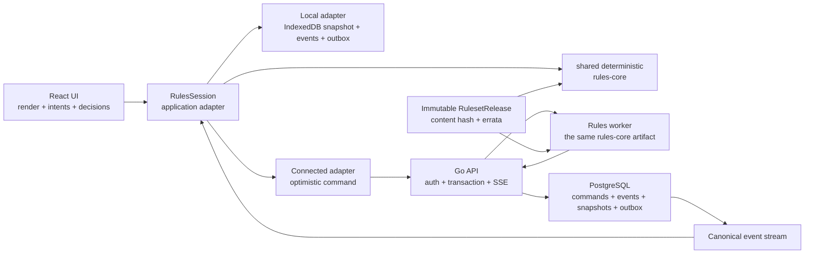
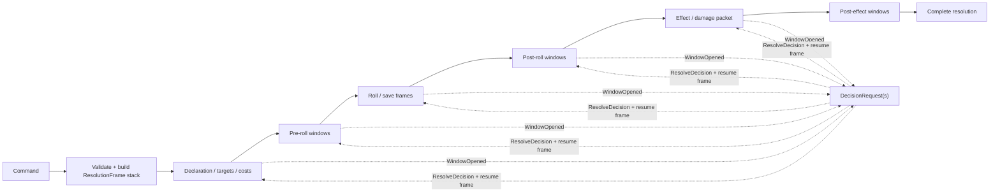

# План миграции rules engine и тестирования D&D 2024

**Статус:** micro-MVP подключён к server-authoritative command path; legacy encounter остаётся compatibility path
**Дата:** 2026-08-12
**База приёмки:** micro-MVP
**Связанные документы:** [micro-MVP Implementation Roadmap](./micro-mvp-roadmap.md),
[Product Requirements Document](./product-prd.md)

## 1. Решение

Правила не следует переносить только на backend. Целевая архитектура — один
детерминированный TypeScript rules core, не зависящий от React, HTTP, БД и
окружения. Один и тот же опубликованный artifact исполняется:

- локально в браузере — для мгновенного интерфейса, preview и полностью
  автономных локальных сценариев;
- на сервере — для авторитетного исполнения общих encounter, проверки прав и
  разрешения конкурентных команд;
- в тестах — без UI, сети и настоящей БД.

Каноническая транзакция имеет вид:

```text
WorldState + Command + SpatialFacts + Decisions + deterministic Env
    -> Resolution
    -> DomainEvent[]
    -> next WorldState
```

Локальный adapter остаётся offline-режимом и быстрым prediction. Для связанных
листов micro-MVP авторитетен backend: браузер отправляет только `GameCommand`,
Go проверяет ACL/revision/release, генерирует deterministic RNG tape и передаёт
команду локальному Node worker, собранному из того же `rules-core`. Только
возвращённые worker events и WorldState атомарно коммитятся в PostgreSQL.

Недельный AI-agent остаётся полезным как исследовательский UI-регресс и поиск
неожиданных комбинаций. Он не является основным oracle правил и не заменяет
детерминированные unit, property, scenario, replay и persistence tests.

### 1.1. Реализованное состояние на 2026-08-12

- `frontend/src/rules-core` содержит чистый детерминированный `WorldState +
  Command -> events -> next state` с типизированными pending decisions,
  replay, explicit RNG/clock/id и fail-closed отказами;
- `frontend/src/rules-session` является единственным write gateway локального
  сценария: immutable genesis, атомарный event stream, optimistic revision и
  восстановление snapshot только после точного replay;
- micro-MVP компилируется из pinned snapshot и versioned overlay в 448 корней;
  все внутренние choices и сложные ветви первого уровня имеют отдельные
  semantic obligations;
- каждый зарегистрированный scenario evidence обязан предъявить исполненный
  `mandatory-two-pc-v1`: два PC, инициатива/ходы, cross-PC действие или
  заклинание, состояние, save/check, deterministic tape и два replay
  checkpoint;
- `/rules-lab` исполняет тот же checked-in compiled artifact в браузере,
  сохраняет изолированный мир в IndexedDB и работает после отключения сети;
- checked-in Node worker исполняет тот же `rules-core` и exact pinned artifact;
  differential test воспроизводит production compiled two-PC trace и требует
  byte-semantic равенства событий и следующего мира;
- `POST /api/rules/canonical-sessions` проверяет exact release/hash, импортирует
  два листа, сверяет HP/resources/effects/equipment/inventory и rule-значимые
  поля карточек с БД и создаёт один server-authority writer;
- `POST /api/rules/canonical-sessions/:id/commands` принимает только intent,
  проверяет membership/controller/declared targets/revision и коммитит command,
  events, snapshot, actor projections и summoned-actor lifecycle транзакционно;
- exact retry по `commandId` возвращает прежнюю квитанцию и не вызывает worker
  повторно; прямые runtime/build writes заблокированы на время активной сессии;
- browser использует локальное исполнение только как prediction, принимает
  server snapshot как источник истины и умеет явно завершить сессию; закрытие
  атомарно снимает writer lock и удаляет compatibility mirror из листов.

Серверный путь сейчас является целевым для совместной сессии micro-MVP. Старый
`/api/transport` выключен по умолчанию и остаётся только явно включаемым
unverified shadow-инструментом. Старый `/encounters` ещё не переведён на этот
command API и не считается доказательством server rules authority.

## 2. Зафиксированная граница micro-MVP

В этом плане действуют продуктовые вехи:

| Веха | Содержание |
|---|---|
| micro-MVP | Ограниченный каталог первого уровня; базовая приёмка |
| mini-MVP | Все заявленные расы, классы и эффекты первого уровня |
| part-MVP | Базовые правила D&D 2024 до пятого уровня включительно |
| MVP | Базовые правила D&D 2024 до двадцатого уровня включительно |

Конечный source corpus — полный контент `Player's Handbook 2024`, `Dungeon
Master's Guide 2024` и `Monster Manual` линейки правил 2024 с точными
ревизиями/errata. SRD может использоваться как дополнительный открытый
reference, но не ограничивает каталог проекта. Вехи задают порядок
механической сертификации этого корпуса.

micro-MVP включает Воина, Волшебника, Плута, Жреца, Чародея, Колдуна и Друида,
ограниченные наборы видов, предысторий, черт, заклинаний, стилей и всё
транзитивное механическое замыкание их первого уровня. Выбор воззвания Колдуна
первого уровня входит в эту границу. Метамагия Чародея и Дикий облик Друида
используются как архитектурные fitness cases, но не выдаются персонажу первого
уровня раньше, чем это разрешают правила.

Подтверждено продуктовое правило `free_origin_feat_choice_v1`: background и
Origin feat являются независимыми осями. Персонаж выбирает ровно одну черту из
доступного milestone-пула; она заменяет фиксированный feat-grant официальной
предыстории и не добавляется поверх него. Отклонение от RAW хранится в
provenance как `product_rule`, получает собственные obligations и входит в hash
rules release. Поэтому базовая матрица micro-MVP содержит 448 сочетаний
`7 классов × 4 вида × 4 предыстории × 4 черты`.

Каждый приёмочный scenario test использует двух игровых персонажей, строгий
порядок ходов, действие, заклинание, состояние, спасбросок и проверку. Полная
геометрия не требуется: расстояние, досягаемость, видимость, укрытие, отношение
к цели и число затронутых целей подаются как явные `SpatialFacts`.

## 3. Исходное состояние до миграции (исторический аудит)

### 3.1. Карта движка

| Область | Текущие компоненты | Оценка границы |
|---|---|---|
| Сборка персонажа | `frontend/src/character/assemble.ts`, `frontend/src/character/rules/resolveCharacterRules.ts` | Рабочая сборка смешана с загрузкой контента и глобальными cache/registry |
| Runtime rules | `frontend/src/engine/*` | Большой объём механик уже выражен в тестируемом TypeScript |
| Публичные runtime-типы | `frontend/src/mvp/contracts.ts` | Контракт фактически общий, но находится в legacy frontend-модуле |
| Actor/target execution | `frontend/src/engine/execute.ts` | Транзакция ограничена `RuntimeState` одного actor и пристёгнутым `targetState` |
| События, триггеры, реакции | `frontend/src/engine/events.ts`, `dispatch.ts` | Полезные примитивы есть, но реакция ещё не является сериализуемой паузой разрешения |
| Ходы, эффекты, состояния | `turn.ts`, `concentration.ts`, `effects.ts`, `conditions.ts` | Lifecycle привязан преимущественно к локальному actor, не к общему миру |
| UI-оркестрация | `frontend/src/components/SheetActionsPanel.tsx`, `frontend/src/pages/CharacterSheetMVP.tsx` | UI выбирает решения, запускает engine, вычисляет save/reaction и отдельно сохраняет участников |
| Encounter transport | `frontend/src/battle/*`, `backend/encounter_controller.go` | Клиент присылает готовые patches; backend — `client-authoritative-relay` |
| Character persistence | `backend/models_character_v3.go`, `backend/character_v3_controller.go` | Snapshot и presentation journal записываются отдельными операциями |
| Offline | PWA-конфигурация и localStorage drafts | Кэшируется shell, но нет versioned rules bundle, world snapshot и durable outbox |

Полезные части текущего engine не нужно переписывать целиком. Формулы, броски,
модификаторы, стоимость, ресурсы, оружие, мастерства, AC и производные значения
можно переносить в чистое ядро постепенно, сохраняя re-export по старым путям.

### 3.2. Главные ограничения текущей модели

1. Два персонажа не существуют как единый атомарный `WorldState`. UI сначала
   изменяет одного, затем другого, затем encounter и журналы.
2. Save, reaction и выбор порядка не являются сохраняемым состоянием
   транзакции. Например, сетевой Shield приходится обрабатывать после расчёта
   попадания компенсацией результата.
3. React-компоненты содержат правила и сетевую хореографию, поэтому полноценный
   сценарий вынужден тестировать детали UI и HTTP вместо доменной семантики.
4. В core ещё встречаются `Math.random`, `Date.now` и глобально изменяемые
   registry. Это мешает точному replay.
5. Неизвестная или незавершённая механика местами превращается в narrative
   result. Для приёмки требуется типизированный отказ, а не видимый успех.
6. Runtime patch, character journal и encounter projection не объединены одной
   транзакцией. У записей нет общей optimistic revision.
7. Encounter принимает произвольный shallow patch, не блокирует строку по
   ожидаемой версии и не гарантирует уникальный `(encounter_id, seq)`.
8. PWA может загрузить интерфейс без сети, но пока не может гарантированно
   продолжить и восстановить rules session.
9. Frontend сохраняет provenance активного эффекта как `sourceId`, но backend
   модель это поле не хранит; `firedThisTurn`/`firedThisRest` также не входят в
   обычный persistence payload. Source-scoped effects и once-per-turn/rest
   способны измениться после reload.
10. Инвентарь агрегирует записи по content card, а не по стабильному item
    instance ID. Два одинаковых предмета с разными charges/attunement пока
    невозможно однозначно развивать независимо.

### 3.3. Текущий проверяемый baseline

Read-only аудит на 2026-08-04 дал следующий baseline:

- `npm test -- --reporter=dot`: 103 test files, 845 тестов, все проходят;
- `npm run test:mvp -- --reporter=dot`: 90 тестов проходят, 38 пропущены,
  4 `todo`;
- `go test ./...`: проходит;
- CI на PR выполняет build, lint, frontend tests, legacy MVP tests и Go tests;
- scheduled workflow запускает legacy `test:mvp`, lint и export production
  snapshot, но не strict live micro gate; snapshot drift сейчас лишь warning;
- строгий manifest gate, live micro gate, certification и character matrix пока
  не являются обязательным PR gate; legacy matrix жёстко ограничена четырьмя
  классами и 256 сочетаниями;
- текущие mechanics sweep/certification tests в основном доказывают отсутствие
  исключения/`NOT_IMPLEMENTED`, а пустая mechanics может считаться валидной;
  это smoke baseline, не доказательство RAW-поведения.

Read-only снимок через production API показывает, что архитектурная миграция и
сертификация контента — разные задачи:

- 10 `characters_v3`: 6 первого уровня, 1 второго, 2 пятого и 1 десятого;
  у двух персонажей суммарно 4 активных эффекта;
- 374 `character_events`, но только 11 имеют `client_event_id`; у журнала нет
  собственного sequence, ruleset/engine version и causation/correlation;
- 12 encounters и 55 encounter events; в snapshots 9 combatants, из них 4
  содержат `characterId`, не указывающий ни на одного существующего персонажа;
- 51 запись имеет `verified_partial`, ни одна — `verified_mechanical`; прямой
  сертификации actions/effects нет;
- в API присутствуют 13 базовых классов, но у Чародея, Колдуна и Друида нет
  текущей отметки mechanical support; отметки Воина, Волшебника, Плута и Жреца
  относятся к прежней частичной границе.

Обнаружен блокирующий дефект baseline: production certification gate сообщает
`37/37 ready`, хотя загружает не весь каталог. Скрипты запрашивают
`limit=1000`, backend молча ограничивает ответ 500 строками, а клиент ошибочно
считает эту страницу последней. При корректной пагинации из прежних 37 записей
готова 31, а dependency hash шести записей устарел: Fighter, Wizard, Rogue,
Cleric, Soldier и Criminal. Исправление пагинации и пересчёт certification —
часть RE0, до них текущий зелёный live gate не является доказательством.

Ни одну запись аудит не изменял. Прямое read-only подключение к production DB
оказалось недоступно с текущими локальными реквизитами, поэтому данные прочитаны
через публичные GET API, а constraints сверены по миграциям. Существующие
пользовательские snapshots нельзя считать эталонным тестовым корпусом или
автоматически интерпретировать как полный исторический журнал доменных событий.

### 3.4. Что можно полноценно тестировать до миграции

| Срез | Текущая покрываемость | Ограничение доказательства |
|---|---|---|
| Formula/roll/modifier/cost/resource/mastery primitives | Высокая: pure unit и property tests возможны уже сейчас | Нужно убрать fallback random/global registry и добавить независимый oracle |
| Сборка одного персонажа | Высокая: generated matrix через реальный assembly | Mutable live content и неполный certification делают результат нестабильным без pinned snapshot |
| Один actor применяет действие к target | Средняя: `executeAction` уже возвращает self и `targetState` | Target не полноценный участник мира, lifecycle/provenance ограничены |
| Два персонажа, несколько ходов, локально | Средняя как characterization: временный runner может перекладывать `result.state/targetState` между actors | Он не доказывает атомарную модель решений, реакций, reload и общего журнала |
| Общий save/reaction через сеть | Низкая: только UI/API E2E текущей хореографии | Save delta/refund и раздельные writes могут дать формально зелёный, но семантически неверный результат |
| Replay и конкурентные клиенты | Практически отсутствует | Текущие журналы не являются каноническими engine events, нет CAS/idempotent encounter command |

Временный двухакторный runner поверх нынешнего executor полезен в RE0 как
characterization harness. Его нельзя объявлять целевой моделью: он должен быть
заменён `WorldState` slice, а сохранённые traces — проигрываться на обеих
реализациях для differential comparison.

## 4. Целевая архитектура



### 4.1. Пакеты и зависимости

Рабочее разбиение:

```text
packages/rules-core/
  domain/          WorldState, ActorState, EffectInstance, TurnState
  build/           BuildChoices -> compiled ActorState/capabilities
  commands/        command schemas and handlers
  resolution/      decisions, reactions, rolls, continuation
  events/          envelopes, reducers, canonical serialization
  rules/           reusable mechanics primitives
  dnd2024/         Dnd5e2024SystemDefinition and rule obligations
  testing/         builders, RNG tape, scenario runner

frontend/src/rules-session/
  local-adapter/   IndexedDB, offline bundle, outbox
  connected/       prediction, ack, reconcile, conflict/reconfirmation
  react/           hooks and projections

backend/
  worlds API       auth, optimistic concurrency, transaction, SSE
rules-worker/
  JSON ABI over the exact pinned rules-core artifact
```

`rules-core` не импортирует React, axios, Go/DB types, browser globals или
конкретный storage. Ограничение проверяется архитектурным тестом.

### 4.2. Канонические контракты

Минимальная модель:

- `RulesetRelease`: `systemId`, версия правил, версия errata, schema version,
  immutable content manifest и canonical content hash;
- `WorldState`: actors, объекты/призывы/зоны, `SceneState` с режимом
  exploration/encounter, optional turn/round, активные эффекты, pending
  resolutions, logical clock, версия и ruleset reference;
- `ActorState`: стабильный actor ID, build snapshot/hash, derived capabilities,
  HP/resources/equipment/effects, controller и usage ledger;
- `Command`: намерение пользователя с `commandId`, actor, expected world
  version, payload, ruleset/content hash, causation и correlation IDs;
- `SpatialFacts`: уже вычисленные факты пространства с `factsSource` и
  `boardRevision`; в local mode их задаёт сценарий/GM, в shared mode сервер
  получает их из авторитетного board snapshot либо подписанного GM ruling;
- `DecisionRequest`: сериализуемая просьба выбрать цель, вариант, бросок,
  реакцию, порядок эффектов или результат ручного ввода;
- `PendingResolution`: continuation data без JS closure, которую можно
  сохранить и загрузить; клиент ссылается только на её ID и не присылает
  continuation обратно;
- `UncommittedRuleEvent`: результат core без DB sequence: type, ordinal, source,
  targets, mechanic/entity provenance и payload;
- `StoredEventEnvelope`: session, глобальный `seq`, окончательный `eventId`,
  command/correlation IDs, schema/artifact versions и uncommitted payload;
- `EffectInstance`: source и targets, origin entity/version, duration boundary,
  stacking key, concentration group и usage ledger;
- `DeterministicEnv`: RNG tape/seed, ID factory и logical clock. Core не читает
  системные время и случайность самостоятельно.

Главные операции:

```text
handleCommand(world, command, facts, env, catalog)
  -> Accepted(events, nextState)
   | AwaitingDecision(events, nextState, requests)
   | Rejected(code, details)

resolveDecision(world, { resolutionId, requestId, choice, expectedRevision }, env, catalog)
  -> Accepted | AwaitingDecision | Rejected

evolve(world, uncommittedRuleEvent) -> world
```

Обязательный инвариант: `fold(before, events) == nextState`. Snapshot является
оптимизацией; подтверждённые domain events — объяснимой причиной состояния.
Переход в ожидание тоже сохраняется событиями вроде `ResolutionOpened` и
`DecisionRequested`; они меняют только pending state, не применяя преждевременно
урон или другой ещё отменяемый результат.

Core находит continuation только внутри `WorldState`; tampered, stale и уже
закрытый `requestId` отклоняются. Command несёт stable entity/revision IDs и
choices, но не готовые damage/effect payloads. Worker сам компилирует и
allowlist-ит pinned catalog; произвольная механика клиента допустима только в
отдельном аудируемом `GMOverride`.
`ResolveDecision` — обычная versioned/idempotent `Command` со своим command ID,
expected revision и controller ACL; отдельного менее защищённого endpoint для
ответа на save/reaction нет.

State hash строится из canonical `WorldState`, rule-event hash — из
`UncommittedRuleEvent[]`, а transport hash — из `StoredEventEnvelope`. DB seq и
event IDs не входят в сравнение browser/worker prediction, иначе конкурентный
commit делал бы одинаковое rule execution формально различным.

### 4.3. Модель разрешения действия



Это не одна линейная state machine, а сериализуемый стек typed frames/windows.
Конкретное правило открывает окно на нужной фазе: Counterspell — во время cast,
Shield — после attack roll до применения hit/effect, Empowered Spell — после
damage roll, а последующий save может открыть новое окно. `WindowOpened`
фиксирует trigger, eligible actors, priority/default и pinned world/board
revision.

Каждый human pause — уже атомарно сохранённый переход saga, а не одна длинная
DB-транзакция. Costs имеют rule-specific состояния `Reserved`, `Paid`,
`Released` и не возвращаются автоматически только потому, что поздний effect
не сработал. Exit tests проверяют судьбу action/reaction/slot/resource при
отказе, Counterspell, отмене и timeout. Такая модель устраняет штатный
«сначала нанести урон, затем вернуть его из-за Shield», но не обещает ошибочно
откатить уже законно уплаченную стоимость.

Для MVP действует простая single-flight policy: пока в session открыт
`PendingResolution`, world принимает только decision command текущего request
или аудируемый timeout/GM resolution. Несвязанные игровые команды получают
`ResolutionInProgress`. Несколько eligible reactors опрашиваются
последовательно в детерминированном priority/order; после pass/answer core
создаёт следующий request уже на новой revision. У request есть deadline и
rule-defined default (обычно pass), поэтому disconnect не оставляет мир
заблокированным навсегда. Отдельный concurrent resolution aggregate можно
добавить позже, но две модели не смешиваются.

### 4.4. Authority и работа при плохой сети

| Режим | Кто авторитетен | Поведение сети |
|---|---|---|
| Лист и локальный сценарий micro-MVP | Browser local adapter | Core отвечает сразу; snapshot, events и outbox сохраняются в IndexedDB; sync необязателен |
| Подключённый личный лист | Сервер после ack, клиент прогнозирует | UI мгновенно показывает prediction; одна доменная команда синхронизируется в фоне |
| Общий encounter | Серверный adapter | Клиент исполняет prediction тем же core, сервер повторяет и присылает canonical events; mismatch вызывает typed reconciliation/conflict |
| Offline во время общего encounter | Сервер остаётся авторитетным | Новые команды можно сохранить как pending, но нельзя финализировать решения других игроков без reconnect |

Запрос не требуется на каждый клик. Выбор вкладки, цели, уровня слота и preview
может быть локальным. Сетевой boundary — принятая доменная команда и последующие
решения, влияющие на общий мир.

В shared mode `SpatialFacts` не принимаются на веру от клиента. Серверный
adapter получает их из pinned board revision; если полной геометрии нет, GM
передаёт подписанное/audited adjudication. Подмена range, visibility, relation,
cover или affected targets клиентом входит в adversarial contract suite.

Автоматическая reconciliation может предложить повтор только для явно
классифицированных commutative/safely revalidatable intentions и всегда создаёт
новую command с новым base revision/ID. Исходная команда никогда не rebase-ится
на месте. Намерение с уже раскрытым roll, выбранной целью, чужим decision или
изменившимся ресурсом по умолчанию получает
`StaleRevision/ReconfirmationRequired`; UI просит подтверждение и связывает
новую command общей correlation, не перенося старое решение молча.

Runtime одного сохранённого персонажа имеет ровно одного writer-authority. При
входе в server session она получает exclusive runtime lease; личный лист читает
projection, а изменения HP/resources/effects маршрутизируются командами этой
session. Одновременное участие того же character в другой авторитетной session
запрещено. Альтернатива detached actor + явный merge возможна позднее как
отдельный продуктовый протокол, но не смешивается с lease-моделью.
Build revision actor также pinned на время session; несовместимое редактирование
build отклоняется или становится отдельной migration command после безопасной
границы, а не меняет derived capabilities посреди pending resolution.

Подтверждённый путь для текущего Go backend — небольшой Node rules worker с
устойчивым versioned JSON ABI. Go продолжает отвечать за auth, ACL, транзакции,
идемпотентность, PostgreSQL и SSE. Немедленная перепись ядра на Go создаст две
семантики на время миграции; Rust/WASM можно рассматривать позже, не меняя
доменный ABI.

Источник броска является частью authority policy. В локальном мире допустимы
local RNG и ручной ввод. В общем encounter автоматический roll либо создаётся
сервером, либо расходует заранее выданный одноразовый подписанный roll token;
клиентский произвольный seed нельзя считать честным oracle. Если точный roll
ещё неизвестен, локальный core мгновенно строит legality/dice plan и
`DecisionRequest`, а итоговое изменение HP ожидает ack. Ручной физический бросок
передаётся отдельным аудируемым decision согласно настройке session.

Повышение локального мира до server authority — отдельная явная операция:
adapter замораживает local writer, загружает genesis + events + bundle hash с
idempotent import ID, сервер проверяет ACL и полностью проигрывает trace,
назначает server seq/revision, после чего клиент переключает authority. Partial
upload, повторный import, clone из второй вкладки и несовместимый rules release
не меняют локальный оригинал.

«Offline micro-MVP» означает уже установленное приложение с заранее
закреплённым полным bundle. Cold first visit без сети невозможен. Gate также
проверяет IndexedDB schema upgrade, atomic write, multi-tab writer lock,
quota/eviction warning и восстановление после частичной записи.

### 4.5. Рассмотренные альтернативы

| Вариант | Offline/latency | Единая семантика | Цена и вывод |
|---|---|---|---|
| Shared TypeScript core в browser и Node worker | Полный local mode; prediction в connected mode | Один artifact и общие contract vectors | Подтверждённый целевой вариант: максимальное повторное использование нынешнего engine |
| Backend-only rules + отдельный frontend predictor | Общий режим ждёт сеть; predictor нужен для хорошего UX | Две реализации неизбежно расходятся, если predictor не тот же artifact | Не решает исходный компромисс |
| Rust core, собранный в WASM/native | Хороший offline и одинаковый artifact | Сильная долгосрочная граница | Возможная будущая цель, но слишком дорогой rewrite до micro-MVP |
| Оставить client-authoritative patches и добавить weekly agent | Хороший локальный UX | Сервер не доказывает легальность; нет атомарного two-actor replay | Агент полезен только как дополнительный E2E-слой |

Отдельная полная реализация правил на Go не рекомендуется. Если operational
ограничения позднее запретят Node worker, сначала следует стабилизировать JSON
ABI и общий corpus, а затем заменить worker на Rust/WASM или другой исполнитель
через differential tests, не переписывая UI и persistence protocol одновременно.

## 5. Fitness cases сложных правил

Следующие правила не обязательно полностью входят в micro-MVP, но их форма
обязана влиять на фундамент сейчас.

| Механика | Что требует от архитектуры | Антипаттерн, который запрещаем |
|---|---|---|
| Метамагия | Phase-addressable modifiers на `CastInstance`: declaration, target/save setup, post-miss, post-damage-roll и subsequent saves; choices, conflicts и resource provenance. Fitness: Subtle/Counterspell eligibility, Quickened turn ledger, Empowered post-roll, Heightened repeated save | Условия `if sorcerer` в React-компоненте заклинания или один универсальный pre-cast hook |
| Воззвания | Параметризованные grants, prerequisites, замена/модификация действий, triggers и usage limits; выбор первого уровня покрывается в micro-MVP | Копирование отдельной версии действия в лист |
| Summoned actor | Полноценный `ActorState`, controller, initiative insertion, commands, HP и concentration/source lifecycle | Narrative condition владельца |
| Conjured spatial effect | World object/zone с anchor/shape facts, entry/start/end-turn triggers, forced movement и ledger `(effect,target,turn,trigger)` | Фиктивный creature с HP/ходом для любого `Conjure X` |
| Смена облика | `BaseActorState + TransformationLayer`, source-specific retention mask, THP grant/termination, equipment disposition, продолжающиеся conditions/concentration и errata-pinned contract | Разрушительная замена персонажа или универсальный отдельный HP-пул формы в стиле 2014 |
| Реакции | Priority/window, eligible reactors, serialize/resume и commit после решения | Постфактум refund HP или AC |
| Концентрация | Один source, несколько targets/objects, damage packets, saves и removal всей группы; прежняя концентрация заканчивается в rule-defined момент начала нового concentration cast/activation | Удаление только локального эффекта caster или восстановление старой концентрации после Counterspell |
| Предметы | Тот же механизм grants/actions/effects/resources с provenance `item` и attunement/equipment lifecycle | Отдельный «предметный движок» |
| Вне боя | Общий logical clock; Help для check; willing/voluntary decisions; PC agency; Search/Study через `GMDecision/ExternalFact`; ritual/concentration/rest interruption; transfer item ownership; transition exploration <-> encounter | Отдельные формулы и mutable state внутри UI вне initiative |

До завершения extraction должны существовать небольшие архитектурные тесты на
форму этих случаев: core умеет выразить phase modifier, создать временного actor
или zone, наложить transformation layer, приостановить reaction window и
перенести effects через смену scene mode. Полную таблицу правил более высоких
уровней они пока не утверждают.

## 6. Целевая модель хранения

Миграция БД только additive до подтверждённого cutover. Имена таблиц ниже
рабочие; перед реализацией они оформляются отдельным ADR и сверяются с текущим
реестром миграций.

### 6.1. Новые сущности

| Таблица | Назначение и ключевые поля |
|---|---|
| `content_revisions` | Immutable canonical body и hash конкретной ревизии каждой rules/content entity |
| `content_dependency_edges` | Граф зависимости одной immutable revision от другой |
| `ruleset_releases` | Immutable manifest: system/version/errata/schema, artifact version, manifest/content hash и status |
| `ruleset_release_entries` | Связь release с точными `content_revisions`, а не с mutable head-row |
| `content_certifications` | Release + revision + suite/evidence hash, status/limitations и revoke history |
| `character_build_revisions` | Immutable build inputs/choices, pinned content revisions, compile artifact и build hash |
| `game_sessions` | Mode, authority, ruleset release, snapshot JSONB, `snapshot_seq`, `revision`, state hash |
| `game_session_members` | Нормализованное membership, role/controller ACL и lifecycle |
| `game_session_actors` | Stable actor ID, optional `character_id`, controller/owner, build snapshot/hash |
| `item_instances` | Instance ID, immutable definition revision, owner/container instance, charges, attunement и mutable state |
| `spatial_fact_sets` | Immutable canonical facts/adjudication body+hash, facts source/signature и optional board revision |
| `game_commands` | Command ID/idempotency, canonical body/request hash, base seq/revision, actor/controller, payload schema, status/rejection, full immutable execution input/hash, rules/artifact hash |
| `command_execution_jobs` | Durable job: command ID, lease owner/until + fencing token, heartbeat, attempts/backoff, terminal/dead-letter status |
| `game_events` | Session, монотонно растущий seq, event ID, command ID/index, payload schema, source/targets и rules/artifact reference |
| `session_snapshots` | Immutable checkpoints с seq, schema/serializer version и state hash; ускоритель replay, не authority |
| `decision_requests` | Projection open decisions: resolution/request ID, assigned controller, deadline/default, idempotency и pinned revisions |
| `transactional_outbox` | Dedup key, lease, attempts/next retry и dead-letter status для надёжной публикации |
| `test_runs` | Изолированный run/namespace, pinned release/seed, status, `expires_at` и artifact links для weekly agent |

Обязательные ограничения:

- unique `(session_id, command_id)`;
- unique `(session_id, seq)`;
- unique `(session_id, command_id, event_index)`;
- unique job per command и FK execution job -> command; fencing token запрещает
  commit от worker с просроченным lease;
- foreign keys команд, событий и actors на session/ruleset;
- unique active runtime participation одного `character_id` при lease-модели;
- optimistic `expected_revision` плюс row lock во время commit;
- canonical JSON serialization и state/event hash;
- actor-controller ACL и отдельная аудируемая команда `GMOverride`;
- append-only protection для revisions, releases, certifications и events;
- обязательные command/event/pending/genesis schema versions и точные
  rules-artifact/serializer versions.

Повтор command ID с тем же request hash возвращает прежний результат. Тот же ID
с другим payload/hash возвращает `IdempotencyConflict`, а не молча принимает
первую запись.

`characters_v3` получает только необходимые поля совместимости: runtime/build
revision, build/derived input hash, ruleset release, projection sequence,
migration status и ссылку на активную session при необходимости. Его
`rule_state` остаётся пересчитываемой projection/cache, а не вторым источником
истины. Текущий `support` JSON также становится projection сертификации exact
content revision; сервер/CI вычисляет hash сам, а не доверяет присланному
клиентом значению.

`game_session_actors`, `item_instances` и open `decision_requests` являются
нормализованными projections/indexes канонического `WorldState`, а не
независимыми mutable authorities. Их projector position проверяется против
session seq.

### 6.2. Атомарный commit серверной команды

Сервер использует двухфазный протокол без долгой DB-транзакции.

Admission transaction:

1. сначала ищет `(session_id, command_id)`; точный request hash возвращает
   сохранённый status/result независимо от текущей revision и гарантирует, что
   admitted command имеет live/reclaimable execution job; другой hash даёт
   `IdempotencyConflict`;
2. только для новой команды проверяет auth/ACL, schemas, rules release и
   expected base revision;
3. сохраняет command в состоянии `admitted` вместе с base snapshot hash и
   полным immutable execution input: canonical command/decision body,
   `SpatialFactSet`/signed adjudication или immutable board revision,
   manual-roll input, deterministic clock, persisted roll token либо
   server-secret derivation/nonce, ID namespace и hashes всех входов;
4. в той же транзакции добавляет durable `command_execution_job`.

Worker claim-ит job по lease, heartbeat-ит его и вычисляет
`UncommittedRuleEvent[]` вне write-транзакции, не имея внешних side effects.
После lease expiry reclaimer повторно ставит тот же command с тем же execution
input; retry/backoff ограничены, а terminal retryable/dead-letter status виден
API и alerting.

Commit transaction:

1. блокирует session, снова проверяет точный command record и возвращает уже
   committed result при retry;
2. для новой фиксации требует, чтобы current revision всё ещё равнялась base
   revision; иначе записывает `StaleRevision` и не переносит старый roll/choice
   на новый state;
3. добавляет command result и stored event envelopes, обновляет
   snapshot/revision/state hash и совместимые projections;
4. записывает outbox notification и фиксирует транзакцию; dispatcher публикует
   SSE после commit.

Timeout/retry повторно использует тот же admitted execution input. Один roll
token расходуется ровно одной command; новый base state требует нового command
ID. Неподтверждённый server roll не раскрывается клиенту при stale/conflict, а
token нельзя выбирать из нескольких или переиспользовать для reroll. Никакого
перевычисления под row lock или автоматического semantic rebase нет.
Kill сразу после admission, во время worker и перед commit должен приводить к
reclaim и единственному commit либо конечному диагностируемому status, но не к
вечному `in-progress`.

Текущие `character_events` остаются presentation/audit journal. Их нельзя
автоматически объявить domain events: в них недостаточно данных для точного
replay. Аналогично старые encounter patches сохраняются как legacy history, но
не backfill-ятся фиктивными событиями.

Новая session начинается событиями `SessionCreated` и `ActorAdded`. Legacy
backfill создаёт одно явное genesis-событие `LegacyStateImported` с normalized
initial world, raw source hashes и `legacy_unknown` для утраченной provenance/
usage history. Snapshot 0 строится из этого события. Replay guarantee для
мигрированной session начинается с genesis event; старые audit/patch записи
показываются рядом, но не притворяются причиной последующего canonical state.

### 6.3. Совместимость и rollback

- У каждой session ровно один authority mode: `legacy_client_patch`,
  `local_rules_core` или `server_rules_core`.
- Старые sessions продолжаются в legacy mode до явной безопасной конвертации;
  новые cohorts создаются на новом пути.
- Shadow execution сравнивает результаты, но не делает второй независимый
  commit.
- Для новой session legacy sheet/encounter fields обновляются только как
  projection канонических events, если старый UI ещё читает их.
- Versioned `LegacyProjectionCapability` перечисляет, какие command/event/state
  variants представимы без потерь; parity test делает
  canonical -> legacy projection -> legacy read.
- Feature flag может откатить deployment/UI/API, но не меняет authority уже
  начатой canonical session. Она продолжается совместимым n-1 worker/UI либо
  временно становится read-only/frozen.
- Downgrade session в legacy разрешён только на quiescent seq boundary и только
  для доказанно lossless subset. Pending resolutions, source-linked effects,
  summons/zones, transformations и item instances по умолчанию запрещают такой
  downgrade.
- Rollback matrix отдельно задаётся для UI, API, worker, schema и rules
  artifact; canonical commands/events никогда не удаляются rollback-ом.
- Удаление старых endpoints/полей разрешается после измеримого retirement gate:
  заданный cohort soak, ноль unexplained shadow diff, replay всех active
  sessions, ноль legacy writes по telemetry, backup/restore и n-1 rollback drill.

### 6.4. Эволюция protocol и rules release

Pinned hash недостаточен, если новый deploy не умеет открыть старый pending
resolution. Command, uncommitted/stored event, genesis, snapshot и
`PendingResolution` имеют независимые schema versions. Для каждой версии
выбирается один из двух путей: проверенный pure upcaster либо сохранённый
совместимый worker artifact. Session не меняет rules/content release, пока в ней
открыто решение; дальнейший upgrade выполняется отдельной командой после
snapshot/rollback point.

Deployment gate проигрывает n и n-1 fixtures, открывает pending resolutions
предыдущей версии и проверяет все active-session artifact references. Нельзя
удалять старый worker/bundle, пока retention/telemetry показывают хотя бы одну
session, которую может продолжить только он.

## 7. Этапы миграции

Этапы — dependency order, а не календарные обещания. Каждый этап выпускается
небольшими вертикальными PR и сохраняет рабочий старый путь.

### RE0. Зафиксировать поведение и обязательства

Работы:

- завести versioned `RuleObligation` registry с source/ruleset/errata и stable
  ID для каждого правила micro-MVP;
- сохранить минимальный corpus текущих успешных и известных ошибочных flows;
- записать commit SHA/deployment artifact, API snapshot time и версии Node, Go
  и PostgreSQL для baseline;
- получить schema-only dump и фактический список/checksum `schema_migrations`
  из production либо объявить это явным blocker RE6; migration source сам по
  себе не доказывает deployed schema;
- составить полный inventory writers: UI generations, encounter/sheet paths,
  scripts, certification tools и legacy clients;
- внедрить deterministic RNG tape, clock, ID factory и canonical serializer в
  test harness;
- зафиксировать manifest micro-MVP и транзитивные зависимости;
- зарегистрировать полный source corpus PHB/DMG/MM и отдельный obligation pack
  `free_origin_feat_choice_v1`, включая подавление official background feat и
  гарантию ровно одного выбранного grant;
- исправить оба catalog loader (`fetchCatalog` и общий `fetchAll`): идти по
  страницам до `received_count == response.total`, независимо от server clamp;
- добавить regression server clamp `requested=1000/actual=500`, включить strict
  full-catalog gate в scheduled CI и завершать job ненулевым кодом при
  stale/missing/duplicate; текущий snapshot warning не является gate;
- пересчитать dependency hashes и внедрить reverse-dependency invalidation либо
  обязательный полный пересчёт при сборке immutable release;
- сохранить анонимизированные snapshots текущих 10 characters и 12 encounters
  только как legacy regression fixtures, включая orphan actor references;
- зафиксировать, что 13 root classes в API — 12 официальных плюс homebrew
  Pugilist, а не 13 классов официальных правил 2024;
- зафиксировать текущие обязательные красные контракты: narrative-only Sneak
  Attack, Innate Sorcery и Primal Order, а также подозрительное legacy-значение
  двух воззваний Колдуна против одного выбора на первом уровне;
- не нормализовать отсутствующие legacy `sourceId`/usage ledgers: сохранять
  `legacy_unknown`;
- добавить obligations для SummonedActor/SpatialEffect split, момента разрыва
  концентрации при начале нового cast и transformation errata;
- классифицировать каждый используемый payload: supported, intentionally
  rejected или deferred outside milestone.

Exit gate:

- каждый заявленный flow воспроизводится одинаковым seed/tape;
- нет неизвестного payload, который маскируется narrative success;
- full-catalog gate видит все страницы, шесть stale certifications пересчитаны
  или явно остаются красными, scheduled job действительно блокирует drift;
- legacy baseline остаётся зелёным, известные расхождения записаны как явные
  characterization cases.

Rollback: только тестовые контракты и adapters, production path не меняется.

### RE1. Выделить чистое ядро без изменения поведения

Работы:

- создать `packages/rules-core` и перенести сначала контракты и чистые
  primitives;
- выделить pure `compileCharacterBuild(BuildChoices, RulesetRelease)` с
  injected content provider; UI/API больше не являются обязательными для
  assembly tests;
- собирать build-time immutable `RulesetReleaseBundle` в repository artifacts;
  RE6 импортирует точно этот hash в БД, а не впервые создаёт release;
- оставить re-export из старых frontend paths;
- передавать RNG, clock, ID factory, condition catalog и content catalog явно;
- запретить imports из UI/API/storage архитектурным тестом;
- закрепить одну canonical serialization/hash implementation в Node и browser.

Exit gate:

- все старые engine tests проходят через новые re-export;
- одинаковый fixture даёт одинаковые events/state hash в browser-like runtime и
  Node;
- одинаковые choices дают один ActorState/build hash в browser и Node, а
  illegal prerequisite/choice отклоняется одним stable code;
- 100 повторов одного corpus не дают nondeterministic diff.

Rollback: re-export возвращается на старую реализацию; persistence не менялась.

### RE2. Ввести Command/Event façade и `WorldState`

Работы:

- обернуть существующий `executeAction` в первый command handler;
- ввести `compileCharacterBuild -> ActorState`, `WorldState`, `TurnId` и
  `SpatialFacts`;
- ввести `SceneState` и команды перехода exploration -> encounter: вне
  инициативы сохраняется детерминированный command order/logical clock, но
  action economy боя не применяется без соответствующего правила;
- убрать target из специального `TargetContext` в новом пути: оба участника —
  равноправные actors мира;
- реализовать `handleCommand`, `evolve` и in-memory session adapter;
- создать scenario DSL и первый двухперсонажный vertical slice:
  attack/check/save/damage/heal/effect/end turn.

Exit gate:

- изменения обоих actors представлены одним упорядоченным набором events;
- `fold(events)` равен returned state;
- новый scenario не импортирует React, HTTP или БД;
- в новом пути нет fake target с огромным HP, передачи рассчитанного delta или
  прямого target PATCH.

Rollback: UI продолжает использовать legacy executor; новый façade работает в
tests/shadow mode.

### RE3. Сделать разрешение действий возобновляемым

Работы:

- добавить typed `DecisionRequest` и `PendingResolution` для targets, rolls,
  manual input, saves, reactions и порядка;
- реализовать typed resolution-frame stack и phase windows до roll/save, после
  roll и после effect/damage packet; continuation хранится только в state;
- реализовать single-flight resolution lock, последовательный reactor priority,
  deadline/default и reconnect к текущему request;
- перенести расход ресурсов, spell slots и commit последствия к корректной
  фазе через `Reserved/Paid/Released`;
- выразить Shield до фиксации попадания/урона;
- привязать once-per-turn/rest к стабильным turn/rest IDs;
- выразить concentration group с effects на нескольких actors/objects;
- сериализовать и возобновлять resolution после reload на каждой pause-point.

Exit gate:

- pause -> serialize -> reload -> resume эквивалентен непрерывному выполнению;
- отказ от реакции, принятая реакция, успешный и проваленный save имеют явные
  event traces;
- повтор решения с тем же ID идемпотентен;
- tampered/stale/already-resolved request отклоняется;
- unrelated command во время окна отклоняется; два reactor responses,
  пришедшие одновременно, не обходят priority и не оставляют зависший request;
- Counterspell, Shield и post-roll modifier не требуют специальных веток UI;
- action/reaction/slot/resource остаются потраченными или освобождаются именно
  по obligation конкретного правила; нет компенсационного HP-refund как
  штатного механизма реакции.

Rollback: до UI cutover весь session/cohort остаётся на legacy authority;
canonical и direct-patch writers внутри одного runtime не смешиваются.

### RE4. Перевести UI на `RulesSession`

Работы:

- сначала создать runtime write gateway/application service `RulesSession` и
  перевести через него все HP/effect/resource/turn writes одновременно;
- с момента включения cohort `RulesSession` — единственный writer runtime;
  ещё не мигрированная family вызывает внутренний `LegacyCommandHandler`/
  `LegacyProjectionAdapter`, который делает один session commit и помечает
  replayable `LegacyStatePatched` событие с before/after hash как
  legacy/non-certified, но UI больше не PATCH-ит state напрямую;
- UI только рендерит projections, отправляет intents и показывает
  `DecisionRequest`;
- мигрировать вертикально: базовые действия -> attacks/mastery -> spells/saves
  -> effects/concentration -> reactions/rest;
- использовать одну session implementation в desktop, mobile и encounter UI;
- заменять handlers по family внутри gateway; новые acceptance worlds запрещают
  `LegacyCommandHandler` полностью.

Exit gate:

- import/API-boundary test доказывает, что ни одна панель не обходит
  `RulesSession` для runtime write;
- в мигрированном handler отсутствуют UI rule branches и ручная сборка patches;
- в каждой session ровно один authority/writer, даже если часть handlers ещё
  legacy; micro acceptance trace не содержит legacy/non-certified command;
- classic/V2/mobile получают одинаковое состояние на одном command trace;
- UI E2E проверяет намерение и отображение, а не повторяет формулы core.

Rollback: flag выбирает прежний handler только внутри `RulesSession` либо весь
cohort остаётся legacy. Возврат к direct mutation component orchestrator после
gateway cutover запрещён.

### RE5. Завершить локальный micro-MVP и offline persistence

Работы:

- IndexedDB хранит immutable rules/content bundle, world snapshots, domain
  events, pending resolutions, outbox и ack cursor;
- service worker кэширует конкретную версию bundle по hash;
- расширить manifest и character matrix до семи классов и всех обязательных
  choices первого уровня;
- закрыть semantic unit tests и обязательный scenario corpus;
- добавить Playwright desktop flow create two characters -> play -> reload;
- сертифицировать каждую сущность micro-MVP против pinned content snapshot.

Exit gate micro-MVP:

- после успешной установки/pin полного bundle включить airplane mode:
  создать/открыть двух actors, выполнить несколько полных ходов, перезагрузить
  страницу и получить тот же state hash;
- каждый обязательный scenario проводит полный раунд обоих characters и имеет
  независимые assertions для non-spell action, spell, actual condition, save и
  ability check, затем проверяет обоих actors и replay;
- в micro gates нет `skip`, `todo`, `NOT_IMPLEMENTED`, stale certification или
  неизвестной зависимости;
- все 448 root tuples `7 classes x 4 species x 4 backgrounds x 4 origin feats`
  по `free_origin_feat_choice_v1` собираются, а каждый внутренний choice
  встречается минимум один раз;
- сценарии и reducers проходят mutation/invariant gates из раздела 8.

Rollback: локальные записи versioned; старый лист доступен для чтения через
projection/import, исходный character build не перезаписывается необратимо.

### RE6. Добавить новую серверную модель в shadow mode

Работы:

- усилить migration runner: advisory lock, checksum применённой миграции,
  atomic `Up + record`, явные состояния failure и отдельные resumable backfill
  jobs; индексы `CONCURRENTLY` выполнять контролируемой отдельной фазой;
- получить фактический production schema dump/migration list, снять backup и
  выполнить migration + restore rehearsal на production clone;
- additive DB migrations из раздела 6;
- импортировать в БД exact build-time `RulesetReleaseBundle` из RE1, собранный
  из versioned canonical export, а не mutable/усечённого API DTO;
- затем idempotent batch backfill с checkpoint/source hash: character
  build/runtime через `LegacyStateImported`, inventory в детерминированные item
  instances, orphan combatants как external legacy actors, character journal
  только как `legacy_audit`;
- replay старых encounter operations сравнить с текущим snapshot; при diff не
  выдумывать события, а сохранить authoritative legacy snapshot и discrepancy;
- добавить optimistic revisions текущим character/encounter compatibility
  endpoints: обновлять только конкретные колонки через
  `UPDATE ... WHERE runtime_revision = ?`, а не load -> full `Save`;
- после preflight duplicate/orphan queries добавить unique
  `(encounter_id, seq)`, event -> encounter FK и необходимые current-encounter
  constraints через `NOT VALID`/`CONCURRENTLY`, затем валидировать отдельно;
- Go endpoint вида `/game-sessions/:id/commands` и version/hash handshake;
- Node worker с pinned rules artifact и health/version endpoints;
- с первого дня endpoint требует service/user identity, membership и actor ACL;
  fallback на общего `public` не разрешает command write;
- transactional admission, immutable execution inputs, durable leased job,
  short commit CAS, idempotency и outbox;
- сравнение client prediction с server execution без второго commit;
- метрики diff, rejection, replay, latency, queue и worker version skew.

Exit gate:

- весь deterministic corpus совпадает между client и worker;
- backfill повторяем, имеет checkpoints и не меняет результат при повторном
  запуске; orphan/unknown provenance не удалены и явно помечены;
- race tests не допускают lost update, duplicate seq и двойной расход;
- failure injection для exact retry, stale revision, worker timeout/crash после
  compute, DB contention и outbox crash восстанавливается без двойного эффекта;
- kill сразу после admission, во время worker и перед commit reclaim-ится либо
  заканчивается terminal status; admitted command не висит бесконечно;
- retry/crash сохраняет тот же server roll/ID namespace, а reuse или подбор
  roll token отклоняется;
- mismatch artifact отклоняется с понятным требованием обновить bundle;
- проверен rollback flag и сохранность legacy projections.

Rollback: новый endpoint/cohort отключается; additive tables и telemetry
остаются, старые sessions не конвертируются автоматически.

### RE7. Включить server authority для общих encounter

Работы:

- включать новый mode по cohorts, начиная с тестовых encounters;
- заменить `ApplyRequest` командами-намерениями;
- передавать canonical domain events через доработанный snapshot/SSE transport:
  атомарный snapshot+cursor, gap detection/buffering, compacted-cursor resync и
  дедупликация нескольких outbox dispatchers;
- реализовать controller ACL, remote decisions, reconnect, reconciliation и
  explicit reconfirmation conflicts;
- проверить два клиента, две вкладки, duplicate/reordered delivery и временный
  offline;
- прекратить независимую запись sheet runtime из encounter UI.

Exit gate:

- серверный replay строит тот же snapshot и hash;
- UI не может напрямую изменить HP/effect/turn новой session;
- personal sheet write и попытка второго encounter для того же character не
  обходят exclusive lease и не создают второго runtime writer;
- disconnect/reconnect не теряет подтверждённые команды и не дублирует события;
- commit между чтением snapshot и subscribe, out-of-order/duplicate delivery,
  потерянное SSE notification и reconnect после compaction проходят gates;
- реакция и save другого игрока переживают reload обоих клиентов;
- production rollback drill выполнен на тестовом cohort.

Rollback: canonical session продолжает совместимый worker/UI либо
замораживается read-only. Переход в legacy разрешён только capability matrix на
quiescent boundary; подтверждённые canonical events не удаляются.

### RE8. Удалить legacy и расширять тот же pipeline

Работы:

- после окна стабильности удалить `PendingSave`, `PendingAttack`, arbitrary
  encounter patches и rule branches из React;
- архивировать legacy технические имена `mvp`/`micro-micro`, не переписывая
  исторические миграции;
- расширить manifest до mini-MVP, затем уровни 2-5 до part-MVP и 6-20 до MVP;
- последовательно импортировать и сертифицировать полный PHB/DMG/MM corpus;
  level-agnostic monsters, magic items и GM rules получают явную milestone/
  capability classification, а не теряются между level gates;
- реализовывать метамагию, summons, transformations и items через уже
  проверенные extension points.

Exit gate:

- production не принимает произвольные state patches;
- нет двух исполняемых реализаций одной поддерживаемой механики;
- каждая следующая продуктовая веха прогоняет полную регрессию предыдущих.

Rollback: удаление legacy разрешается только после потери необходимости в
rollback; до этого этапа cleanup не выполняется.

### 7.1. Критический путь


micro-MVP принимается после RE5. RE6-RE7 нужны для надёжного общего сетевого
режима, но локальную базу приёмки не задерживают.

### 7.2. Связь с пакетами MM roadmap

Новый план не создаёт вторую продуктовую дорожную карту:

| Пакет roadmap | Архитектурная зависимость |
|---|---|
| MM0-MM2: baseline, metadata, manifest/certification | RE0; честная пагинация и immutable release обязательны до сертификации |
| MM3: создание и 448-root matrix | RE0 плюс build boundary RE1; не требует server worker |
| MM4: прозрачность листа | Идёт параллельно RE1-RE3, но explanations становятся projection core |
| MM5: двухакторный игровой цикл | RE2-RE4; это основной vertical slice архитектуры |
| MM6: хранение/восстановление | Локальная часть RE5; server/group durability — RE6-RE7 |
| MM7: приёмка | Exit gate RE5 плюс все semantic/UI gates раздела 8 |
| Групповой режим после micro-MVP | RE6-RE7; не подменяется текущим relay |

## 8. Стратегия тестирования micro-MVP

### 8.1. Что означает «полное покрытие»

Raw line coverage не доказывает соответствие D&D. Базовая единица покрытия —
не строка TypeScript, а versioned `RuleObligation` и механическая сущность
manifest.

Для micro-MVP обязательны одновременно:

1. `CapabilityEvidenceMatrix` задаёт знаменатель: для каждого
   `entityId/obligationId + aspectId` перечислены capability profile и
   обязательные evidence types. Например, display-only запись требует
   schema/render/a11y, grant — assembly/persistence, executable action —
   positive/negative/boundary execution, reducer — unit/property/replay.
2. Неприменимый слой отмечается `N/A` с машинно проверяемой причиной, owner и
   scope rule. `N/A` не равно skip; in-scope механика не может закрыться через
   `UnsupportedMechanic`.
3. CI строит пересчитываемый индекс
   `obligationId + aspectId -> assertion IDs -> result -> rules/content hash` и
   отклоняет orphan obligation, пустое упоминание без assertion, stale evidence
   и assertion без владельца.
4. Positive/negative/boundary expectations и legality берутся из независимо
   составленных obligation fixtures. Production catalog определяет IDs/scope,
   но production assembler/prerequisite resolver/handler не вычисляет expected
   результат собственного теста.
5. Все variants `Command`, rule/stored event, `DecisionRequest`, payload и
   reducer исчерпывающе обработаны. Typed `UnsupportedMechanic` разрешён только
   для aspect, явно находящегося вне текущего release.
6. Для небольшого списка critical reducers, cost formulas и state transitions
   branch coverage равен 100%; aggregate rules-core metrics публикуются и не
   уменьшаются. Список модулей и coverage provider фиксируются в gate, а не
   подразумеваются для всего repository.
7. Mutation gate остаётся следующим усилением после micro-MVP: он должен
   покрыть HP, AC, DC, dice, resource cost, duration, target, save, turn
   legality и stacking. Текущая приёмка не заявляет mutation coverage и вместо
   него блокируется на semantic obligations и exact structural coverage
   critical modules.
8. Каждый micro-MVP acceptance scenario проверяет конкретные assertion IDs,
   normalized event trace, state обоих actors и replay hash, а не только наличие
   тега или текст UI.

Differential parity browser/Node, legacy/new и client/worker доказывает
переносимость, но не RAW. Она принимается только вместе с независимым obligation
oracle; разрешённый legacy/new diff ссылается на obligation и утверждённое
исправление.

Невозможную комбинацию не генерируют как позитивный тест. Независимый fixture
задаёт ожидаемый legality/rejection; immutable catalog даёт только исходные
факты и stable IDs, а не oracle поведения.

### 8.2. Слои тестов

| Слой | Что доказывает | Среда и частота |
|---|---|---|
| Schema/reference | Валидность mechanics, IDs, ссылок, prerequisites, exhaustive payloads | Каждый PR |
| Pure unit | Формулы, dice, advantage, AC/DC, costs, resources, conditions, durations, mastery, stacking | Каждый PR |
| Property/invariant | Bounds, conservation, idempotency, commutativity только там, где она заявлена, serialize/deserialize | Каждый PR для малого набора; полный nightly |
| Build matrix | Любой допустимый build собирается без потерянных grants/choices | Все 448 roots и каждый internal choice на PR; pairwise nightly |
| Scenario | Два actors, ходы, действия, spells, conditions, save/check и state transitions | Обязательный corpus на PR |
| Replay/differential | `fold(events)`, pause/resume, browser/Node и legacy/new parity на миграции | PR + nightly |
| Persistence integration | Transaction, revision, idempotency, outbox, reload, races | PR для adapters; расширенный nightly |
| Browser E2E | Реальный create/play/decision/reload и понятность UI | Малый smoke на PR; полный weekly |
| Live content drift | Production catalog совпадает с pinned manifest/certification hash | Nightly; не является fixture unit tests |
| Exploratory agent | Неожиданные UX-пути, тексты, viewports, сочетания | Weekly/on demand, не release oracle |

Unit/scenario tests используют repository fixtures и immutable content snapshot,
а не production БД. Database integration поднимает одноразовый PostgreSQL
namespace/container и очищается транзакцией или TTL. Тестовый агент никогда не
создаёт и не удаляет production-персонажей. Любая mutating test command обязана
fail closed без явного `TEST_API_URL`, service identity и server capability,
подтверждающей isolated environment; production suite допускает только GET/hash
drift checks.

### 8.3. Scenario DSL

Канонический scenario — JSON-compatible документ с `schemaVersion`, который
исполняет реальный core. Fluent builder допустим как authoring sugar, но обязан
скомпилироваться в этот документ без callback/closure. Сокращённый фрагмент:

```ts
const spec: ScenarioSpec = {
  schemaVersion: 1,
  id: 'micro.fighter-wizard.mastery-shield',
  rulesetRelease: 'dnd5e-2024@<release-hash>',
  actors: {
    fighter: { buildFixture: 'micro.fighter.1' },
    wizard: { buildFixture: 'micro.wizard.1' },
  },
  initiative: ['fighter', 'wizard'],
  steps: [
    { do: 'startTurn', actor: 'fighter' },
    {
      do: 'use',
      actor: 'fighter',
      entityId: '<stable-action-id>',
      targets: ['wizard'],
      facts: { distanceFt: 5, reachFt: 5, lineOfSight: true, cover: 'none' },
      rolls: { attack: [14], damage: [6] },
      decisions: [{ actor: 'wizard', type: 'reaction', choice: 'accept' }],
      expect: { actors: {/* explicit deltas/state */}, events: [/* types */] },
    },
    { do: 'endTurn', actor: 'fighter' },
    // Следующие ходы содержат castSpell, applyCondition, savingThrow и abilityCheck.
    { do: 'checkpointReload' },
  ],
  requiredTrace: [
    'nonSpellAction',
    'castSpell',
    'applyCondition',
    'savingThrow',
    'abilityCheck',
  ],
};

runScenario(spec).expectReplayHash();
```

DSL не должен вычислять ожидаемые значения теми же helpers, что production
handler. Expected outcome задаётся явными числами/состояниями или независимой
таблицей obligation fixtures, иначе тест повторит ошибку реализации.
Roll tape именуется по назначению (`attack`, `damage`, `save`, `check`) и строг:
недостающий, лишний или выходящий за диапазон результат завершает тест ошибкой,
никогда не откатываясь к `Math.random`.

Каждый failure artifact содержит:

- rules artifact и content hash;
- seed/RNG tape и ручные решения;
- build snapshots обоих actors;
- commands, pending decisions и canonical events;
- before/after state и hash;
- для E2E — browser trace, console/network log и screenshot.

### 8.4. Обязательный scenario corpus

Каждый acceptance scenario ниже обязан пройти общий контракт пользователя:

- ровно два `playerCharacter` actors в общем `WorldState`;
- полный раунд: оба получили собственный ход в строгом порядке;
- отдельные trace/assertion IDs для `nonSpellAction`, `castSpell`,
  `applyCondition` (именно игровое состояние, не просто concentration/effect),
  `savingThrow` и `abilityCheck` (не attack roll);
- применение как минимум одного spell/effect одного персонажа к другому;
- assertions по обоим actors, checkpoint serialize/reload и replay equality;
- success и negative/boundary lanes с явным roll tape.

| ID | Пара и основная цель | Дополнительные обязательства |
|---|---|---|
| SC-01 | Воин <-> Волшебник | Attack + mastery/Prone, отдельный Study/Search check, Burning Hands/Thunderwave save и Shield accept/decline до effect; hit/miss, reaction/slot и duration assertions |
| SC-02 | Плут <-> Жрец | Hide ability check -> Invisible condition, Guidance/Bless и Sacred Flame save, damage/heal; обязательные Sneak Attack positive/no-eligibility/once-per-turn assertions |
| SC-03 | Чародей <-> Друид | Spell attack и save spell, condition и concentration damage save; отдельные executable obligations Innate Sorcery и Primal Order; ручной/system roll parity |
| SC-04 | Колдун <-> Воин | Ровно одно L1 invocation, которое меняет compiled capabilities; Pact Magic slot/short-rest semantics и weapon mastery; save/check/condition закрываются отдельными stable entities, не притворяются свойствами invocation |
| SC-05 | Exploration -> encounter, Жрец <-> Плут | Вне инициативы Help/Guidance для Search/Study check, external fact/hazard save и condition, затем перенос effects/resources в инициативу и полный боевой раунд |

До статуса `ready` каждая строка обязана получить из manifest конкретные stable
IDs `nonSpellActionId`, `spellId`, `conditionId`, `saveObligationId` и
`checkObligationId`; локализованное имя не является селектором. Если общий trace
невозможно законно построить из заявленного каталога, это незамкнутый manifest,
а не повод подставить несвязанную проверку или ослабить контракт.

Сфокусированные tests не называются acceptance scenarios и не обязаны
искусственно повторять весь omnibus trace:

| ID | Фокус | Gate |
|---|---|---|
| CF-01 | Два/несколько sources одного condition: provenance, stacking/replacement, duration | RE3/PR |
| CF-02 | Multi-target и несколько eligible reactors: simultaneous responses, strict priority, timeout/default; допускает actors >= 2 | RE3/nightly |
| CF-03 | Slots, hit dice, per-rest ledger, short/long rest interruption | RE3/PR |
| PI-01 | Local pending save/reaction -> reload, duplicate local command, IndexedDB/outbox | RE5 |
| PI-02 | Server retry/reconnect, stale revision, conflict/reconfirmation, SSE gap | RE6-RE7 |

### 8.5. Unit и property suites, необходимые для приёмки

- D20: normal/advantage/disadvantage, natural 1/20 там, где правило применимо,
  manual input, provenance каждого die;
- checks/saves/attacks: proficiency, expertise, modifiers, DC/AC boundary,
  critical hit, resistance/immunity/vulnerability и rounding;
- action economy: action, bonus action, reaction, movement facts, one-per-turn,
  illegal actor/phase/target;
- conditions: каждый condition micro manifest, source-scoped application,
  immunity, duplicate/stack policy, start/end/save duration;
- concentration: start/replace/break, each damage packet, multiple targets,
  source removal и incapacitation/death paths;
- weapon mastery: prerequisite, selected weapon, hit/miss/save boundary,
  once-per-turn ledger и interaction с condition;
- spells: target legality, attack/save/automatic hit, scaling boundary, slot/free
  use, concentration, duration, resistance и reaction timing;
- grants/choices: race/background/feat/class/invocation sources, prerequisites,
  duplicate UUID, conflict и deterministic assembly; отдельно
  `free_origin_feat_choice_v1` проверяет все 16 background/feat pairs, ровно
  один resulting feat, отсутствие скрытого official grant и provenance
  `product_rule`;
- HP/resources/rest: temp HP, zero HP, max clamp, hit dice, slots, free uses,
  short/long rest и persistence round-trip;
- reducers/events: exhaustive event variants, provenance, canonical ordering,
  duplicate delivery, replay from empty and from snapshot;
- general invariants: одинаковые state/command/tape дают одинаковый результат,
  входное состояние не мутирует, неуспешная оплата атомарна, HP/resources не
  выходят за границы, отсутствующий required SpatialFact fail closed;
- future fitness: phase-specific metamagic, SummonedActor и SpatialEffect,
  errata-pinned TransformationLayer и item-granted action на synthetic fixtures.

### 8.6. Character matrix без комбинаторного взрыва

На каждом PR generator строит все 448 root tuples подтверждённого продуктового
правила:

```text
7 classes x 4 species x 4 backgrounds x 4 origin feats = 448 roots
```

`free_origin_feat_choice_v1` заменяет фиксированный background feat-grant одним
независимым выбором из milestone-пула. Generator отдельно доказывает, что
персонаж получил ровно одну Origin feat и что official grant не добавился
вторично. Поверх 448 roots generator обязан:

- встретить каждый class/species/background/feat internal choice минимум один
  раз;
- встретить каждое воззвание, fighting style, cantrip и spell из micro manifest
  минимум один раз в законном build;
- построить pairwise coverage взаимодействующих choices;
- отдельно проверять запрещённые и конфликтные варианты;
- выдавать coverage report по stable IDs и obligations, чтобы рост каталога не
  мог тихо уменьшить полноту.

### 8.7. CI и ритм регрессии

Текущее состояние gates:

| Gate/команда | Состояние 2026-08-04 | С какого этапа блокирует | Среда и бюджет |
|---|---|---|---|
| `build`, `lint`, default/MVP tests | Блокируют PR | Сейчас | Offline Node/Go |
| `test:micro:manifest` + `test:micro:matrix` | Блокируют PR; 49 сущностей и 448 roots | Сейчас | Pinned snapshot |
| `test:rules:coverage` + `test:rules:primitives` | Блокируют PR на 100% critical modules | Сейчас | V8 coverage |
| `test:micro:coverage` | Блокирует PR; unit + mandatory two-PC evidence | Сейчас | Две фазы, execution manifest |
| Playwright desktop + Pixel 7 | Блокирует PR; Forge, Rules Lab, offline/reload/corruption | Сейчас | Local preview, intercepted in-memory API; не backend/DB acceptance |
| `go test ./...` с PostgreSQL 16 + `go vet ./...` | Блокирует PR | Сейчас | Ephemeral DB service |
| live compilation/certification | Scheduled/manual; drift fail closed | Сейчас | Production GET-only |
| `test:rules:mutation` | Tooling отсутствует | После micro-MVP | Critical operators |
| `test:rules:worker-diff` | Worker отсутствует | RE6 | Client/worker exact artifacts |

На PR после RE5 обязательны schema/import boundary, pure unit/fast properties,
448 roots + каждое stable internal choice, весь acceptance scenario corpus,
replay/hash, build/lint/Go и один desktop smoke. Pairwise/t-wise choice
interactions остаются nightly, поэтому нет противоречия между «каждый choice на
PR» и «комбинации choices ночью».

Целевой nightly после соответствующих этапов:

- полный property/pairwise corpus;
- blocking mutation artifact critical core для того же commit, который может
  быть принят release pipeline;
- client/worker differential replay после RE6;
- pagination-aware live content drift/certification с non-zero exit;
- concurrency, failure injection и rebuild snapshot из genesis/events после
  RE6.

Weekly/on demand:

- полный Playwright corpus на поддерживаемых browsers/viewports;
- AI exploratory agent в одноразовом test namespace;
- accessibility scan и визуальные snapshots ключевых decision/rejection states;
- архивирование trace, screenshots, seed, ruleset/content hash и найденных
  counterexamples.

AI-agent получает manifest и список obligations, генерирует только допустимые
команды через публичный UI, не подменяет ожидаемую математику собственным
мнением и оформляет найденный дефект как воспроизводимый deterministic scenario.
Очистка выполняется по `run_id` и TTL в тестовой среде, а не удалением
произвольного «тестового персонажа» в production.

### 8.8. UI и accessibility acceptance

UI не пересчитывает правило, но обязан понятно показать projection решения:

- почему действие доступно или отклонено, кто source/target и какие
  action/resource costs будут потрачены;
- какой roll/save/reaction/choice ожидается и у какого controller;
- итоговый roll с модификаторами и provenance, изменения HP/resources и
  наложенное состояние с source/duration;
- pending/offline/conflict/reconciliation без ложного сообщения об успешном
  commit;
- одинаковую доменную причину на desktop и mobile, даже если layout различен.

Текущий Playwright gate проверяет desktop/mobile layout, доступные labels/live
status, Character Forge, команды, offline/reload и corruption failure. Он
перехватывает весь `/api/**` в in-memory fixture и не запускает backend или
PostgreSQL; реальная sheet/API/DB acceptance выполняется отдельным live smoke.
Keyboard/focus, Escape/cancel, reduced motion и автоматический axe scan остаются
целевым accessibility-расширением mini-MVP. Селекторы
опираются на stable entity/decision IDs, не на перевод или DOM-структуру.
Визуальные snapshots проверяют layout decision/rejection/condition states, но
не служат oracle механики. Каждая renderable entity проходит generated
render/a11y contract; Playwright покрывает capability families и ключевые
decision/rejection paths, а не отдельный хрупкий E2E на каждый content ID. Для
micro-MVP release gate — desktop; mobile получает smoke, а полный функциональный
parity остаётся gate mini-MVP согласно roadmap.

## 9. Нефункциональные gates

- **Детерминизм:** один bundle + initial state + command/decision trace дают
  байт-в-байт одинаковый canonical event/state hash.
- **Latency:** local prediction не зависит от сети; server latency измеряется на
  command boundary, worker имеет timeout/circuit breaker и version health.
- **Crash safety:** любой accepted command либо полностью записан, либо не
  записан; retry безопасен.
- **Concurrency:** stale expected revision не перезаписывает новый state;
  конфликт возвращается как domain-level result для явной revalidation/
  reconfirmation, без автоматического переноса roll/choice.
- **Spatial authority:** shared command закрепляет server board revision или
  signed GM adjudication; клиентский range/LoS/cover не является authority.
- **Explainability:** итоговый modifier, roll, damage, effect и rejection имеют
  mechanic/entity provenance и видимую пользователю причину.
- **Security:** command author проверяется против controller/GM authority;
  клиентский patch никогда не считается доказательством легальности.
- **Compatibility:** правила и content bundle pinned по hash; несовпадение не
  исполняется «наилучшим образом».
- **Observability:** command/event IDs проходят через UI, Go, worker, DB и SSE;
  diff/replay/rejection доступны без персональных данных.

## 10. Первые вертикальные PR

Следующая нарезка минимизирует риск и быстро даёт проверяемый результат:

1. **PR-A — honest baseline:** исправить оба paginated catalog loaders, включить
   strict scheduled gate, зафиксировать snapshot metadata, legal manifest и
   первый `RuleObligation`/evidence report.
2. **PR-B — deterministic seams:** `DeterministicEnv`, strict roll tape,
   canonical serializer, payload exhaustiveness, pure build compile и build-time
   `RulesetReleaseBundle` без изменения production execution.
3. **PR-C — package boundary:** `packages/rules-core`, re-export текущих
   contracts/formula/roll/modifier/cost primitives, import-boundary tests.
4. **PR-D — world slice:** `WorldState` с двумя actors, commands/events/reducer,
   in-memory adapter и SC-01 без React/API/DB.
5. **PR-E — resumable resolution:** frame stack, `DecisionRequest`, cost timing,
   persistence round-trip, Shield/save/concentration tests.
6. **PR-F — RulesSession UI slice:** сначала весь runtime write surface проходит
   через один gateway, затем одна action family получает canonical handler под
   flag плюс Playwright; rollback меняет handler внутри gateway, не writer.
7. **PR-G — local durability:** IndexedDB snapshots/events/outbox, offline reload,
   acceptance scenarios SC-01..SC-05 и focused PI-01.
8. **PR-H — micro acceptance:** manifest семи классов, 448-root matrix,
   content certification, zero in-scope skip/todo/unsupported и release report.
9. **PR-I — server shadow:** additive schema, Go command endpoint, Node worker,
   admitted/idempotent atomic commit и differential telemetry.

Не следует начинать с массового переноса файлов или новой карты. Первый
архитектурный proof — SC-01, который меняет двух полноценных actors одной
командной цепочкой, переживает pause/reload и воспроизводится из events.

## 11. Критерий готовности миграции

Фундамент считается принятым, когда одновременно верны утверждения:

1. Ни один micro-MVP scenario не импортирует React, HTTP или DB.
2. Два персонажа являются равноправными actors одного `WorldState`.
3. Любой save/reaction/choice можно сохранить и возобновить.
4. Состояние получается `fold` доменных событий и совпадает по hash после
   reload/replay.
5. Browser и server worker на одном artifact дают одинаковый результат.
6. UI не меняет HP, effects, resources или turn напрямую в мигрированном пути.
7. Серверная команда атомарна, идемпотентна и защищена expected revision.
8. Все obligations и сущности manifest micro-MVP имеют доказуемое semantic
   coverage; в gate нет скрытого skip или narrative fallback.
9. Локальный micro-MVP полностью работает без сети; общий encounter явно
   показывает pending/conflict при отсутствии server authority.
10. Weekly agent превращает находки в постоянные deterministic regression tests,
    но его успешный прогон не может сделать красный domain gate зелёным.

## 12. Нормативная база правил

Rule obligations создаются не из текущего поведения проекта и не из памяти
агента. Исходный порядок авторитета для этого плана:

1. закреплённые полные редакции `Player's Handbook 2024`, `Dungeon Master's
   Guide 2024` и `Monster Manual` линейки правил 2024 с конкретными errata;
2. официальные web-представления для навигации:
   [Character Classes](https://www.dndbeyond.com/sources/dnd/br-2024/character-classes),
   [Creating a Character](https://www.dndbeyond.com/sources/dnd/br-2024/creating-a-character),
   [Character Origins](https://www.dndbeyond.com/sources/dnd/br-2024/character-origins),
   [Playing the Game](https://www.dndbeyond.com/sources/dnd/br-2024/playing-the-game),
   [Rules Glossary](https://www.dndbeyond.com/sources/dnd/br-2024/rules-glossary),
   [Spells](https://www.dndbeyond.com/sources/dnd/br-2024/spells) и
   [Spell Descriptions](https://www.dndbeyond.com/sources/dnd/br-2024/spell-descriptions),
   а актуальность errata сверяется с официальным
   [changelog](https://www.dndbeyond.com/changelog);
3. официальный
   [SRD 5.2.1](https://media.dndbeyond.com/compendium-images/srd/5.2/SRD_CC_v5.2.1.pdf)
   из [реестра SRD](https://www.dndbeyond.com/srd) как дополнительный открытый
   reference, но не как граница полного каталога;
4. точный проектный manifest, если он намеренно сужает доступный контент, но не
   меняет саму механику;
5. явно оформленный product ruling/house rule с отдельным ID, никогда не
   замаскированный под RAW.

Официальные правила подтверждают архитектурно важные факты: Колдун получает
одно воззвание уже на первом уровне и должен соблюдать prerequisites; Метамагия
появляется у Чародея на втором уровне; Wild Shape — у Друида на втором и
сохраняет часть исходных характеристик, текущие эффекты и концентрацию по
описанным правилам; реакция привязана к trigger и восстанавливается в начале
следующего собственного хода actor; одновременные эффекты требуют решения
порядка. Прежняя концентрация заканчивается в момент начала cast/activation,
требующего концентрации, а не после успешного появления нового effect, поэтому
Counterspell не восстанавливает старую концентрацию. Damage save,
Incapacitated/death также могут её завершить. Поэтому prerequisites, resumable
decisions, TurnId, layered projection и source-linked effects являются
требованиями фундамента, а не гипотетической универсализацией.

Каждый `RuleObligation` хранит source ID/track, edition/version, section +
page/anchor, retrieval date, source hash, ruleset release, errata version и
проверяемый аспект, но не копирует большие фрагменты защищённого текста. Для
summon/transformation дополнительно закрепляется Monster Manual/stat-block
revision. Web HTML удобен для навигации, но не заменяет pinned track/hash и
может обновляться. Актуальная официальная errata закрепляется как отдельный
immutable вход release; например,
[PHB 2024 errata v1](https://media.dndbeyond.com/compendium-images/errata/PHB-24/PHB-2024_v1.pdf)
меняет в том числе детали Polymorph/Shapechange, поэтому одного значения
`ruleset_version = 2024` недостаточно.

## 13. Подтверждённые решения и оставшиеся defaults

Подтверждено владельцем 2026-08-04:

1. Отдельный Node rules worker рядом с Go backend допустим и является целевым
   server executor с versioned JSON ABI.
2. Нормативный content corpus — полные PHB, DMG и MM линейки правил 2024 с
   pinned revisions/errata; SRD не ограничивает реализацию.
3. `free_origin_feat_choice_v1` сохраняет независимый выбор ровно одной Origin
   feat вместо фиксированного background grant. micro-MVP использует четыре
   черты и матрицу 448 roots.

До отдельного решения действуют defaults:

1. Должен ли локальный мир micro-MVP автоматически синхронизироваться с
   аккаунтом после появления auth, или только по явной команде пользователя?
   Рекомендация — явное подключение/импорт, чтобы не менять authority молча.
2. Какие browsers и mobile viewports являются обязательным release gate для
   micro-MVP? Рекомендация — desktop Chromium как gate micro-MVP, полный
   desktop/mobile parity к mini-MVP согласно roadmap.
