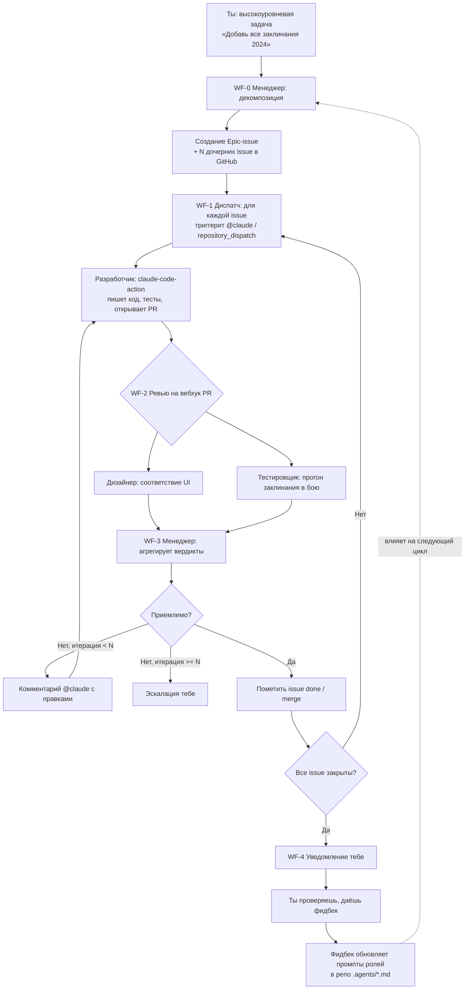

# Автоматизация разработки `dnd_cards/battle` через N8N + Claude

Дизайн-документ и пошаговый план. Версия 1.0 · июнь 2026

---

## 0. Главная идея (TL;DR)

N8N **сам код не пишет** — он оркестратор. Поэтому система состоит из двух плоскостей:

- **Control plane (N8N)** — принимает высокоуровневую задачу, декомпозирует её, распределяет, гоняет петлю ревью, держит состояние, шлёт уведомления, ждёт твой фидбек.
- **Execution plane (GitHub + Claude Code Action)** — реально читает репозиторий, пишет код, гоняет тесты, открывает PR.

Связка: N8N через GitHub API инициирует работу `anthropics/claude-code-action@v1` (официальный headless-агент, делает PR), затем слушает GitHub-вебхуки и прогоняет ревью силами AI Agent нод на Claude. Роли «менеджер / дизайнер / тестировщик» — это **промпты + ноды в N8N**, а «разработчик» — это **Claude Code в GitHub Actions**.

> Ключевой вывод: не пытайся заставить N8N писать код напрямую. N8N оркестрирует, Claude Code исполняет.

---

## 1. Распределение ролей по инструментам

| Роль | Где живёт | Чем является технически | Модель |
|------|-----------|------------------------|--------|
| **Менеджер** | N8N | AI Agent node, выдаёт JSON-список мини-задач + оценивает ревью | Claude Opus |
| **Разработчик** | GitHub Actions | `claude-code-action@v1`, реально пишет код и делает PR | Claude (Sonnet/Opus) |
| **Дизайнер** | N8N | AI Agent node, читает diff PR + design-guidelines, выносит вердикт | Claude Sonnet |
| **Тестировщик** | N8N + battle-репо | AI Agent node, дёргает **eval-харнесс боя** и интерпретирует результат | Claude Sonnet |
| **Ты (human gate)** | Telegram/Slack/почта | Финальная приёмка + фидбек, меняющий промпты ролей | — |

Почему разработчик отдельно: только `claude-code-action` имеет полный доступ к файловой системе репо, git, тестам и умеет открывать/обновлять PR. Дизайнер и тестировщик работают **поверх готового PR** (читают diff, дёргают API), им файловый доступ не нужен — их удобно держать прямо в N8N.

---

## 2. Архитектура и петля обратной связи



Главные нюансы петли:

- **Счётчик итераций** на каждую issue (`max_iterations`, например 3). Без него агенты могут крутиться бесконечно и сжигать токены. Превышение → эскалация тебе.
- **Состояние** хранится в GitHub (Epic-issue как доска задач + лейблы статусов `status:in-dev`, `status:review`, `status:done`) — это надёжнее, чем держать стейт внутри N8N. N8N держит только счётчики итераций (Postgres / n8n Data Table).
- **Промпты ролей версионируются в репо** (`.agents/manager.md`, `designer.md`, `tester.md`). N8N читает их через GitHub API в рантайме. Твой фидбек = PR в эти файлы. Так «изменение поведения ролей» становится обычным git-изменением с историей.

---

## 3. Критическая зависимость, которую надо закрыть ПЕРВОЙ

Роль «тестировщик пройдётся по каждому заклинанию и посмотрит, как оно показывает себя в бою» — самая сложная и **блокирует всю автоматизацию**. Чтобы агент мог «прогнать заклинание», в `battle`-бэкенде должен существовать **headless eval-харнесс**:

- API/CLI вида «создай бой → примени заклинание X к цели → верни итоговый стейт (урон, статусы, длительность, ресурсы)».
- Детерминированный режим (фиксированный seed для бросков), чтобы результат был воспроизводим.
- Машиночитаемый вывод (JSON) — его интерпретирует тестировщик-агент.

Без этого харнесса тестировщик сможет лишь читать код, а не проверять поведение. **Это задача №1 до постройки N8N-петли.** Хорошая новость: её саму можно отдать `claude-code-action` как первую задачу.

Аналогично для дизайнера: нужен файл **дизайн-системы** (`battle/DESIGN.md` или design tokens: цвета, отступы, компоненты карточек, типографика). Дизайнер-агент сверяет diff с этим документом. Без эталона «соответствие интерфейсу» проверять не с чем.

---

## 4. N8N: структура воркфлоу (разбивай на под-воркфлоу)

Не строй один гигантский воркфлоу — N8N тяжело отлаживать монолитом. Разбей на 5:

**WF-0 — Intake & Decompose**
Триггер: Chat/Webhook (ты кидаешь задачу) → нода GitHub (читает `.agents/manager.md` + контекст репо) → **AI Agent (менеджер, Claude Opus)** с structured output → парсинг JSON → GitHub: создать Epic-issue + дочерние issue с лейблом `status:todo`.

**WF-1 — Dispatch Developer**
Триггер: Schedule/при появлении `status:todo` → для каждой issue → GitHub API: `repository_dispatch` или коммент `@claude <тело задачи>` → лейбл `status:in-dev`. Параллелизм ограничь (1–2 issue одновременно), иначе конфликты веток и расход токенов.

**WF-2 — Review**
Триггер: GitHub Trigger node на событие `pull_request` (opened/synchronize) → получить diff → **параллельно** две AI Agent ноды:
- Дизайнер: diff + `DESIGN.md` → вердикт `{approve|changes, comments[]}`.
- Тестировщик: вызывает eval-харнесс по затронутым заклинаниям → собирает JSON-результаты → интерпретирует → вердикт.

**WF-3 — Evaluate & Loop**
Объединить вердикты → **AI Agent (менеджер-оценщик)**: приемлемо ли? → если нет и итерация < N: собрать правки в один коммент `@claude` к PR, инкремент счётчика → если нет и итерация ≥ N: эскалация → если да: лейбл `status:done`, (опц.) auto-merge.

**WF-4 — Notify & Feedback**
Триггер: все issue Epic в `status:done` → уведомление тебе (Telegram/Slack/email) со сводкой и ссылками на PR → ждёт реакцию → твой фидбек оформляется как PR в `.agents/*.md` (правка промптов ролей) → опц. перезапуск цикла.

---

## 5. Механизм триггера N8N ↔ GitHub (ты не знал — вот варианты)

Связь двусторонняя:

- **N8N → GitHub (запустить разработчика):** через GitHub API нода — либо создать коммент `@claude ...` в issue/PR (его ловит `claude-code-action`), либо отправить `repository_dispatch` событие, на которое подписан workflow в `.github/workflows/`. `repository_dispatch` чище и надёжнее для автоматизации.
- **GitHub → N8N (узнать о результате):** GitHub Webhook → **n8n Webhook/GitHub Trigger node**. Подписки на события `pull_request`, `issue_comment`, `check_run`, `workflow_run`. Так N8N узнаёт, что PR готов / тесты прошли / агент ответил.

Для этого N8N должен быть доступен из интернета (self-hosted с реверс-прокси/туннелем или n8n Cloud). Авторизация GitHub — через GitHub App (предпочтительно) или PAT с правами `repo`, `workflow`.

---

## 6. Промпты ролей (стартовые шаблоны)

Положи в репо, версионируй, N8N читает в рантайме.

**`.agents/manager.md`**
```
Ты — менеджер проекта dnd_cards/battle. На вход высокоуровневая задача.
Разбей её на атомарные мини-задачи: одна задача = одно заклинание/способность/класс.
Для каждой верни JSON:
{ "title", "description", "acceptance_criteria"[], "type": "spell|class|ability|infra",
  "affects": ["frontend"|"backend"], "test_notes" }
Требования к атомарности: задача должна закрываться одним PR < ~400 строк диффа.
Учитывай уже существующие issue (не дублируй). Соблюдай конвенции из CLAUDE.md.
```

**`.agents/designer.md`**
```
Ты — дизайн-ревьюер. На вход: diff PR и DESIGN.md (дизайн-система).
Проверь соответствие: токены цветов, отступы, компоненты карточек, типографику,
консистентность с существующими экранами боя. Не оценивай логику — только UI/UX.
Верни { "verdict": "approve|changes", "comments": [{"file","line","issue","fix"}] }.
```

**`.agents/tester.md`**
```
Ты — тестировщик боевого поведения. На вход: список затронутых заклинаний и доступ
к eval-харнессу боя (API: simulate(spell, target, seed) -> state_json).
Для каждого заклинания прогони сценарии (одиночная цель, AoE, сейв-throw, длительность,
ресурсы/слоты). Сверь с acceptance_criteria и правилами D&D 2024.
Верни { "verdict": "pass|fail", "cases": [{"spell","scenario","expected","actual","ok"}] }.
```

**`.agents/evaluator.md`** (менеджер в режиме оценки)
```
На вход вердикты дизайнера и тестировщика. Реши: принять PR или вернуть на доработку.
Если вернуть — собери конкретные actionable-правки одним списком для @claude.
Верни { "decision": "accept|revise", "feedback_for_dev": "...", "blocking_issues": [] }.
```

---

## 7. Поэтапный план внедрения (не строй всё сразу)

**Фаза 0 — Фундамент (до N8N).**
1. Eval-харнесс боя (детерминированный, JSON-вывод) — отдать `claude-code-action`.
2. `DESIGN.md` / дизайн-токены.
3. `CLAUDE.md` с конвенциями репо (структура, как гонять тесты, стиль).
4. Подключить `anthropics/claude-code-action@v1`, проверить что `@claude` в issue делает PR.

**Фаза 1 — Декомпозиция (N8N начинается).**
WF-0: задача → менеджер → issues. Пока **вручную** дёргаешь `@claude` по issue. Цель — выверить качество разбиения.

**Фаза 2 — Авто-диспатч разработчика.**
WF-1: автоматический `repository_dispatch` по `status:todo`. Получаешь PR без ручного участия.

**Фаза 3 — Авто-ревью.**
WF-2 + WF-3: дизайнер и тестировщик на вебхук PR, петля правок со счётчиком итераций.

**Фаза 4 — Замыкание петли.**
WF-4: уведомления + фидбек → PR в `.agents/*.md`. Полный автономный цикл.

Каждую фазу прогоняй на **одной-двух задачах**, прежде чем масштабировать на «все заклинания».

---

## 8. Риски и как их гасить

- **Бесконечные петли / расход токенов** → жёсткий `max_iterations`, лимит параллельных задач, дешёвые модели (Sonnet/Haiku) для ревью, Opus только для менеджера.
- **Конфликты веток** при параллельной работе → одна issue = одна ветка, ограничить параллелизм, rebase-политика.
- **Дизайнер «галлюцинирует» соответствие** без эталона → обязателен `DESIGN.md`; на старте дизайнер только флажит, не блокирует.
- **Тестировщик без харнесса бесполезен** → Фаза 0 обязательна, иначе вся затея не взлетит.
- **N8N как монолит неотлаживаем** → под-воркфлоу + логирование каждого шага.
- **Безопасность**: `claude-code-action` с автономным merge — риск. На старте — merge только вручную/после твоей приёмки. GitHub App с минимальными правами, секреты в N8N credentials, не в нодах.
- **Стоимость** ревью-петли растёт с числом заклинаний → батчируй похожие заклинания в один Epic, кешируй контекст.

---

## 9. Что нужно подготовить перед стартом

- [ ] Anthropic API ключ (для N8N AI Agent нод и для claude-code-action).
- [ ] N8N доступный извне (self-hosted + туннель или n8n Cloud).
- [ ] GitHub App или PAT с правами `repo` + `workflow`.
- [ ] `anthropics/claude-code-action@v1` подключён к репо.
- [ ] Eval-харнесс боя + `DESIGN.md` + `CLAUDE.md` в репозитории.
- [ ] Папка `.agents/` со стартовыми промптами (раздел 6).

---

## Источники

- [Anthropic Chat Model node — n8n Docs](https://docs.n8n.io/integrations/builtin/cluster-nodes/sub-nodes/n8n-nodes-langchain.lmchatanthropic/)
- [Anthropic credentials — n8n Docs](https://docs.n8n.io/integrations/builtin/credentials/anthropic)
- [Claude integrations — n8n](https://n8n.io/integrations/claude/)
- [Claude Code GitHub Actions — Claude Code Docs](https://code.claude.com/docs/en/github-actions)
- [anthropics/claude-code-action — GitHub](https://github.com/anthropics/claude-code-action)
- [Claude Code in CI/CD and Headless Automation](https://hidekazu-konishi.com/entry/claude_code_cicd_and_headless_automation.html)
